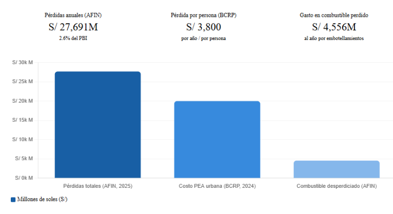
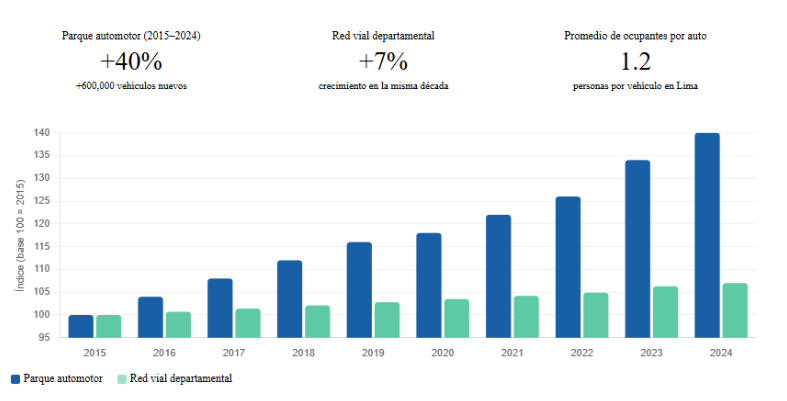
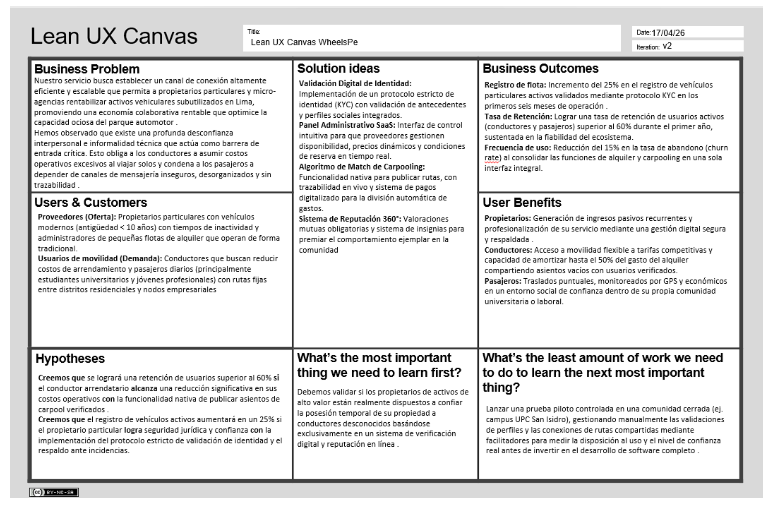
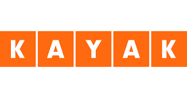

# MOVEO-Report

    </img>

    <strong>Universidad Peruana de Ciencias Aplicadas</strong>

    <strong>Carrera: Ingeniería de Software</strong>

    <strong>Periodo 202610</strong>

    <strong>Curso: Aplicaciones para Dispositivos Móviles</strong>

    <strong>Sección: 3678</strong>

    <strong>Profesor: David Gerardo Quevedo Velasco</strong>

    <strong>Informe de Trabajo Final</strong>

    <strong>Startup: MOVEO</strong>

    <strong>Producto: WheeelsPe</strong>

### Relación de integrantes
| Código            | Integrante                          |
|-------------------|-------------------------------------|
| u202312031        | Arrieta Quispe, Alison Jimena       |
| u20211g491        | Encalada Salazar, Alexi             |
| u202318049        | Goñe Araccata, Esther Abigail       |
| u202321941        | Salazar Caballero, Alvaro Fabrizzio |
| u202317362        | Santiago Peña, Andreow Jomark       |

## Abril 2026

# Registro de Versiones del Informe

| Versión   | Fecha       | Autor(es)                                                                                                                                              | Descripción de Modificación                                                                                                                                                                                                                                                                                                                                                                                                                                                                                                                                          |
|-----------|-------------|--------------------------------------------------------------------------------------------------------------------------------------------------------|----------------------------------------------------------------------------------------------------------------------------------------------------------------------------------------------------------------------------------------------------------------------------------------------------------------------------------------------------------------------------------------------------------------------------------------------------------------------------------------------------------------------------------------------------------------------|
| 1.0 (AV1) | 09/04/2026  | Arrieta Quispe, Alison JimenaEncalada Salazar, AlexisGoñe Araccata, Esther AbigailSalazar Caballero, Alvaro FabrizzioSantiago Peña, Andreow Jomark     | Capítulo I: Introducción 1.1 Startup Profile (Descripción de la Startup y perfiles del equipo).1.2 Solution Profile (Antecedentes y problemática).1.2.2.1 Lean UX Problem Statements (Definición de los problemas a resolver).1.2.2.2 Lean UX Assumptions (Identificación de suposiciones).1.2.2.3 Lean UX Hypothesis Statements (Formulación de hipótesis).1.3 Segmentos objetivo (Definición del público meta)                                                                                                                                                     |
| 1.1 (AV1) | 13/04/2026  | Arrieta Quispe, Alison Jimena Encalada Salazar, Alexis Goñe Araccata, Esther Abigail Salazar Caballero, Alvaro Fabrizzio Santiago Peña, Andreow Jomark | Capítulo I: Introducción y Capítulo II: Requirements & Analysis 1.2.2.4 Lean UX Canvas (Creación del lienzo de Lean UX) 2.1.1 Análisis competitivo (Investigación de competidores) 2.1.2 Estrategias y tácticas frente a competidores (Definición de estrategias competitivas) 2.2.1.Diseño de entrevistas (Creación de guiones de entrevistas)                                                                                                                                                                                                                      |
| 1.2 (AV1) | 17/04/2026  | Arrieta Quispe, Alison Jimena Encalada Salazar, Alexis Goñe Araccata, Esther Abigail Salazar Caballero, Alvaro Fabrizzio Santiago Peña, Andreow Jomark | Capítulo II: Requirements & Analysis 2.2.2 Registro de entrevistas (Documentación de entrevistas realizadas a los segmentos objetivo) 2.2.3 Análisis de entrevistas (Síntesis de hallazgos por segmento) 2.3.1 User Personas (Construcción de perfiles representativos de los usuarios) 2.3.2 User Task Matrix (Identificación de tareas por frecuencia e importancia)                                                                                                                                                                                               |
| 1.3 (AV1) | 18./04/2026 | Arrieta Quispe, Alison Jimena Encalada Salazar, Alexis Goñe Araccata, Esther Abigail Salazar Caballero, Alvaro Fabrizzio Santiago Peña, Andreow Jomark | Capítulo II: Requirements & Analysis. 2.3.3 User Journey Mapping (Mapeo de la experiencia del usuario en los flujos principales).2.3.4 Empathy Mapping (Construcción de mapas de empatía por segmento objetivo).2.3.5 Big Picture Event Storming (Exploración colaborativa del dominio del negocio).2.3.6 Ubiquitous Language (Definición del glosario de términos del dominio)                                                                                                                                                                                      |
| 1.4 (AV1) | 22/04/2026  | Arrieta Quispe, Alison Jimena Encalada Salazar, Alexis Goñe Araccata, Esther Abigail Salazar Caballero, Alvaro Fabrizzio Santiago Peña, Andreow Jomark | Capítulo II: Requirements & Analysis.2.4.1 User Stories (Especificación de historias de usuario por épica).2.4.2 Impact Mapping (Construcción del mapa de impacto del producto).2.4.3 Product Backlog (Priorización del backlog del producto) 2.5.1 Event Storming — Strategic Level (Sesión de diseño estratégico con DDD).2.5.1.1 Candidate Context Discovery (Identificación de bounded contexts candidatos)                                                                                                                                                      |
| 1.5 (AV1) | 23/04/2026  | Arrieta Quispe, Alison Jimena Encalada Salazar, Alexis Goñe Araccata, Esther Abigail Salazar Caballero, Alvaro Fabrizzio Santiago Peña, Andreow Jomark | Capítulo II: Requirements & Analysis 2.5.1.2 Domain Message Flows Modeling (Modelado de flujos de mensajes entre contextos) 2.5.1.3 Bounded Context Canvases (Definición de los lienzos de cada bounded context).2.5.2 Context Mapping (Definición de relaciones entre bounded contexts) 2.5.3 Software Architecture (Diagramas de arquitectura a nivel de contexto, contenedor y despliegue) 2.6 Tactical-Level DDD (Domain Layer, Interface Layer, Application Layer e Infrastructure Layer de los bounded contexts IAM, Carpooling, Rental, Operations y Billing) |

# Project Report Collaboration Insights 

Repositorio donde se encuentra el **Project Report**: [https://github.com/App-Moviles-MOVEO/MOVEO-Report](https://github.com/App-Moviles-MOVEO/MOVEO-Report)

FOTO

Utilizamos Google Docs como herramienta colaborativa para redactar el informe y luego trasladamos la información al archivo README.md de nuestro repositorio.

# Contenido
[Student Outcome](#student-outcome)

[Objetivos Smart](#objetivos-smart)

[Capítulo I: Introducción](#capítulo-i-introducción)

[1.1 Startup Profile](#11-startup-profile)

[1.1.1 Descripción de la Startup](#111-descripción-de-la-startup)

[1.1.2 Perfiles de integrantes del equipo](#112-perfiles-de-integrantes-del-equipo)

[1.2 Solution Profile](#12-solution-profile)

[1.2.1 Antecedentes y Problemática](#121-antecedentes-y-problemática)

[1.2.2 Lean UX Process](#122-lean-ux-process)

[1.2.3 Lean UX Problem Statement](#1221-lean-ux-problem-statement)

[1.2.4 Lean UX Assumptions](#1222-lean-ux-assumptions)

[1.2.5 Lean UX Hypothesis Statements](#1223-lean-ux-hypothesis-statements)

[1.2.6 Lean UX Canvas](#1224-lean-ux-canvas)

[1.3 Segmentos objetivo](#segmentos-objetivo)

[Capítulo II: Requirements Elicitation & Analysis](#capítulo-ii-requirements-elicitation--analysis)

[2.1 Competidores](#21-competidores)

[2.1.1 Análisis competitivo](#211-análisis-competitivo)

[2.1.2 Estrategias y tácticas frente a competidores](#212-estrategias-y-tácticas-frente-a-competidores)

[2.2 Entrevistas](#22-entrevistas)

[2.2.1 Diseño de entrevista](#221-diseño-de-entrevista)

[2.2.2 Registro de entrevistas](#222-registro-de-entrevistas)

[2.2.3 Análisis de Entrevistas](#223-análisis-de-entrevistas)

[2.3 Needfinding](#23-needfinding)

[2.3.1 User Persona](#231-user-persona)

[2.3.2 User Task Matrix](#232-user-task-matrix)

[2.3.3 User Journey Mapping](#233-user-journey-mapping)

[2.3.4 Empathy Mapping](#234-empathy-mapping)

[2.3.5 As-is Scenario Mapping](#235-as-is-scenario-mapping)

[2.4 Ubiquitous Language](#24-ubiquitous-language)

[Capítulo III: Requirements Specification](#capítulo-iii-requirements-specification)

[3.1 To-Be Scenario Mapping](#31-to-be-scenario-mapping)

[3.2 User Stories](#32-user-stories)

[3.3 Impact Mapping](#33-impact-mapping)

[3.4 Product Backlog](#34-product-backlog) 

[Capítulo IV: Solutions Software Design](#capítulo-iv-solutions-software-design)

[4.1 Strategic-Level Domain Driven Design](#41-strategic-level-domain-driven-design)

[4.1.1 EventStorming](#411-eventstorming) 

[4.1.1.1 Candidate Context Discovery](#4111-candidate-context-discovery)

[4.1.1.2 Domain Message Flows Modeling](#4112-domain-message-flows-modeling)

[4.1.1.3 Bounded Contexts Canvases](#4113-bounded-contexts-canvases)

[4.1.2. Context Mapping](#412-context-mapping)

[4.1.3 Software Architecture](#413-software-architecture)

[4.1.3.1 Software Architecture Context Level Diagrams](#4131-software-architecture-context-level-diagrams)

[4.1.3.2 Software Architecture Container Level Diagrams](#4132-software-architecture-container-level-diagrams)

[4.1.3.3 Software Architecture Deployment Diagrams](#4133-software-architecture-deployment-diagrams)

[4.1.2 Context Mapping](#412-context-mapping)

[4.1.3 Software Architecture](#413-software-architecture)

[4.1.3.1 Software Architecture Context Level Diagrams](#4131-software-architecture-context-level-diagrams)

[4.1.3.2 Software Architecture Container Level Diagrams](#4132-software-architecture-container-level-diagrams)

[4.1.3.3 Software Architecture Deployment Diagrams](#4133-software-architecture-deployment-diagrams)

[4.2 Tactical-Level Domain Driven Design](#42-tactical-level-domain-driven-design)

[4.2.1 Bounded Contexts: <Bounded Context Name>](#421-bounded-contexts-bounded-context-name)

[4.2.1.1 Domain Layer](#4211-domain-layer)

[4.2.1.2 Interface Layer](#4212-interface-layer)

[4.2.1.3 Application Layer](#4213-application-layer)

[4.2.1.4 Infrastructure Layer](#4214-infrastructure-layer)

[4.2.1.5 Bounded Context Software Architecture Component Level Diagrams](#4215-bounded-context-software-architecture-component-level-diagrams)

[4.2.1.6 Bounded Context Software Architecture Code Level Diagrams](#4216-bounded-context-software-architecture-code-level-diagrams)

[4.2.1.7 Bounded Context Domain Layer Class Diagrams](#4217-bounded-context-domain-layer-class-diagrams)

[4.2.1.8 Bounded Context Database Design Diagram](#4218-bounded-context-database-design-diagram)

[conclusiones y Recomendaciones](#conclusiones-y-recomendaciones)

[Conclusiones](#conclusiones)

[Bibliografía](#bibliografía)

[Anexos](#anexos)

# Student Outcome

El curso aporta al cumplimiento del criterio ABET: ABET – EAC - Student Outcome 7: Aprendizaje Continuo y Autónomo
Criterio: La capacidad de adquirir y aplicar nuevos conocimientos según sea necesario, utilizando estrategias de aprendizaje apropiadas.
En el cuadro siguiente se detallan las actividades llevadas a cabo y las conclusiones formuladas por el equipo, las cuales sirven como evidencia del logro alcanzado en el ABET – EAC - Student Outcome.

**Criterio:** *La capacidad de adquirir y aplicar nuevos conocimientos según sea necesario, utilizando estrategias de aprendizaje apropiadas.*

En el cuadro siguiente se detallan las actividades llevadas a cabo y las conclusiones formuladas por el equipo, las cuales sirven como evidencia del logro alcanzado en el ABET – EAC \- Student Outcome.

| Criterio específico | Acciones realizadas | Conclusiones |  |
| ----- | ----- | ----- | ----- |
| Actualiza conceptos y conocimientos necesarios para su desarrollo profesional y en especial para su proyecto en soluciones de software. | **Arrieta Quispe, Alison Jimena** *AV1* Investigó y aplicó conceptos de Domain-Driven Design para desarrollar el Domain Message Flows Modeling, Bounded Context Canvases y el Bounded Context Billing, profundizando en el modelado de flujos entre contextos y reglas de negocio financieras.  **Encalada Salazar, Alexis** *AV1* Estudió los fundamentos teóricos de DDD para construir el Ubiquitous Language, el Event Storming y el Context Mapping, aplicando patrones de diseño estratégico en el Bounded Context Rental.  **Goñe Araccata, Esther Abigail** *AV1* Investigó y aplicó metodologías Lean UX y Event Storming para desarrollar el Startup Profile, Solution Profile, el análisis de entrevistas y el Bounded Context Operations, integrando técnicas de investigación cualitativa con la exploración del dominio.  **Salazar Caballero, Alvaro Fabrizzio** *AV1* Investigó patrones de arquitectura de software y gestión de identidad para desarrollar la Software Architecture y el Bounded Context Iam, adquiriendo conocimientos sobre seguridad y verificación de usuarios en plataformas digitales.  **Santiago Peña, Andreow Jomark** *AV1* Aplicó técnicas de Needfinding e investigación con usuarios para desarrollar el análisis de entrevistas y el Bounded Context Carpooling, conectando los hallazgos de campo con el modelado del dominio de movilidad compartida. | **AV1:** Durante la elaboración del primer avance, el equipo identificó y adquirió de forma autónoma los conocimientos necesarios para cada área del proyecto, desde metodologías de discovery hasta diseño estratégico con DDD, demostrando capacidad para actualizar su formación según las exigencias reales del desarrollo. |  |
| Reconoce la necesidad del aprendizaje permanente para el desempeño profesional y el desarrollo de proyectos en soluciones de software. | **Arrieta Quispe, Alison Jimena** *AV1* Al modelar los flujos entre contextos y el contexto Billing, reconoció que el diseño estratégico de software exige formación continua más allá de los contenidos del curso, profundizando en reglas de negocio sobre comisiones y reembolsos.  **Encalada Salazar, Alexis** *AV1* Al construir el Ubiquitous Language a partir del Event Storming, reconoce que la calidad del diseño depende del entendimiento profundo del dominio y no solo del conocimiento técnico.  **Goñe Araccata, Esther Abigail** *AV1* Al liderar las entrevistas y el Big Picture Event Storming, reconoció que la investigación con usuarios y la facilitación colaborativa son competencias profesionales que requieren desarrollo continuo, complementando su formación técnica.  **Salazar Caballero, Alvaro Fabrizzio** *AV1* Al diseñar la arquitectura y el contexto Iam, reconoció que la seguridad y la gestión de identidad son áreas en constante evolución, investigando estándares que van más allá del contenido impartido en el curso.  **Santiago Peña, Andreow Jomark** *AV1* Al desarrollar el Needfinding y el contexto Carpooling, reconoció que el aprendizaje profesional integra tanto la investigación con usuarios como el modelado técnico, ampliando su visión del rol del ingeniero de software. | **AV1:** Durante esta primera etapa del proyecto, el equipo demostró consciencia sobre la necesidad del aprendizaje permanente al enfrentar responsabilidades que requerían conocimientos fuera del contenido directo del curso, respondiendo de forma proactiva mediante investigación autónoma y aplicación práctica en cada entregable. |  |

# Capítulo I: Introducción
# 1.1. Startup Profile
### 1.1.1. Descripción de la Startup

**MOVEO** se define como una organización de base tecnológica cuyo propósito fundamental es transformar la dinámica de la movilidad urbana en el Perú. El enfoque estratégico de la startup se centra en el desarrollo de soluciones digitales avanzadas que actúan como un puente eficiente entre personas con necesidades de transporte y propietarios de vehículos disponibles para alquiler, fomentando simultáneamente la integración del transporte compartido entre usuarios de una misma zona geográfica. A diferencia de los modelos corporativos tradicionales, la propuesta de valor de **MOVEO** no depende de la gestión de una flota de vehículos propia, sino que se sustenta íntegramente en una red colaborativa donde los mismos ciudadanos registran sus unidades en la plataforma y empresas de alquiler que no cuentan con el alcance suficiente para ofrecer sus autos en alquiler . Esta estructura permite ampliar la oferta de movilidad de manera orgánica y reducir los costos operativos, democratizando el acceso al servicio.

El modelo de intermediación diseñado por la organización busca alcanzar la máxima eficiencia económica, permitiendo que los propietarios particulares moneticen sus vehículos únicamente cuando estos son efectivamente arrendados por terceros y que las empresas puedan contar con un canal seguro y práctico para poner en circulación sus vehículos a alquilar, mientras que los conductores finales acceden a tarifas de mercado significativamente más bajas que las de las empresas de alquiler convencionales. Como elemento diferencial y disruptivo, la plataforma integra una funcionalidad técnica de carpooling que permite a los conductores compartir sus trayectos cotidianos con otros usuarios de manera voluntaria. Esta integración no solo optimiza el uso individual de cada activo vehicular, sino que contribuye de forma directa y positiva a mitigar la congestión vehicular y el impacto ambiental en las zonas urbanas de alta densidad.

**Misión**

Ofrecer una solución tecnológica moderna y robusta que simplifique radicalmente el acceso a vehículos de alquiler para los ciudadanos. La organización se compromete a integrar la movilidad compartida como una alternativa que sea percibida como accesible, segura y altamente eficiente por todos los usuarios urbanos en el contexto peruano.

**Visión**

Consolidarse como el referente más reconocido y confiable de movilidad colaborativa en el Perú. Liderar la innovación en los modelos de alquiler entre particulares y transporte compartido, construyendo un ecosistema digital sostenible que sea identificado por la seguridad de sus procesos y el valor generado para su comunidad de usuarios.

### 1.1.2. Perfiles de integrantes del equipo
En esta sección presentamos a los miembros de la startup, describiendo nuestros perfiles, nombrando nuestras habilidades y conocimientos.

| Foto | Perfil |
| :---: | ----- |
| ![image2] | **Arrieta Quispe, Alison Jimena** Mi nombre es Alison, tengo 19 años y soy estudiante de Ingeniería de Software enfocada en el desarrollo de aplicaciones web modernas potenciadas con Inteligencia Artificial para entornos globales. |
|  | **Encalada Salazar, Alexis** Soy Alexis Encalada Salazar, actualmente tengo 22 años, Curso el 5to ciclo de la carrera de ingeniería de software en la universidad peruana de ciencias aplicadas. Considero que soy alguien responsable, así cómo perseverante tanto en trabajos solitarios como en equipo. Pienso ayudar a mi equipo con mis conocimientos en los lenguajes de programación C++ y python y también en edición de videos |
| ![][image4] | **Goñe Araccata, Esther Abigail** Mi nombre es Abigail Goñe, tengo 20 años y actualmente me encuentro en el séptimo ciclo de la carrera de Ingeniería de Software. Soy una persona responsable, amigable y me gusta poder ayudar a los demás en todo lo que pueda. |
| ![][image6] | **Salazar Caballero, Alvaro Fabrizzio** Soy Alvaro Fabrizzio Salazar Caballero, estudiante de Ingeniería de Software en la Universidad Peruana de Ciencias Aplicadas. Me interesa contribuir al equipo con mis conocimientos en desarrollo backend y gestión de proyectos. |
| ![][image5] | **Santiago Peña, Andreow Jomark** Soy estudiante de Ingeniería de Software en la Universidad Peruana de Ciencias Aplicadas, con una gran pasión por el desarrollo de aplicaciones móviles y backend. |

# 1.2. Solution Profile

## 1.2.1. Antecedentes y Problemática
De acuerdo con Álvarez (2020), la metodología de las 5W's y 2H's permite estructurar y desarrollar un plan de acción o estrategia detallada, constituyendo una herramienta clave para comprender a fondo las necesidades de los usuarios. Por esta razón, se utilizó para recopilar y clasificar la información del mercado, la cual se presentará a continuación.

Aplicación del método 5W + 2H

**What?**
#### ¿Cuál es el problema?
El problema central radica en la profunda desconexión, ineficiencia e informalidad en el acceso a la movilidad temporal y compartida en el Perú. Por un lado, existe un gran sector de propietarios particulares con autos subutilizados que pierden la oportunidad de generar ingresos adicionales debido a la falta de canales seguros para alquilarlos. En paralelo, las empresas del rubro operan con procesos manuales e ineficientes, careciendo del impulso tecnológico necesario para captar nuevos clientes de forma escalable. Por otro lado, quienes alquilan un vehículo asumen la totalidad de los altos costos operativos al no existir una opción integrada de transporte compartido, mientras que los pasajeros sin vehículo, como estudiantes o trabajadores con rutas fijas, carecen de un directorio centralizado, viéndose obligados a coordinar viajes a través de grupos de mensajería informal, sin filtros de seguridad ni verificación de identidad

#### ¿Cuál es la relación con la persona en cuestión?
El problema se manifiesta en múltiples momentos cotidianos según el actor involucrado. Para los propietarios particulares, la frustración aparece cada fin de semana o a fin de mes, cuando perciben que su vehículo se deprecia sin generar ingresos al no encontrar arrendatarios confiables. Para las empresas formales del rubro, el obstáculo es diario, ya que los procesos anticuados no les permiten captar clientes a la velocidad que exige el mercado. Para quienes alquilan un vehículo, la fricción económica surge en el momento exacto en que inician su viaje con asientos vacíos, asumiendo en solitario los costos de combustible y peajes. Finalmente, para estudiantes y trabajadores, la dificultad ocurre todos los días durante las horas pico, cuando intentan encontrar una ruta compartida y pierden tiempo valioso intercambiando mensajes de confirmación sin garantías de seguridad.
**¿Cuándo?**
#### ¿Cuándo sucede el problema?
El problema se manifiesta en múltiples momentos cotidianos según el actor involucrado. Para los propietarios particulares, la frustración aparece cada fin de semana o a fin de mes, cuando perciben que su vehículo se deprecia sin generar ingresos al no encontrar arrendatarios confiables. Para las empresas formales del rubro, el obstáculo es diario, ya que los procesos anticuados no les permiten captar clientes a la velocidad que exige el mercado. Para quienes alquilan un vehículo, la fricción económica surge en el momento exacto en que inician su viaje con asientos vacíos, asumiendo en solitario los costos de combustible y peajes. Finalmente, para estudiantes y trabajadores, la dificultad ocurre todos los días durante las horas pico, cuando intentan encontrar una ruta compartida y pierden tiempo valioso intercambiando mensajes de confirmación sin garantías de seguridad.

#### ¿Cuándo utiliza el cliente el servicio?
El usuario se enfrenta a estas barreras de manera recurrente en momentos de alta necesidad de desplazamiento, especialmente cuando requiere una solución de movilidad rápida y no dispone de tiempo para negociar tarifas en empresas físicas ni para buscar publicaciones dispersas en grupos de mensajería informal.
**¿Dónde?**
#### ¿Dónde surge el problema?
La problemática se concentra principalmente en entornos urbanos de alta densidad demográfica y congestión vehicular, siendo Lima Metropolitana el principal escenario del país donde la demanda de transporte temporal es masiva pero la oferta es ineficiente y fragmentada. Físicamente, el déficit se evidencia en los grandes corredores viales que conectan distritos residenciales con puntos fijos de alta concurrencia, como campus universitarios y centros empresariales. En el entorno digital, el problema se perpetúa en canales de comunicación informales, ya que las personas intentan resolver su necesidad de transporte migrando a aplicaciones de mensajería que no están diseñadas para la logística, careciendo de mapas integrados o verificación de perfiles.

#### ¿Dónde está el cliente cuando usa el producto?
El usuario se encuentra inmerso en contextos de movilidad activa y decisiones sobre la marcha: planificando su día desde casa, intentando salir de la universidad tras clases, o coordinando el regreso desde su centro de trabajo. En todos estos escenarios, la falta de información centralizada sobre arrendamientos y rutas compartidas se convierte en un obstáculo paralizante

**¿Quiénes?**
#### ¿Quiénes son los actores y grupos de interés que sufren el impacto de esta problemática? 
Los principales afectados por la deficiencia estructural en el transporte se dividen en dos grandes segmentos con necesidades insatisfechas. Por un lado, se encuentran los proveedores potenciales, compuestos por propietarios particulares con vehículos estacionados sin uso productivo y microempresas del rubro de alquiler que operan bajo esquemas tradicionales poco competitivos y manuales. Por otro lado, se ubican los usuarios de movilidad, que incluyen tanto a conductores que asumen cargas financieras excesivas por traslados individuales, como a pasajeros diarios principalmente estudiantes y trabajadores que se desplazan entre puntos fijos bajo un clima de incertidumbre y desorganización

#### ¿Cuál es el alcance del impacto en los diversos agentes que integran el ecosistema?
El impacto de la informalidad y la falta de canales verificados afecta transversalmente a todos los actores del entorno urbano en Lima Metropolitana. Los propietarios de vehículos ven limitada su capacidad de generar ingresos adicionales y enfrentan la depreciación acelerada de sus activos sin retorno. Las pequeñas empresas del sector pierden competitividad frente a un mercado que exige agilidad tecnológica, mientras que los ciudadanos que requieren movilidad temporal asumen costos desproporcionados al no contar con herramientas para compartir trayectos. Finalmente, los pasajeros diarios quedan expuestos a riesgos de seguridad personal al verse forzados a coordinar viajes mediante canales informales.

#### ¿Cuál es el perfil demográfico y geográfico de los ciudadanos directamente impactados?
Esta situación de crisis impacta directamente a ciudadanos con un estilo de vida dinámico que requieren soluciones de transporte inmediatas para cumplir con sus responsabilidades académicas y laborales. Se trata primordialmente de adultos jóvenes, profesionales y estudiantes universitarios que transitan entre zonas residenciales y nodos críticos de concurrencia como campus universitarios y distritos empresariales en Lima. Estos agentes se ven obligados a navegar diariamente por un sistema fragmentado donde la ausencia de información centralizada y de rutas verificadas se convierte en un obstáculo recurrente que afecta su calidad de vida y economía personal

#### ¿De qué manera influye el factor humano y sus habilidades en la persistencia del problema?
La problemática está estrechamente ligada a la brecha de confianza interpersonal y a las limitaciones en las capacidades digitales de los involucrados. Muchos propietarios y gestores de pequeñas flotas carecen de acceso a herramientas que les permitan profesionalizar la oferta de sus activos, dependiendo de procesos manuales propensos al error. Asimismo, la falta de una cultura de economía colaborativa, agravada por la percepción de inseguridad ciudadana, impide que las personas aprovechen sus habilidades de coordinación para generar soluciones colectivas eficientes. Esta carencia de un entorno validado refuerza la dependencia hacia medios riesgosos, donde la verificación de la identidad del otro es casi imposible de realizar de manera autónoma
**¿Por qué?**

#### ¿Cuál es la causa del problema?
La situación se origina por la ausencia de un ecosistema tecnológico unificado que integre el alquiler de vehículos y la economía colaborativa de trayectos compartidos en un mismo entorno. Las empresas de alquiler mantienen procesos manuales debido a que el desarrollo de software a medida resulta técnica y financieramente inaccesible para la mayoría de ellas. Por el lado de los usuarios, la dependencia de aplicaciones de mensajería para coordinar rutas compartidas persiste porque no existe un directorio confiable que estandarice las publicaciones de viajes. Al no contar con un entorno formal que valide si un conductor realmente pertenece a una comunidad universitaria o laboral específica, impera un clima generalizado de desconfianza que frena el aprovechamiento de los vehículos disponibles en el mercado y consolida la informalidad como única alternativa viable.

**¿Cómo?**
#### ¿En qué condiciones los involucrados enfrentan la problemática?
Los ciudadanos enfrentan las deficiencias del transporte en su entorno cotidiano, principalmente al planificar traslados desde el hogar, el centro de estudios o el lugar de trabajo. Ante la falta de un sistema integrado, los usuarios dependen de sus dispositivos móviles para consultar múltiples fuentes de información dispersas, intentando encontrar rutas o vehículos en sus momentos libres o durante desplazamientos activos. En general, el usuario debe adaptar su ritmo de vida a la escasa oferta existente, priorizando la seguridad y la economía, aunque esto signifique sacrificar la inmediatez y la sencillez en sus interacciones de transporte diarias.

#### ¿Cómo se informan los ciudadanos sobre alternativas de transporte compartido? 
Actualmente, los involucrados buscan alternativas a través de la observación de tendencias en redes sociales como TikTok e Instagram, donde se visualiza el descontento generalizado y se comparten consejos informales sobre los beneficios teóricos del transporte compartido. Asimismo, el "boca a boca" dentro de comunidades universitarias y centros de trabajo representa el canal de descubrimiento más utilizado, considerando que las personas suelen compartir experiencias negativas y recomendaciones de grupos cerrados con compañeros que enfrentan las mismas dificultades de movilidad y altos costos de desplazamiento diario.

#### ¿Bajo qué criterios buscan los usuarios resolver su necesidad de movilidad?
Los usuarios buscan resolver su necesidad de manera rápida, intuitiva y desde cualquier lugar, tratando de encontrar opciones de movilidad sin los pasos burocráticos de las agencias tradicionales. Valoran la posibilidad de visualizar opciones de transporte, intentar verificar la identidad de conductores en grupos de chat o coordinar trayectos en pocos pasos desde el mismo dispositivo que ya usan a diario. En ese sentido, la expectativa es que la gestión de sus traslados o el alquiler de una unidad resulte tan natural y ágil como cualquier otra acción cotidiana desde el celular, algo que la informalidad actual no logra ofrecer.

#### ¿Qué factores determinantes originaron esta situación de crisis? 
Lo que llevó a los ciudadanos a esta situación es una combinación de factores estructurales y tecnológicos consolidados con el tiempo. La ausencia de plataformas formales y confiables para el alquiler entre particulares obligó a propietarios y arrendatarios a operar en la informalidad o a depender de intermediarios ineficientes. Por otro lado, la falta de herramientas digitales accesibles para las pequeñas empresas de alquiler perpetuó procesos lentos que no responden a las expectativas de un mercado digitalizado. A esto se suma la inexistencia de un canal verificado para coordinar rutas compartidas, lo que forzó a estudiantes y trabajadores a gestionar sus desplazamientos diarios mediante grupos de mensajería sin filtros de seguridad, consolidando un ecosistema de movilidad fragmentado, costoso e inseguro.

**¿Cuánto cuesta?**

#### Estadísticas que sustentan la problemática

El Banco Central de Reserva del Perú estimó que una persona pierde en promedio S/ 3,800 al año en Lima debido al tiempo adicional invertido en el tráfico (Banco Central de Reserva del Perú, 2024). Esta cifra se agrava según estimaciones más recientes: la Asociación para el Fomento de la Infraestructura Nacional reveló que la congestión vehicular en Lima y Callao genera pérdidas anuales superiores a los S/ 27,691 millones, equivalente al 2.6% del PBI del Perú (Infobae Perú, 2025).

**Figura 1**

*Impacto económico y pérdidas anuales por la congestión vehicular en Lima*

*Nota.* Elaboración propia. Basado en BCRP (2024) e Infobae Perú / AFIN (2025).

Respecto al crecimiento del parque automotor frente a la infraestructura vial, la brecha es estructural: entre 2015 y 2024, el parque automotor en Lima aumentó un 40% con el ingreso de más de 600,000 vehículos, mientras que la red vial departamental apenas creció un 7% (Instituto Peruano de Economía, 2024). Finalmente, según la asociación Lima Cómo Vamos, un auto en Lima transporta en promedio 1.2 personas, lo que significa que en la mayoría de casos el conductor viaja solo (citado en Gutiérrez, 2018). Esto evidencia el enorme potencial desaprovechado del transporte compartido en la ciudad y sustenta la necesidad urgente de conectar a conductores con pasajeros para optimizar los vehículos ya existentes.

**Figura 2**

*Brecha estructural entre el parque automotor y la red vial frente a la ocupación vehicular*

*Nota.* Elaboración propia. Basado en Instituto Peruano de Economía (2024) y Gutiérrez (2018).

## 1.2.2. Lean UX Process

### 1.2.2.1. Lean UX Problem Statement

La declaración del problema es un componente fundamental del proceso Lean UX, ya que permite al equipo enfocarse en los síntomas reales del dominio antes de proponer soluciones técnicas específicas. Para este proyecto, se ha identificado lo que delimita el alcance del trabajo.

Actualmente, los ciudadanos de Lima que necesitan movilidad temporal no cuentan con una plataforma confiable que les permita alquilar vehículos de particulares o unirse a trayectos compartidos de forma segura y verificada. Los propietarios que desean rentabilizar sus vehículos subutilizados tampoco disponen de mecanismos que garanticen la validación del arrendatario ni el respaldo ante posibles incidencias, lo que genera desconfianza y mantiene esos activos fuera del mercado.

Hemos observado que esta falta de formalidad y transparencia en los procesos de movilidad compartida es el factor crítico que impide tanto que los propietarios ofrezcan sus vehículos como que los usuarios adopten este modelo como alternativa real de transporte urbano.

**¿Cómo podemos crear un ecosistema digital que conecte a propietarios y usuarios de movilidad de manera segura, formal y eficiente, logrando que ambos perciban la plataforma como una solución confiable y de alto valor para sus necesidades de transporte en Lima?**

### 1.2.2.2. Lean UX Assumptions

En el marco de **Lean UX**, las suposiciones son declaraciones de lo que creemos que es cierto dentro del dominio del problema y la solución propuesta. El objetivo de este proceso es exponer las ideas de todos los miembros del equipo para identificar los riesgos potenciales antes de realizar inversiones significativas en desarrollo.

**User Assumptions (Necesidades y comportamientos)**

* **Propietarios:** Cuentan con vehículos subutilizados gran parte de la semana y están dispuestos a rentarlos de manera recurrente, siempre que dispongan de un canal que garantice seguridad jurídica, validación de identidad y protección contra daños.  
* **Empresas (SMBs):** Las micro y pequeñas empresas del rubro necesitan digitalizar su inventario para ampliar su alcance comercial y reducir tiempos manuales de gestión, pero carecen de presupuesto y conocimiento técnico para software propio.  
* **Conductores:** Perciben el alquiler tradicional como un gasto excesivamente elevado para uso recurrente y buscan mecanismos integrados que les permitan publicar rutas para llevar pasajeros y amortizar costos.  
* **Pasajeros:** Dependen actualmente de grupos informales en redes sociales o WhatsApp; tienen la necesidad de migrar a una plataforma formal que ofrezca inmediatez, perfiles verificados y organización.

**User Outcome Assumptions (Beneficios esperados)**

* Los propietarios y empresas experimentarán un incremento directo en sus ingresos y un aumento en su tasa de ocupación mensual al reducir los "tiempos muertos" de su flota.  
* Los conductores que arrienden un vehículo y compartan trayectos lograrán reducir drásticamente su presupuesto de transporte, haciendo viable el alquiler recurrente.  
* Los pasajeros experimentarán una mejora significativa en su calidad de vida y seguridad al acceder a rutas puntuales y verificadas.  
* El sistema de perfiles y valoraciones fomentará la lealtad y confianza en toda la comunidad, asegurando una experiencia sin complicaciones.

  **Business Assumptions (Modelo de negocio y mercado)**

* Un modelo de monetización basado en comisiones por transacción exitosa es viable y escala con el volumen de uso sin representar riesgos fijos para los proveedores.  
* Existe un mercado desatendido en Lima Metropolitana de usuarios que requieren movilidad flexible que las empresas tradicionales no cubren por sus altas tarifas.  
* Las pequeñas agencias de alquiler adoptarán la plataforma como su herramienta principal de gestión operativa para competir con franquicias internacionales.  
* La integración nativa de carpooling será el factor disruptivo que genere un ciclo de retroalimentación positivo entre alquileres y viajes compartidos.

  **Business Outcome Assumptions (Impactos positivos en el negocio)**

* Se espera un incremento sostenido en el registro de vehículos por parte de empresas al comprobar la modernización de su captación de clientes.  
* El ecosistema logrará una tasa de retención de usuarios activos superior al 60% durante el primer año basada en la confianza generada.  
* La consolidación de funciones en una sola aplicación reducirá la tasa de abandono (*churn rate*) al encontrar valor continuo como conductor o pasajero.  
* La marca se consolidará como el referente en movilidad colaborativa y digitalización de flotas en el mercado peruano en los próximos 24 meses.

  **Feature Assumptions (Funcionalidades y resolución)**

* Un panel de administración intuitivo permitirá que el 80% de los proveedores configure su inventario sin requerir asistencia técnica.  
* Un sistema de filtros avanzado permitirá concretar una reserva vehicular en menos de cinco minutos.  
* Al menos el 40% de los conductores arrendatarios utilizará la opción de publicar rutas de carpool voluntariamente para dividir gastos.  
* La visualización clara de perfiles verificados será el factor determinante para concretar el 75% de las transacciones exitosas.

	
**Priorización de Suposiciones (Assumptions Priority)**

Una vez identificados los supuestos, es necesario determinar cuáles son los más riesgosos para trabajar en ellos prioritariamente. El equipo ha utilizado una matriz de priorización para evaluar cada ítem en función de su nivel de incertidumbre y riesgo potencial para el negocio.

**La Suposición más Riesgosa (Riskiest Assumption)**

Atendiendo a la retroalimentación docente de identificar el riesgo crítico, el equipo ha determinado que la suposición más importante que debemos aprender primero es:

**"Los propietarios de vehículos (particulares y microagencias) están dispuestos a confiar la seguridad y el estado físico de sus activos a conductores desconocidos, bajo la creencia de que un sistema de verificación digital de identidad y perfiles reputacionales es suficiente para mitigar el riesgo de daño o pérdida."**

**Justificación:** Esta declaración es el pilar de toda la solución. Si este supuesto se prueba falso, el modelo de negocio carecerá de oferta vehicular, lo que causaría que el proyecto completo falle independientemente de su implementación técnica. Por ello, este será el foco del primer experimento de validación.

### 1.2.2.3. Lean UX Hypothesis Statements

**Seguridad jurídica y confianza del proveedor**

**Creemos que** la implementación de un proceso estricto de verificación de identidad y un sistema de valoraciones mutuas **para** los propietarios particulares **logrará** brindar la seguridad jurídica necesaria para rentar sus vehículos subutilizados sin temor a riesgos . 

**Sabremos que esto es cierto cuando veamos** un aumento del 25% en el registro de vehículos particulares activos y que el 80% de los propietarios exprese sentirse seguro al aceptar una reserva en sus encuestas de satisfacción posteriores al servicio.

**Digitalización y escalabilidad del sector de alquiler**

**Creemos que** ofrecer un proceso de publicación de vehículos sencillo, digital y accesible **para** las micro y pequeñas empresas de alquiler **logrará** que estas encuentren en la plataforma su canal principal para captar nuevos clientes de forma escalable. 

**Sabremos que esto es cierto cuando veamos** que al menos el 30% de las nuevas publicaciones provengan de perfiles corporativos y estas registren un promedio de 10 reservas semanales a través de la aplicación.

**Eficiencia operativa y amortización de costos**

**Creemos que** la integración nativa de una opción para publicar rutas de carpool **para** los arrendatarios de vehículos **logrará** motivarlos a alquilar unidades de manera más frecuente al permitirles dividir el costo operativo de su viaje con otros pasajeros.

**Sabremos que esto es cierto cuando veamos** que al menos el 40% de los usuarios que arriendan un vehículo utilizan la funcionalidad de carpool, logrando reducir sus costos de viaje y aumentando su tasa de retención mensual.

**Seguridad y formalización del transporte compartido**

**Creemos que** ofrecer un directorio centralizado con perfiles verificados de conductores **para** los pasajeros que actualmente coordinan viajes por medios informales **logrará** solucionar la inseguridad y desorganización que enfrentan en sus traslados diarios.

**Sabremos que esto es cierto cuando veamos** una tasa de conversión donde el 60% de los pasajeros que buscan una ruta en la plataforma concreten la reserva de un asiento compartido en menos de 10 minutos.

**Validación de reputación y filtro de comunidad**

**Creemos que** implementar un sistema de reseñas bidireccional obligatorio **para** todos los usuarios **logrará** fomentar un ecosistema de autorregulación y alta confianza interpersonal dentro de la plataforma.

**Sabremos que esto es cierto cuando veamos** que el 90% de las transacciones finalizadas reciben una calificación mutua de 4 estrellas o superior, consolidando la fiabilidad de los perfiles.

**Estrategia de crecimiento en nodos académicos**

**Creemos que** ofrecer incentivos de crédito por referidos verificados **para** los estudiantes universitarios **logrará** acelerar el crecimiento orgánico de la red en los campus de mayor densidad vehicular de Lima.

**Sabremos que esto es cierto cuando veamos** que el 20% de los nuevos usuarios registrados provengan de invitaciones directas de la comunidad universitaria dentro de los primeros seis meses de operación.

**Protección y soporte de activos de valor**

**Creemos que** integrar un esquema de soporte ante incidencias mecánicas incluido en cada reserva **para** los proveedores **logrará** eliminar la resistencia al alquiler de unidades modernas o de gama media-alta.

**Sabremos que esto es cierto cuando veamos** un incremento del 15% mensual en el registro de vehículos con una antigüedad menor a los 5 años, diversificando la oferta del catálogo.

### 1.2.2.4. Lean UX Canvas.

**Figura 3**

*Lean UX Canvas de WheelsPe*

*Nota.* Elaboración Propia

# 1.3. Segmentos objetivos 

Para garantizar que nuestra solución tecnológica responda de manera efectiva a las necesidades del mercado, se identificaron y analizaron los segmentos clave que enfrentan retos en el ecosistema de movilidad urbana en Lima. A continuación se detallan sus perfiles estratégicos, profundizando en las características demográficas, geográficas y psicográficas que sustentan su relevancia dentro del dominio del problema.

**Segmento Objetivo \#1: Proveedores de Vehículos**

Representa tanto a propietarios particulares con vehículos subutilizados como a micro y pequeñas empresas del rubro de alquiler que buscan digitalizar su operación y ampliar su alcance comercial mediante un canal tecnológico confiable.

Aspectos demográficos:

* **Sexo:** Masculino y femenino  
* **Rango de edad:** 25 a 65 años  
* **Nivel socioeconómico:** Sectores A, B y C (propietarios de vehículos particulares, emprendedores y pequeños empresarios del rubro)

Aspectos geográficos:

* **Nacionalidad:** Peruana  
*  **Zona geográfica:** Áreas urbanas de alta densidad vehicular (Lima Metropolitana)

Aspectos psicográficos:

* **Dolor principal:** Poseen vehículos que permanecen sin uso durante gran parte de la semana, lo que representa una pérdida económica directa. Las micro y pequeñas empresas del rubro operan con procesos manuales que les impiden captar clientes a la velocidad que exige el mercado, sin presupuesto para desarrollar software propio.  
*  **Intereses:** Generar ingresos adicionales a través de un activo que ya poseen sin invertir tiempo excesivo en la gestión. Digitalizar su operación y ampliar su alcance comercial mediante un canal tecnológico confiable y escalable.  
* **Actitudes:** Proactivos en la búsqueda de soluciones que rentabilicen sus recursos. Valoran la seguridad jurídica, la verificación de identidad del arrendatario y el respaldo ante posibles incidencias como condición indispensable para publicar sus vehículos en una plataforma.  
*  **Necesidades clave:** Contar con un canal formal y seguro para ofrecer sus vehículos en alquiler, mecanismos de validación de identidad del arrendatario, protección ante daños o incidencias, y visibilidad ante una base de usuarios activos y verificados.  
  
**Segmento Objetivo \#2: Usuarios de Movilidad**

Representa tanto a propietarios particulares con vehículos subutilizados como a micro y pequeñas empresas del rubro de alquiler que buscan digitalizar su operación y ampliar su alcance comercial mediante un canal tecnológico confiable.

Aspectos demográficos:

* **Sexo:** Masculino y femenino  
* **Rango de edad:** 18 a 50 años  
* **Nivel socioeconómico:** Sectores B y C (estudiantes universitarios, jóvenes profesionales y trabajadores con desplazamientos diarios fijos)

Aspectos geográficos:

* **Nacionalidad:** Peruana  
*  **Zona geográfica:** Áreas urbanas con alta congestión vehicular y demanda de transporte flexible (Lima Metropolitana, con foco en corredores viales que conectan distritos residenciales con campus universitarios y centros empresariales)

Aspectos psicográficos:

* **Dolor principal:** Los conductores arrendatarios asumen el costo total del alquiler de forma individual al no contar con herramientas integradas para compartir el trayecto. Los pasajeros, por su parte, se ven obligados a coordinar viajes a través de grupos de WhatsApp o redes sociales, exponiéndose a la informalidad, la falta de verificación de identidad y la desorganización.  
*  **Intereses:** Acceder a soluciones de movilidad flexibles, económicas y seguras que se adapten a sus desplazamientos cotidianos. Encontrar rutas compartidas verificadas como alternativa real al transporte público informal.  
* **Actitudes:** Estilo de vida práctico y conectado digitalmente; toman decisiones de movilidad sobre la marcha y priorizan la inmediatez y la confianza por encima del precio absoluto. Están dispuestos a migrar hacia plataformas formales siempre que estas les ofrezcan perfiles verificados y una experiencia ágil.  
*  **Necesidades clave:** Acceso rápido a vehículos disponibles, rutas compartidas desde el celular, perfiles verificados de conductores y a la vez propietarios, mecanismos para dividir bien los gastos de viaje, y un entorno organizado que sustituya la coordinación informal actual.

# Capítulo II: Requirements Development and Software Solution Design
## 2.1. Competidores 

Previo al desarrollo de la aplicación, hicimos una búsqueda de las opciones que ya existen en el mercado, para ver que es lo que ofrecen y como podemos diferenciarnos de ellos.
- **Peru Rent A Car:**
  Esta plataforma se especializa en el alquiler de coches en Perú. Ofrece una amplia gama de vehículos y opciones de alquiler, así como información sobre destinos turísticos en Perú.
  La plataforma también permite a los usuarios comparar precios y reservar coches en línea.
  

 
  

- **Kayak:**
  Kayak es una de las plataformas de búsqueda de viajes más grandes del mundo. Permite a los usuarios buscar y comparar precios de vuelos, hoteles y alquiler de coches en una sola plataforma.
  Kayak también ofrece herramientas para planificar viajes, como alertas de precios y recomendaciones personalizadas.
  

  

- **Budget Car Rental Peru:**
  A diferencia de Peru Rent A Car, Budget Car Rental es una empresa internacional que ofrece servicios de alquiler de coches en Perú.
  La plataforma permite a los usuarios buscar y comparar precios de coches de alquiler en diferentes ubicaciones y reservar en línea. Budget Car Rental también ofrece opciones de alquiler a largo plazo y programas de fidelización.
  

  

## 2.1.1 Análisis Competitivo

Para obtener una comprensión más profunda de nuestro entorno competitivo y evaluar a fondo a los posibles rivales del sector, hemos desarrollado el siguiente Competitive Landscape:

**¿Por qué llevar a cabo este análisis?**
Determinar las ventajas competitivas de WheelsPe mediante la integración de alquiler entre particulares y el carpooling en una sola aplicación móvil, con el fin de identificar oportunidades en un mercado local desatendido y posicionarse como la primera solución peruana de movilidad colaborativa frente a competidores tradicionales y plataformas internacionales.

| | | **WheelsPe** | **Kayak** | **Peru Rent A Car** | **Budget Car Rental Peru** |
|---|---|---|---|---|---|
| **Perfil** | Overview | App móvil que conecta propietarios y pequeñas empresas de alquiler con arrendatarios, integrando carpooling para compartir trayectos y dividir gastos | Plataforma líder de búsqueda de vuelos, hoteles y alquiler de vehículos | Plataforma web con catálogo establecido de vehículos, atención vía WhatsApp | Plataforma de alquiler similar a Peru Rent A Car, orientada a clientes con énfasis en el presupuesto |
| | Ventaja competitiva | Única solución peruana que unifica alquiler entre particulares, canal digital para pequeñas empresas y carpooling en una sola app | Aplicación líder en búsqueda de servicios por su variedad y robusta plataforma | Líder local con amplia flota y rápida atención al usuario | Alternativa económica de alquiler velando por el bolsillo del cliente |
| **Perfil de Marketing** | Mercado objetivo | Propietarios particulares, microempresas de alquiler, conductores arrendatarios y pasajeros que buscan rutas compartidas | Turistas o viajeros que necesiten cualquier tipo de servicio de comodidad | Adultos peruanos que busquen alquilar un vehículo | Adultos peruanos que busquen alquilar un vehículo económico |
| | Estrategias de marketing | Campañas en TikTok e Instagram y alianzas con empresas locales como primeros adoptantes | Alianzas con Google Ads en YouTube y Chrome | Patrocinio mediante búsquedas en Chrome | Patrocinio mediante búsquedas en Chrome |
| **Perfil de Producto** | Productos & Servicios | App móvil con publicación de vehículos en alquiler entre particulares y pequeñas empresas, carpooling integrado y sistema de valoraciones mutuas | App móvil y web con gran variedad de servicios para viajeros y turistas | App web rápida e intuitiva para consultar catálogo de vehículos disponibles | App web ágil y amigable con oferta limitada de vehículos económicos |
| | Precios & Costos | Descuentos semanales en alquileres y ofertas especiales en rutas compartidas | Modelo gratuito con cobro de comisión a empresas referidas | Ingreso directo mediante el alquiler | Ingreso directo mediante el alquiler |
| | Canales de distribución | App móvil (Android e iOS) con versión web complementaria | App en Google Play y App Store + plataforma web | Disponible en línea a través de la web | Disponible en línea a través de la web |
| **Análisis SWOT** | Fortalezas | Integra alquiler y carpooling en una sola app · Modelo sin flota propia · Canal accesible para pequeñas empresas · Sistema de valoraciones entre usuarios | Gran cantidad de usuarios · Referente del sector · Plataformas ágiles e intuitivas | Plataforma local · Excelente atención al cliente | Plataforma web amigable · Catálogo disponible para cualquier usuario |
| | Debilidades | Sin reconocimiento de marca inicial · Oferta dependiente del crecimiento orgánico de proveedores | Pobre atención al cliente | Solo se puede consultar parte del catálogo | Nicho muy concreto · Menor relevancia que su competencia |
| | Oportunidades | Mercado local desatendido · Alta congestión vehicular que impulsa la demanda de carpooling | Fuerte presencia internacional · Referente del sector | Flota amplia y en crecimiento · Atención personalizada | Excelente interfaz |
| | Amenazas | Posible ingreso de plataformas internacionales · Resistencia cultural a formalizar el alquiler entre particulares | Oferta demasiado amplia · Sin control de calidad | Oferta fija y poco variada · Sin opciones para propietarios interesados en alquilar | Opacado por la competencia · Oferta aún más limitada |

### 2.1.2. Estrategias y tácticas frente a competidores. 

**WheelsPe** se diferenciará de competidores como Kayak, Peru Rent A Car y Budget Car Rental Peru al posicionarse como la primera solución peruana que unifica el alquiler entre particulares y el carpooling en una sola aplicación móvil. A diferencia de las plataformas tradicionales que operan con flotas fijas y procesos rígidos, la propuesta permite que los mismos ciudadanos registren sus vehículos, generando una oferta flexible y orgánica que los competidores establecidos no pueden replicar con facilidad.

Para contrarrestar la falta de reconocimiento inicial como nueva marca, se aplicarán tácticas de marketing digital en TikTok e Instagram orientadas a comunidades universitarias y centros de trabajo, espacios donde la necesidad de movilidad compartida es más frecuente e inmediata. Aprovechando que ningún competidor local ofrece carpooling integrado, la estrategia central será capturar ese segmento desatendido antes de que plataformas internacionales como BlaBlaCar o Turo consideren ingresar al mercado peruano.

Frente a las debilidades identificadas en la competencia, como la ausencia de opciones para propietarios que deseen alquilar sus vehículos en Peru Rent A Car y Budget, o la falta de control de calidad en Kayak, la táctica será destacar el sistema de valoraciones mutuas como mecanismo de confianza que beneficia tanto a proveedores como a usuarios. Esta funcionalidad genera una barrera de entrada difícil de imitar por plataformas que operan únicamente como directorios o buscadores de terceros.

Finalmente, para mitigar la resistencia cultural a formalizar el alquiler entre particulares, se priorizará una estrategia de alianzas con pequeñas empresas locales como primeros adoptantes, quienes actuarán como referentes de confianza dentro del ecosistema y acelerarán la validación del modelo ante los usuarios más escépticos.

## 2.2. Entrevistas

En esta sección se presenta la investigación cualitativa realizada mediante entrevistas profundas a representantes de nuestros dos segmentos objetivo: **propietarios de vehículos** (Segmento 1) e **inquilinos o usuarios que desean alquilar autos** (Segmento 2). El objetivo es comprender sus necesidades reales, frustraciones, hábitos de consumo y expectativas frente a una plataforma de alquiler de autos, validando así los supuestos del modelo de negocio y ajustando la propuesta de valor de Moveo a lo que el mercado realmente demanda.

### 2.2.1. Diseño de entrevista 
Esta sección incluye preguntas demográficas, conductuales y psicográficas dirigidas a cada segmento, con el fin de construir arquetipos (personas) basados en evidencia real. Se aplican buenas prácticas de diseño de entrevistas: preguntas abiertas, no sugestivas, orden lógico (de lo general a lo específico) y enfoque en comportamientos reales, no hipotéticos.

Antes de realizar las entrevistas profundas, se aplicó un formulario digital (Google Forms) a todos los participantes con el objetivo de recolectar información demográfica y conductual básica. Esto permitió segmentar adecuadamente a los entrevistados, personalizar el enfoque de cada entrevista según su perfil, y optimizar el tiempo durante las sesiones cualitativas.

Formulario segmento Proveedores de Vehiculos: https://forms.gle/uyVSkqSiuiKx1nb69

Formulario segmento Inquilinos: https://forms.gle/kz3BdxPoZHKNgqUg9
#### **Segmento 1: Proveedores de Vehiculos** 

**Demográficas (para arquetipo):**
- ¿Cuál es tu nombre completo?
- ¿Qué edad tienes?
- ¿En qué distrito resides?
- ¿Cuál es tu género?
- ¿Cuál es tu estado civil?
- ¿Vives solo, con pareja, con hijos u otros familiares?
- ¿A qué te dedicas (trabajo, estudios, negocio propio)?

**Psicográficas y comportamentales (para arquetipo):**
- ¿Cómo describirías tu personalidad cuando se trata de prestar algo valioso (precavido, confiado, flexible, exigente)?
- ¿Qué marcas de autos confías más para alquilar? ¿Por qué?
- ¿Qué influencers, blogs, canales o redes sociales te influyen a la hora de tomar decisiones sobre tu auto o negocios?
- ¿Qué dispositivos usas con más frecuencia (celular, laptop, tablet)? ¿Qué apps o navegadores prefieres?
- ¿Por qué canales digitales sueles informarte o resolver dudas (WhatsApp, Instagram, Facebook, Google, foros)?

> *Nota: Estas preguntas fueron incluidas en el formulario inicial para identificar patrones de comportamiento digital y afinidades, lo que permitió guiar mejor las entrevistas profundas y construir arquetipos más precisos.*

**Necesidades y comportamiento (preguntas principales):**
- ¿Qué tipo de unidades sueles alquilar (auto, SUV, camioneta, moto, otro)?
- ¿Cuál es el tiempo mínimo y máximo que normalmente estás dispuesto a prestar tu vehículo?
- ¿Qué requisitos solicitas a una persona antes de entregarle tu vehículo?
- ¿Dónde publicas actualmente tus vehículos para alquilarlos (apps, redes sociales, conocidos)?
- ¿Cómo gestionas el control de tus autos disponibles y en uso (anotaciones, Excel, aplicación, otro)?
- ¿Qué tan confiable consideras que son las plataformas actuales para validar a los clientes?
- ¿Qué tan útil sería para ti ver comentarios de otros dueños sobre un cliente antes de alquilar?
- ¿Te interesaría contar con un panel digital donde registres todos tus autos y su estado?
- ¿Qué tan importante consideras poder calificar a los clientes después de cada alquiler?
- ¿Has tenido malas experiencias alquilando tu auto? Cuéntame qué pasó y qué aprendiste.

---
#### **Segmento 2: Clientes**

**Demográficas (para arquetipo):**
- ¿Cuál es tu nombre completo?
- ¿Qué edad tienes?
- ¿En qué distrito vives?
- ¿Cuál es tu género?
- ¿Cuál es tu estado civil?
- ¿Vives solo, con pareja, con hijos u otros familiares?
- ¿Cuál es tu ocupación principal?

**Psicográficas y comportamentales (para arquetipo):**
- ¿Cómo describirías tu estilo al tomar decisiones de consumo (espontáneo, investigador, influenciable, ahorrativo)?
- ¿Qué marcas de autos o servicios de alquiler prefieres o evitas? ¿Por qué?
- ¿Qué personas, influencers o medios digitales te ayudan a decidir antes de alquilar un auto?
- ¿Qué dispositivos usas con más frecuencia (celular, laptop, tablet)? ¿Qué apps o navegadores prefieres?
- ¿Por qué canales digitales sueles buscar soluciones o servicios (WhatsApp, Instagram, Google Maps, TikTok, foros)?

> *Nota: La información recolectada en el formulario permitió identificar segmentos de comportamiento digital y afinidades de marca, facilitando la construcción de arquetipos realistas y la personalización de las preguntas durante la entrevista.*

**Necesidades y comportamiento (preguntas principales):**
- ¿Qué documentos te han solicitado en tus experiencias previas al alquilar un auto?
- ¿Qué tipo de vehículo prefieres alquilar según tu necesidad (trabajo, viaje, ocasión especial)?
- ¿Qué requisitos o condiciones suelen ponerte antes de alquilar (edad mínima, tarjeta de crédito, otros)?
- ¿Qué factores te desaniman al momento de querer alquilar un auto (precio, desconfianza, restricciones, otro)?
- ¿Dónde sueles buscar opciones de autos en alquiler (apps, redes, páginas web, conocidos)?
- ¿Qué tan confías en que las aplicaciones muestran información real de los dueños y autos?
- ¿Qué tan valioso sería para ti revisar reseñas de otros usuarios sobre el dueño antes de alquilar?
- ¿Te resultaría útil poder reservar un vehículo con anticipación directamente desde la app?
- ¿Qué tan importante es para ti dejar una opinión sobre tu experiencia con el dueño o el vehículo?
- ¿Cuál ha sido tu peor experiencia alquilando un auto? ¿Qué cambiarías para evitarlo?

### 2.2.2. Registro de entrevistas

### 2.2.3. Análisis de Entrevistas 

## 2.3. Needfinding

### 2.3.1. User Persona

### 2.3.2. User Task Matrix

### 2.3.3. User Journey Mapping

### 2.3.4. Empathy Mapping 

### 2.3.5. Big Picture EventStorming

### 2.3.6. Ubiquitous Language

Arrendador:	Usuario que publica su vehículo para alquiler.

Arrendatario:	Usuario que alquila un vehículo disponible en la app.

Vehículo:	Entidad principal registrada por un arrendador.

Reserva:	Proceso mediante el cual un arrendatario aparta un vehículo en una fecha.

Publicación:	Objeto que contiene los datos visibles de un vehículo (precio, fotos, reglas).

Reseña:	Valoración escrita o numérica sobre el arrendador o vehículo.

Framework:	Conjunto de herramientas y librerías que usamos para construir la aplicación .

Entidad:	Objeto del dominio que tiene identidad propia .

Repositorio: Componente de software que gestiona la persistencia de
## 2.4. Requirements Specification

### 2.4.1. User Stories

### 2.4.2. Impact Mapping

### 2.4.3. Product Backlog

## 2.5. Strategic-Level Domain Driven Design

En esta sección se introduce el proceso de Domain-Driven Desing a nivel estratégico para MOVEO. Nuestro enfoque nos permitió conceptualizar el sistema a partir de la lógica de nuetro negocio, con el proposito de modelar una arquitectura de microservicios coherentes. Para conseguir eso identificamos subconjuntos del sistema con límites naturales y claros, conocidos como los Bounded Contexts. Las herramientas utilizadas para este propósito son el EventStorming, que nos ayudó a visualizar el flujo de eventos del negocio, y el Bounded Context Canvas, la cual nos ayuda a definir formalmente cada contexto y sus relaciones, garantizando así una base sólida para el desarrollo de nuestro proyecto.

### 2.5.1 EventStorming

Event Storming es una técnica que consiste en la realización de un taller facilitado en el que los miembros del equipo identifican eventos claves del negocio y los requisitos para el bien funcionamiento de la plataforma, a lo largo de diferentes pasos que deber ser realizados colaborativamente.

Esta herramiente nos permitió elaborar una arquitectura de aplicación más robusta, estructurada y alineada con el enfoque de Domain-Driven Desing, además de visualizar posibles flujos de los usuarios y estructuras de código a utilizar. En nuestro negocio por temas de visualización y facilidad al momento de diseñar los diagramas hemos utilizado la plataforma de Miro para realizar el Event Storming.

#### 2.5.1.1. Candidate Context Discovery
#### 2.5.1.2. Domain Message Flows Modeling
#### 2.5.1.3. Bounded Contexts Canvases

### 2.5.2. Context Mapping

### 2.5.3. Software Architecture

#### 2.5.3.1. Software Architecture Context Level Diagrams
#### 2.5.3.2. Software Architecture Container Level Diagrams
#### 2.5.3.3. Software Architecture Deployment Diagrams

## 2.6. Tactical-Level Domain Driven Design

### 2.6.x. Bounded Contexts: <Bounded Context Name>

#### 2.6.1.1 Domain Layer
#### 2.6.1.2 Interface Layer
#### 2.6.1.3 Application Layer
#### 2.6.1.4 Infrastructure Layer
#### 2.6.1.5 Bounded Context Software Architecture Component Level Diagrams
#### 2.6.1.6 Bounded Context Software Architecture Code Level Diagrams
#### 2.6.1.7 Bounded Context Domain Layer Class Diagrams
#### 2.6.1.8 Bounded Context Database Design Diagram

## Conclusiones y Recomendaciones

### Conclusiones

### Bibliografía

### Anexos

