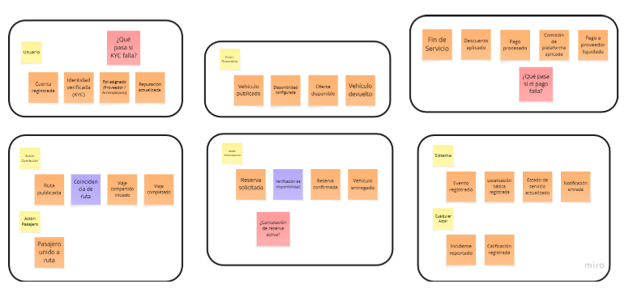
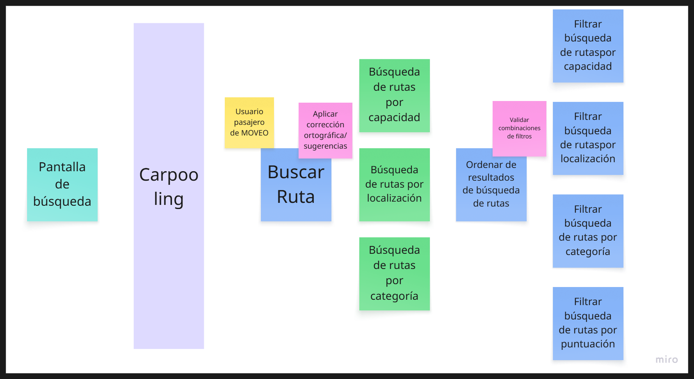
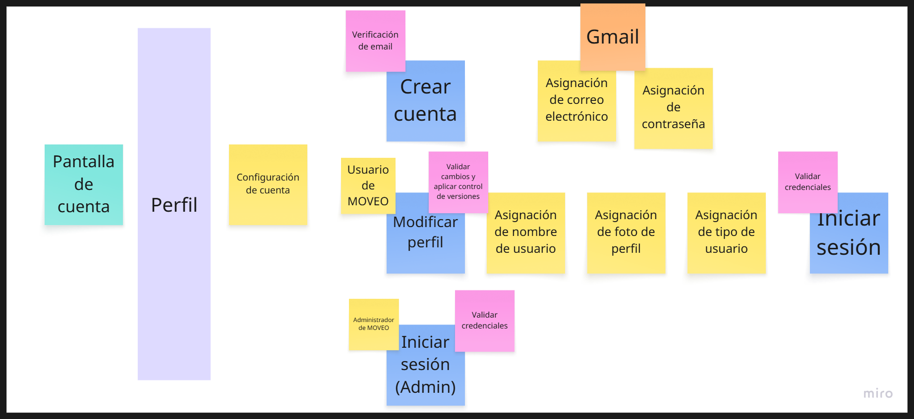
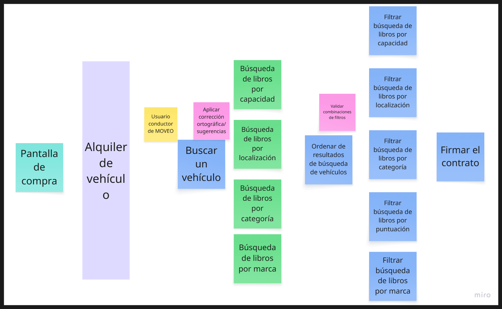
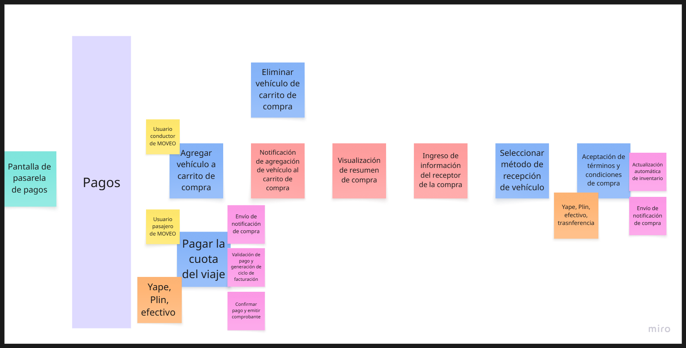

# MOVEO-Report

    </img>

    <strong>Universidad Peruana de Ciencias Aplicadas</strong>

    <strong>Carrera: Ingeniería de Software</strong>

    <strong>Periodo 202610</strong>

    <strong>Curso: Aplicaciones para Dispositivos Móviles</strong>

    <strong>Sección: 3678</strong>

    <strong>Profesor: David Gerardo Quevedo Velasco</strong>

    <strong>Informe de Trabajo Final</strong>

    <strong>Startup: MOVEO</strong>

    <strong>Producto: WheelsPe</strong>

### Relación de integrantes
| Código            | Integrante                          |
|-------------------|-------------------------------------|
| u202312031        | Arrieta Quispe, Alison Jimena       |
| u20211g491        | Encalada Salazar, Alexis            |
| u202318049        | Goñe Araccata, Esther Abigail       |
| u202321941        | Salazar Caballero, Alvaro Fabrizzio |
| u202317362        | Santiago Peña, Andreow Jomark       |

### Abril 2026
 

# Registro de Versiones del Informe

| Versión   | Fecha       | Autor(es)                                                                                                                                              | Descripción de Modificación                                                                                                                                                                                                                                                                                                                                                                                                                                                                                                                                          |
|-----------|-------------|--------------------------------------------------------------------------------------------------------------------------------------------------------|----------------------------------------------------------------------------------------------------------------------------------------------------------------------------------------------------------------------------------------------------------------------------------------------------------------------------------------------------------------------------------------------------------------------------------------------------------------------------------------------------------------------------------------------------------------------|
| 1.0 (AV1) | 09/04/2026  | Arrieta Quispe, Alison JimenaEncalada Salazar, AlexisGoñe Araccata, Esther AbigailSalazar Caballero, Alvaro FabrizzioSantiago Peña, Andreow Jomark     | Capítulo I: Introducción 1.1 Startup Profile (Descripción de la Startup y perfiles del equipo).1.2 Solution Profile (Antecedentes y problemática).1.2.2.1 Lean UX Problem Statements (Definición de los problemas a resolver).1.2.2.2 Lean UX Assumptions (Identificación de suposiciones).1.2.2.3 Lean UX Hypothesis Statements (Formulación de hipótesis).1.3 Segmentos objetivo (Definición del público meta)                                                                                                                                                     |
| 1.1 (AV1) | 13/04/2026  | Arrieta Quispe, Alison Jimena Encalada Salazar, Alexis Goñe Araccata, Esther Abigail Salazar Caballero, Alvaro Fabrizzio Santiago Peña, Andreow Jomark | Capítulo I: Introducción y Capítulo II: Requirements & Analysis 1.2.2.4 Lean UX Canvas (Creación del lienzo de Lean UX) 2.1.1 Análisis competitivo (Investigación de competidores) 2.1.2 Estrategias y tácticas frente a competidores (Definición de estrategias competitivas) 2.2.1.Diseño de entrevistas (Creación de guiones de entrevistas)                                                                                                                                                                                                                      |
| 1.2 (AV1) | 17/04/2026  | Arrieta Quispe, Alison Jimena Encalada Salazar, Alexis Goñe Araccata, Esther Abigail Salazar Caballero, Alvaro Fabrizzio Santiago Peña, Andreow Jomark | Capítulo II: Requirements & Analysis 2.2.2 Registro de entrevistas (Documentación de entrevistas realizadas a los segmentos objetivo) 2.2.3 Análisis de entrevistas (Síntesis de hallazgos por segmento) 2.3.1 User Personas (Construcción de perfiles representativos de los usuarios) 2.3.2 User Task Matrix (Identificación de tareas por frecuencia e importancia)                                                                                                                                                                                               |
| 1.3 (AV1) | 18./04/2026 | Arrieta Quispe, Alison Jimena Encalada Salazar, Alexis Goñe Araccata, Esther Abigail Salazar Caballero, Alvaro Fabrizzio Santiago Peña, Andreow Jomark | Capítulo II: Requirements & Analysis. 2.3.3 User Journey Mapping (Mapeo de la experiencia del usuario en los flujos principales).2.3.4 Empathy Mapping (Construcción de mapas de empatía por segmento objetivo).2.3.5 Big Picture Event Storming (Exploración colaborativa del dominio del negocio).2.3.6 Ubiquitous Language (Definición del glosario de términos del dominio)                                                                                                                                                                                      |
| 1.4 (AV1) | 22/04/2026  | Arrieta Quispe, Alison Jimena Encalada Salazar, Alexis Goñe Araccata, Esther Abigail Salazar Caballero, Alvaro Fabrizzio Santiago Peña, Andreow Jomark | Capítulo II: Requirements & Analysis.2.4.1 User Stories (Especificación de historias de usuario por épica).2.4.2 Impact Mapping (Construcción del mapa de impacto del producto).2.4.3 Product Backlog (Priorización del backlog del producto) 2.5.1 Event Storming — Strategic Level (Sesión de diseño estratégico con DDD).2.5.1.1 Candidate Context Discovery (Identificación de bounded contexts candidatos)                                                                                                                                                      |
| 1.5 (AV1) | 23/04/2026  | Arrieta Quispe, Alison Jimena Encalada Salazar, Alexis Goñe Araccata, Esther Abigail Salazar Caballero, Alvaro Fabrizzio Santiago Peña, Andreow Jomark | Capítulo II: Requirements & Analysis 2.5.1.2 Domain Message Flows Modeling (Modelado de flujos de mensajes entre contextos) 2.5.1.3 Bounded Context Canvases (Definición de los lienzos de cada bounded context).2.5.2 Context Mapping (Definición de relaciones entre bounded contexts) 2.5.3 Software Architecture (Diagramas de arquitectura a nivel de contexto, contenedor y despliegue) 2.6 Tactical-Level DDD (Domain Layer, Interface Layer, Application Layer e Infrastructure Layer de los bounded contexts IAM, Carpooling, Rental, Operations y Billing) |

# Project Report Collaboration Insights 

Repositorio donde se encuentra el **Project Report**: [https://github.com/App-Moviles-MOVEO/MOVEO-Report](https://github.com/App-Moviles-MOVEO/MOVEO-Report)

FOTO

Utilizamos Google Docs como herramienta colaborativa para redactar el informe y luego trasladamos la información al archivo README.md de nuestro repositorio.

# Contenido

[Student Outcome (ver anexo A)](#student-outcome-ver-anexo-a)

[Objetivos SMART](#objetivos-smart)

# Capítulo I: Presentación

[1.1. Startup Profile](#11-startup-profile)

[1.1.1. Descripción de la Startup](#111-descripción-de-la-startup)

[1.1.2. Perfiles de integrantes del equipo](#112-perfiles-de-integrantes-del-equipo)

[1.2. Solution Profile](#12-solution-profile)

[1.2.1. Antecedentes y problemática](#121-antecedentes-y-problemática)

[1.2.2. Lean UX Process](#122-lean-ux-process)

[1.2.2.1. Lean UX Problem Statements](#1221-lean-ux-problem-statements)

[1.2.2.2. Lean UX Assumptions](#1222-lean-ux-assumptions)

[1.2.2.3. Lean UX Hypothesis Statements](#1223-lean-ux-hypothesis-statements)

[1.2.2.4. Lean UX Canvas](#1224-lean-ux-canvas)

[1.3. Segmentos objetivo](#13-segmentos-objetivo)

# Capítulo II: Requirements Development and Software Solution Design

[2.1. Competidores](#21-competidores)

[2.1.1. Análisis competitivo](#211-análisis-competitivo)

[2.1.2. Estrategias y tácticas frente a competidores](#212-estrategias-y-tácticas-frente-a-competidores)

[2.2. Entrevistas](#22-entrevistas)

[2.2.1. Diseño de entrevistas](#221-diseño-de-entrevistas)

[2.2.2. Registro de entrevistas](#222-registro-de-entrevistas)

[2.2.3. Análisis de entrevistas](#223-análisis-de-entrevistas)

[2.3. Needfinding](#23-needfinding)

[2.3.1. User Personas](#231-user-personas)

[2.3.2. User Task Matrix](#232-user-task-matrix)

[2.3.3. User Journey Mapping](#233-user-journey-mapping)

[2.3.4. Empathy Mapping](#234-empathy-mapping)

[2.3.5. Big Picture EventStorming](#235-big-picture-eventstorming)

[2.3.6. Ubiquitous Language](#236-ubiquitous-language)

[2.4. Requirements specification](#24-requirements-specification)

[2.4.1. User Stories](#241-user-stories)

[2.4.2. Impact Mapping](#242-impact-mapping)

[2.4.3. Product Backlog](#243-product-backlog)

[2.5. Strategic-Level Domain-Driven Design](#25-strategic-level-domain-driven-design)

[2.5.1. EventStorming](#251-eventstorming)

[2.5.1.1. Candidate Context Discovery](#2511-candidate-context-discovery)

[2.5.1.2. Domain Message Flows Modeling](#2512-domain-message-flows-modeling)

[2.5.1.3. Bounded Context Canvases](#2513-bounded-context-canvases)

[2.5.2. Context Mapping](#252-context-mapping)

[2.5.3. Software Architecture](#253-software-architecture)

[2.5.3.1. Software Architecture Context Level Diagrams](#2531-software-architecture-context-level-diagrams)

[2.5.3.2. Software Architecture Container Level Diagrams](#2532-software-architecture-container-level-diagrams)

[2.5.3.3. Software Architecture Deployment Diagrams](#2533-software-architecture-deployment-diagrams)

[2.6. Tactical-Level Domain-Driven Design](#26-tactical-level-domain-driven-design)

[2.6.1. Bounded Context: Identity & Access Management (IAM)](#261-bounded-context-identity--access-management-iam)

[2.6.1.1. Domain Layer](#2611-domain-layer)

[2.6.1.2. Interface Layer](#2612-interface-layer)

[2.6.1.3. Application Layer](#2613-application-layer)

[2.6.1.4. Infrastructure Layer](#2614-infrastructure-layer)

[2.6.1.5. Bounded Context Software Architecture Component Level Diagrams](#2615-bounded-context-software-architecture-component-level-diagrams)

[2.6.1.6. Bounded Context Software Architecture Code Level Diagrams](#2616-bounded-context-software-architecture-code-level-diagrams)

[2.6.1.6.1. Bounded Context Domain Layer Class Diagrams](#26161-bounded-context-domain-layer-class-diagrams)

[2.6.1.6.2. Bounded Context Database Design Diagram](#26162-bounded-context-database-design-diagram)

[2.6.2. Bounded Context: Carpooling](#262-bounded-context-carpooling)

[2.6.2.1. Domain Layer](#2621-domain-layer)

[2.6.2.2. Interface Layer](#2622-interface-layer)

[2.6.2.3. Application Layer](#2623-application-layer)

[2.6.2.4. Infrastructure Layer](#2624-infrastructure-layer)

[2.6.2.5. Bounded Context Software Architecture Component Level Diagrams](#2625-bounded-context-software-architecture-component-level-diagrams)

[2.6.2.6. Bounded Context Software Architecture Code Level Diagrams](#2626-bounded-context-software-architecture-code-level-diagrams)

[2.6.2.6.1. Bounded Context Domain Layer Class Diagrams](#26261-bounded-context-domain-layer-class-diagrams)

[2.6.2.6.2. Bounded Context Database Design Diagram](#26262-bounded-context-database-design-diagram)

[2.6.3. Bounded Context: Rental](#263-bounded-context-rental)

[2.6.3.1. Domain Layer](#2631-domain-layer)

[2.6.3.2. Interface Layer](#2632-interface-layer)

[2.6.3.3. Application Layer](#2633-application-layer)

[2.6.3.4. Infrastructure Layer](#2634-infrastructure-layer)

[2.6.3.5. Bounded Context Software Architecture Component Level Diagrams](#2635-bounded-context-software-architecture-component-level-diagrams)

[2.6.3.6. Bounded Context Software Architecture Code Level Diagrams](#2636-bounded-context-software-architecture-code-level-diagrams)

[2.6.3.6.1. Bounded Context Domain Layer Class Diagrams](#26361-bounded-context-domain-layer-class-diagrams)

[2.6.3.6.2. Bounded Context Database Design Diagram](#26362-bounded-context-database-design-diagram)

[2.6.4. Bounded Context: Billing](#264-bounded-context-billing)

[2.6.4.1. Domain Layer](#2641-domain-layer)

[2.6.4.2. Interface Layer](#2642-interface-layer)

[2.6.4.3. Application Layer](#2643-application-layer)

[2.6.4.4. Infrastructure Layer](#2644-infrastructure-layer)

[2.6.4.5. Bounded Context Software Architecture Component Level Diagrams](#2645-bounded-context-software-architecture-component-level-diagrams)

[2.6.4.6. Bounded Context Software Architecture Code Level Diagrams](#2646-bounded-context-software-architecture-code-level-diagrams)

[2.6.4.6.1. Bounded Context Domain Layer Class Diagrams](#26461-bounded-context-domain-layer-class-diagrams)

[2.6.4.6.2. Bounded Context Database Design Diagram](#26462-bounded-context-database-design-diagram)

[2.6.5. Bounded Context: Operations](#265-bounded-context-operations)

[2.6.5.1. Domain Layer](#2651-domain-layer)

[2.6.5.2. Interface Layer](#2652-interface-layer)

[2.6.5.3. Application Layer](#2653-application-layer)

[2.6.5.4. Infrastructure Layer](#2654-infrastructure-layer)

[2.6.5.5. Bounded Context Software Architecture Component Level Diagrams](#2655-bounded-context-software-architecture-component-level-diagrams)

[2.6.5.6. Bounded Context Software Architecture Code Level Diagrams](#2656-bounded-context-software-architecture-code-level-diagrams)

[2.6.5.6.1. Bounded Context Domain Layer Class Diagrams](#26561-bounded-context-domain-layer-class-diagrams)

[2.6.5.6.2. Bounded Context Database Design Diagram](#26562-bounded-context-database-design-diagram)

# Capítulo III: Solution UI/UX Design

[3.1. Product design](#31-product-design)

[3.1.1. Style Guidelines](#311-style-guidelines)

[3.1.1.1. General Style Guidelines](#3111-general-style-guidelines)

[3.1.2. Information Architecture](#312-information-architecture)

[3.1.2.1. Organization Systems](#3121-organization-systems)

[3.1.2.2. Labelling Systems](#3122-labelling-systems)

[3.1.2.3. SEO Tags and Meta Tags](#3123-seo-tags-and-meta-tags)

[3.1.2.4. Searching Systems](#3124-searching-systems)

[3.1.2.5. Navigation Systems](#3125-navigation-systems)

[3.1.3. Landing Page UI Design](#313-landing-page-ui-design)

[3.1.3.1. Landing Page Wireframe](#3131-landing-page-wireframe)

[3.1.3.2. Landing Page Mock-up](#3132-landing-page-mock-up)

[3.1.4. Mobile Applications UX/UI Design](#314-mobile-applications-uxui-design)

[3.1.4.1. Mobile Applications Wireframes](#3141-mobile-applications-wireframes)

[3.1.4.2. Mobile Applications Wireflow Diagrams](#3142-mobile-applications-wireflow-diagrams)

[3.1.4.3. Mobile Applications Mock-ups](#3143-mobile-applications-mock-ups)

[3.1.4.4. Mobile Applications User Flow Diagrams](#3144-mobile-applications-user-flow-diagrams)

[3.1.4.5. Mobile Applications Prototyping](#3145-mobile-applications-prototyping)

# Capítulo IV: Product Implementation & Validation

[4. Product Implementation & Validation](#4-product-implementation--validation)

[4.1. Software Configuration Management](#41-software-configuration-management)

[4.1.1. Software Development Environment Configuration](#411-software-development-environment-configuration)

[4.1.2. Source Code Management](#412-source-code-management)

[4.1.3. Source Code Style Guide & Conventions](#413-source-code-style-guide--conventions)

[4.1.4. Software Deployment Configuration](#414-software-deployment-configuration)

[4.2. Landing Page & Mobile Application Implementation](#42-landing-page--mobile-application-implementation)

[4.2.1. Sprint n](#421-sprint-n)

[4.2.1.1. Sprint Planning n](#4211-sprint-planning-n)

[4.2.1.2. Sprint Backlog n](#4212-sprint-backlog-n)

[4.2.1.3. Development Evidence for Sprint Review](#4213-development-evidence-for-sprint-review)

[4.2.1.4. Testing Suite Evidence for Sprint Review](#4214-testing-suite-evidence-for-sprint-review)

[4.2.1.5. Execution Evidence for Sprint Review](#4215-execution-evidence-for-sprint-review)

[4.2.1.6. Services Documentation Evidence for Sprint Review](#4216-services-documentation-evidence-for-sprint-review)

[4.2.1.7. Software Deployment Evidence for Sprint Review](#4217-software-deployment-evidence-for-sprint-review)

[4.2.1.8. Team Collaboration Insights during Sprint](#4218-team-collaboration-insights-during-sprint)

[4.3. Validation Interviews](#43-validation-interviews)

[4.3.1. Diseño de Entrevistas](#431-diseño-de-entrevistas)

[4.3.2. Registro de Entrevistas](#432-registro-de-entrevistas)

[4.3.3. Evaluaciones según heurísticas](#433-evaluaciones-según-heurísticas)

# Conclusiones

[Conclusiones y recomendaciones](#conclusiones-y-recomendaciones)

[Video App Validation](#video-app-validation)

[Video About the product](#video-about-the-product)

[Video About the team](#video-about-the-team)

[Glosario](#glosario)

[Bibliografía](#bibliografía)

[Anexos](#anexos)

**Criterio:** *La capacidad de adquirir y aplicar nuevos conocimientos según sea necesario, utilizando estrategias de aprendizaje apropiadas.*

En el cuadro siguiente se detallan las actividades llevadas a cabo y las conclusiones formuladas por el equipo, las cuales sirven como evidencia del logro alcanzado en el ABET – EAC \- Student Outcome.

| Criterio específico | Acciones realizadas | Conclusiones |  |
| ----- | ----- | ----- | ----- |
| Actualiza conceptos y conocimientos necesarios para su desarrollo profesional y en especial para su proyecto en soluciones de software. | **Arrieta Quispe, Alison Jimena** *AV1* Investigó y aplicó conceptos de Domain-Driven Design para desarrollar el Domain Message Flows Modeling, Bounded Context Canvases y el Bounded Context Billing, profundizando en el modelado de flujos entre contextos y reglas de negocio financieras.  **Encalada Salazar, Alexis** *AV1* Estudió los fundamentos teóricos de DDD para construir el Ubiquitous Language, el Event Storming y el Context Mapping, aplicando patrones de diseño estratégico en el Bounded Context Rental.  **Goñe Araccata, Esther Abigail** *AV1* Investigó y aplicó metodologías Lean UX y Event Storming para desarrollar el Startup Profile, Solution Profile, el análisis de entrevistas y el Bounded Context Operations, integrando técnicas de investigación cualitativa con la exploración del dominio.  **Salazar Caballero, Alvaro Fabrizzio** *AV1* Investigó patrones de arquitectura de software y gestión de identidad para desarrollar la Software Architecture y el Bounded Context Iam, adquiriendo conocimientos sobre seguridad y verificación de usuarios en plataformas digitales.  **Santiago Peña, Andreow Jomark** *AV1* Aplicó técnicas de Needfinding e investigación con usuarios para desarrollar el análisis de entrevistas y el Bounded Context Carpooling, conectando los hallazgos de campo con el modelado del dominio de movilidad compartida. | **AV1:** Durante la elaboración del primer avance, el equipo identificó y adquirió de forma autónoma los conocimientos necesarios para cada área del proyecto, desde metodologías de discovery hasta diseño estratégico con DDD, demostrando capacidad para actualizar su formación según las exigencias reales del desarrollo. |  |
| Reconoce la necesidad del aprendizaje permanente para el desempeño profesional y el desarrollo de proyectos en soluciones de software. | **Arrieta Quispe, Alison Jimena** *AV1* Al modelar los flujos entre contextos y el contexto Billing, reconoció que el diseño estratégico de software exige formación continua más allá de los contenidos del curso, profundizando en reglas de negocio sobre comisiones y reembolsos.  **Encalada Salazar, Alexis** *AV1* Al construir el Ubiquitous Language a partir del Event Storming, reconoce que la calidad del diseño depende del entendimiento profundo del dominio y no solo del conocimiento técnico.  **Goñe Araccata, Esther Abigail** *AV1* Al liderar las entrevistas y el Big Picture Event Storming, reconoció que la investigación con usuarios y la facilitación colaborativa son competencias profesionales que requieren desarrollo continuo, complementando su formación técnica.  **Salazar Caballero, Alvaro Fabrizzio** *AV1* Al diseñar la arquitectura y el contexto Iam, reconoció que la seguridad y la gestión de identidad son áreas en constante evolución, investigando estándares que van más allá del contenido impartido en el curso.  **Santiago Peña, Andreow Jomark** *AV1* Al desarrollar el Needfinding y el contexto Carpooling, reconoció que el aprendizaje profesional integra tanto la investigación con usuarios como el modelado técnico, ampliando su visión del rol del ingeniero de software. | **AV1:** Durante esta primera etapa del proyecto, el equipo demostró consciencia sobre la necesidad del aprendizaje permanente al enfrentar responsabilidades que requerían conocimientos fuera del contenido directo del curso, respondiendo de forma proactiva mediante investigación autónoma y aplicación práctica en cada entregable. |  |

# Capítulo I: Introducción
# 1.1. Startup Profile
### 1.1.1. Descripción de la Startup

**MOVEO** se define como una organización de base tecnológica cuyo propósito fundamental es transformar la dinámica de la movilidad urbana en el Perú. El enfoque estratégico de la startup se centra en el desarrollo de soluciones digitales avanzadas que actúan como un puente eficiente entre personas con necesidades de transporte y propietarios de vehículos disponibles para alquiler, fomentando simultáneamente la integración del transporte compartido entre usuarios de una misma zona geográfica. A diferencia de los modelos corporativos tradicionales, la propuesta de valor de **MOVEO** no depende de la gestión de una flota de vehículos propia, sino que se sustenta íntegramente en una red colaborativa donde los mismos ciudadanos registran sus unidades en la plataforma y empresas de alquiler que no cuentan con el alcance suficiente para ofrecer sus autos en alquiler . Esta estructura permite ampliar la oferta de movilidad de manera orgánica y reducir los costos operativos, democratizando el acceso al servicio.

El modelo de intermediación diseñado por la organización busca alcanzar la máxima eficiencia económica, permitiendo que los propietarios particulares moneticen sus vehículos únicamente cuando estos son efectivamente arrendados por terceros y que las empresas puedan contar con un canal seguro y práctico para poner en circulación sus vehículos a alquilar, mientras que los conductores finales acceden a tarifas de mercado significativamente más bajas que las de las empresas de alquiler convencionales. Como elemento diferencial y disruptivo, la plataforma integra una funcionalidad técnica de carpooling que permite a los conductores compartir sus trayectos cotidianos con otros usuarios de manera voluntaria. Esta integración no solo optimiza el uso individual de cada activo vehicular, sino que contribuye de forma directa y positiva a mitigar la congestión vehicular y el impacto ambiental en las zonas urbanas de alta densidad.

**Misión**

Ofrecer una solución tecnológica moderna y robusta que simplifique radicalmente el acceso a vehículos de alquiler para los ciudadanos. La organización se compromete a integrar la movilidad compartida como una alternativa que sea percibida como accesible, segura y altamente eficiente por todos los usuarios urbanos en el contexto peruano.

**Visión**

Consolidarse como el referente más reconocido y confiable de movilidad colaborativa en el Perú. Liderar la innovación en los modelos de alquiler entre particulares y transporte compartido, construyendo un ecosistema digital sostenible que sea identificado por la seguridad de sus procesos y el valor generado para su comunidad de usuarios.

### 1.1.2. Perfiles de integrantes del equipo
En esta sección presentamos a los miembros de la startup, describiendo nuestros perfiles, nombrando nuestras habilidades y conocimientos.

|                      Foto                       | Perfil                                                                                                                                                                                                                                                                                                                                                                                                                                     |
|:-----------------------------------------------:|--------------------------------------------------------------------------------------------------------------------------------------------------------------------------------------------------------------------------------------------------------------------------------------------------------------------------------------------------------------------------------------------------------------------------------------------|
|  | **Arrieta Quispe, Alison Jimena** Mi nombre es Alison, tengo 19 años y soy estudiante de Ingeniería de Software enfocada en el desarrollo de aplicaciones web modernas potenciadas con Inteligencia Artificial para entornos globales.                                                                                                                                                                                                  |
|                 | **Encalada Salazar, Alexis** Soy Alexis Encalada Salazar, actualmente tengo 22 años, Curso el 5to ciclo de la carrera de ingeniería de software en la universidad peruana de ciencias aplicadas. Considero que soy alguien responsable, así cómo perseverante tanto en trabajos solitarios como en equipo. Pienso ayudar a mi equipo con mis conocimientos en los lenguajes de programación C++ y python y también en edición de videos |
|      | **Goñe Araccata, Esther Abigail** Mi nombre es Abigail Goñe, tengo 20 años y actualmente me encuentro en el séptimo ciclo de la carrera de Ingeniería de Software. Soy una persona responsable, amigable y me gusta poder ayudar a los demás en todo lo que pueda.                                                                                                                                                                      |
|                 | **Salazar Caballero, Alvaro Fabrizzio** Soy Alvaro Fabrizzio Salazar Caballero, estudiante de Ingeniería de Software en la Universidad Peruana de Ciencias Aplicadas. Me interesa contribuir al equipo con mis conocimientos en desarrollo backend y gestión de proyectos.                                                                                                                                                              |
|               | **Santiago Peña, Andreow Jomark** Soy estudiante de Ingeniería de Software en la Universidad Peruana de Ciencias Aplicadas, con una gran pasión por el desarrollo de aplicaciones móviles y backend.                                                                                                                                                                                                                                    |

# 1.2. Solution Profile

## 1.2.1. Antecedentes y Problemática
De acuerdo con Álvarez (2020), la metodología de las 5W's y 2H's permite estructurar y desarrollar un plan de acción o estrategia detallada, constituyendo una herramienta clave para comprender a fondo las necesidades de los usuarios. Por esta razón, se utilizó para recopilar y clasificar la información del mercado, la cual se presentará a continuación.

Aplicación del método 5W + 2H

**What?**
#### ¿Cuál es el problema?
El problema central radica en la profunda desconexión, ineficiencia e informalidad en el acceso a la movilidad temporal y compartida en el Perú. Por un lado, existe un gran sector de propietarios particulares con autos subutilizados que pierden la oportunidad de generar ingresos adicionales debido a la falta de canales seguros para alquilarlos. En paralelo, las empresas del rubro operan con procesos manuales e ineficientes, careciendo del impulso tecnológico necesario para captar nuevos clientes de forma escalable. Por otro lado, quienes alquilan un vehículo asumen la totalidad de los altos costos operativos al no existir una opción integrada de transporte compartido, mientras que los pasajeros sin vehículo, como estudiantes o trabajadores con rutas fijas, carecen de un directorio centralizado, viéndose obligados a coordinar viajes a través de grupos de mensajería informal, sin filtros de seguridad ni verificación de identidad

#### ¿Cuál es la relación con la persona en cuestión?
El problema se manifiesta en múltiples momentos cotidianos según el actor involucrado. Para los propietarios particulares, la frustración aparece cada fin de semana o a fin de mes, cuando perciben que su vehículo se deprecia sin generar ingresos al no encontrar arrendatarios confiables. Para las empresas formales del rubro, el obstáculo es diario, ya que los procesos anticuados no les permiten captar clientes a la velocidad que exige el mercado. Para quienes alquilan un vehículo, la fricción económica surge en el momento exacto en que inician su viaje con asientos vacíos, asumiendo en solitario los costos de combustible y peajes. Finalmente, para estudiantes y trabajadores, la dificultad ocurre todos los días durante las horas pico, cuando intentan encontrar una ruta compartida y pierden tiempo valioso intercambiando mensajes de confirmación sin garantías de seguridad.

**¿Cuándo?**
#### ¿Cuándo sucede el problema?
El problema se manifiesta en múltiples momentos cotidianos según el actor involucrado. Para los propietarios particulares, la frustración aparece cada fin de semana o a fin de mes, cuando perciben que su vehículo se deprecia sin generar ingresos al no encontrar arrendatarios confiables. Para las empresas formales del rubro, el obstáculo es diario, ya que los procesos anticuados no les permiten captar clientes a la velocidad que exige el mercado. Para quienes alquilan un vehículo, la fricción económica surge en el momento exacto en que inician su viaje con asientos vacíos, asumiendo en solitario los costos de combustible y peajes. Finalmente, para estudiantes y trabajadores, la dificultad ocurre todos los días durante las horas pico, cuando intentan encontrar una ruta compartida y pierden tiempo valioso intercambiando mensajes de confirmación sin garantías de seguridad.

#### ¿Cuándo utiliza el cliente el servicio?
El usuario se enfrenta a estas barreras de manera recurrente en momentos de alta necesidad de desplazamiento, especialmente cuando requiere una solución de movilidad rápida y no dispone de tiempo para negociar tarifas en empresas físicas ni para buscar publicaciones dispersas en grupos de mensajería informal.
**¿Dónde?**
#### ¿Dónde surge el problema?
La problemática se concentra principalmente en entornos urbanos de alta densidad demográfica y congestión vehicular, siendo Lima Metropolitana el principal escenario del país donde la demanda de transporte temporal es masiva pero la oferta es ineficiente y fragmentada. Físicamente, el déficit se evidencia en los grandes corredores viales que conectan distritos residenciales con puntos fijos de alta concurrencia, como campus universitarios y centros empresariales. En el entorno digital, el problema se perpetúa en canales de comunicación informales, ya que las personas intentan resolver su necesidad de transporte migrando a aplicaciones de mensajería que no están diseñadas para la logística, careciendo de mapas integrados o verificación de perfiles.

#### ¿Dónde está el cliente cuando usa el producto?
El usuario se encuentra inmerso en contextos de movilidad activa y decisiones sobre la marcha: planificando su día desde casa, intentando salir de la universidad tras clases, o coordinando el regreso desde su centro de trabajo. En todos estos escenarios, la falta de información centralizada sobre arrendamientos y rutas compartidas se convierte en un obstáculo paralizante

**¿Quiénes?**
#### ¿Quiénes son los actores y grupos de interés que sufren el impacto de esta problemática? 
Los principales afectados por la deficiencia estructural en el transporte se dividen en dos grandes segmentos con necesidades insatisfechas. Por un lado, se encuentran los proveedores potenciales, compuestos por propietarios particulares con vehículos estacionados sin uso productivo y microempresas del rubro de alquiler que operan bajo esquemas tradicionales poco competitivos y manuales. Por otro lado, se ubican los usuarios de movilidad, que incluyen tanto a conductores que asumen cargas financieras excesivas por traslados individuales, como a pasajeros diarios principalmente estudiantes y trabajadores que se desplazan entre puntos fijos bajo un clima de incertidumbre y desorganización

#### ¿Cuál es el alcance del impacto en los diversos agentes que integran el ecosistema?
El impacto de la informalidad y la falta de canales verificados afecta transversalmente a todos los actores del entorno urbano en Lima Metropolitana. Los propietarios de vehículos ven limitada su capacidad de generar ingresos adicionales y enfrentan la depreciación acelerada de sus activos sin retorno. Las pequeñas empresas del sector pierden competitividad frente a un mercado que exige agilidad tecnológica, mientras que los ciudadanos que requieren movilidad temporal asumen costos desproporcionados al no contar con herramientas para compartir trayectos. Finalmente, los pasajeros diarios quedan expuestos a riesgos de seguridad personal al verse forzados a coordinar viajes mediante canales informales.

#### ¿Cuál es el perfil demográfico y geográfico de los ciudadanos directamente impactados?
Esta situación de crisis impacta directamente a ciudadanos con un estilo de vida dinámico que requieren soluciones de transporte inmediatas para cumplir con sus responsabilidades académicas y laborales. Se trata primordialmente de adultos jóvenes, profesionales y estudiantes universitarios que transitan entre zonas residenciales y nodos críticos de concurrencia como campus universitarios y distritos empresariales en Lima. Estos agentes se ven obligados a navegar diariamente por un sistema fragmentado donde la ausencia de información centralizada y de rutas verificadas se convierte en un obstáculo recurrente que afecta su calidad de vida y economía personal

#### ¿De qué manera influye el factor humano y sus habilidades en la persistencia del problema?
La problemática está estrechamente ligada a la brecha de confianza interpersonal y a las limitaciones en las capacidades digitales de los involucrados. Muchos propietarios y gestores de pequeñas flotas carecen de acceso a herramientas que les permitan profesionalizar la oferta de sus activos, dependiendo de procesos manuales propensos al error. Asimismo, la falta de una cultura de economía colaborativa, agravada por la percepción de inseguridad ciudadana, impide que las personas aprovechen sus habilidades de coordinación para generar soluciones colectivas eficientes. Esta carencia de un entorno validado refuerza la dependencia hacia medios riesgosos, donde la verificación de la identidad del otro es casi imposible de realizar de manera autónoma
**¿Por qué?**

#### ¿Cuál es la causa del problema?
La situación se origina por la ausencia de un ecosistema tecnológico unificado que integre el alquiler de vehículos y la economía colaborativa de trayectos compartidos en un mismo entorno. Las empresas de alquiler mantienen procesos manuales debido a que el desarrollo de software a medida resulta técnica y financieramente inaccesible para la mayoría de ellas. Por el lado de los usuarios, la dependencia de aplicaciones de mensajería para coordinar rutas compartidas persiste porque no existe un directorio confiable que estandarice las publicaciones de viajes. Al no contar con un entorno formal que valide si un conductor realmente pertenece a una comunidad universitaria o laboral específica, impera un clima generalizado de desconfianza que frena el aprovechamiento de los vehículos disponibles en el mercado y consolida la informalidad como única alternativa viable.

**¿Cómo?**
#### ¿En qué condiciones los involucrados enfrentan la problemática?
Los ciudadanos enfrentan las deficiencias del transporte en su entorno cotidiano, principalmente al planificar traslados desde el hogar, el centro de estudios o el lugar de trabajo. Ante la falta de un sistema integrado, los usuarios dependen de sus dispositivos móviles para consultar múltiples fuentes de información dispersas, intentando encontrar rutas o vehículos en sus momentos libres o durante desplazamientos activos. En general, el usuario debe adaptar su ritmo de vida a la escasa oferta existente, priorizando la seguridad y la economía, aunque esto signifique sacrificar la inmediatez y la sencillez en sus interacciones de transporte diarias.

#### ¿Cómo se informan los ciudadanos sobre alternativas de transporte compartido? 
Actualmente, los involucrados buscan alternativas a través de la observación de tendencias en redes sociales como TikTok e Instagram, donde se visualiza el descontento generalizado y se comparten consejos informales sobre los beneficios teóricos del transporte compartido. Asimismo, el "boca a boca" dentro de comunidades universitarias y centros de trabajo representa el canal de descubrimiento más utilizado, considerando que las personas suelen compartir experiencias negativas y recomendaciones de grupos cerrados con compañeros que enfrentan las mismas dificultades de movilidad y altos costos de desplazamiento diario.

#### ¿Bajo qué criterios buscan los usuarios resolver su necesidad de movilidad?
Los usuarios buscan resolver su necesidad de manera rápida, intuitiva y desde cualquier lugar, tratando de encontrar opciones de movilidad sin los pasos burocráticos de las agencias tradicionales. Valoran la posibilidad de visualizar opciones de transporte, intentar verificar la identidad de conductores en grupos de chat o coordinar trayectos en pocos pasos desde el mismo dispositivo que ya usan a diario. En ese sentido, la expectativa es que la gestión de sus traslados o el alquiler de una unidad resulte tan natural y ágil como cualquier otra acción cotidiana desde el celular, algo que la informalidad actual no logra ofrecer.

#### ¿Qué factores determinantes originaron esta situación de crisis? 
Lo que llevó a los ciudadanos a esta situación es una combinación de factores estructurales y tecnológicos consolidados con el tiempo. La ausencia de plataformas formales y confiables para el alquiler entre particulares obligó a propietarios y arrendatarios a operar en la informalidad o a depender de intermediarios ineficientes. Por otro lado, la falta de herramientas digitales accesibles para las pequeñas empresas de alquiler perpetuó procesos lentos que no responden a las expectativas de un mercado digitalizado. A esto se suma la inexistencia de un canal verificado para coordinar rutas compartidas, lo que forzó a estudiantes y trabajadores a gestionar sus desplazamientos diarios mediante grupos de mensajería sin filtros de seguridad, consolidando un ecosistema de movilidad fragmentado, costoso e inseguro.

**¿Cuánto cuesta?**

#### Estadísticas que sustentan la problemática

El Banco Central de Reserva del Perú estimó que una persona pierde en promedio S/ 3,800 al año en Lima debido al tiempo adicional invertido en el tráfico (Banco Central de Reserva del Perú, 2024). Esta cifra se agrava según estimaciones más recientes: la Asociación para el Fomento de la Infraestructura Nacional reveló que la congestión vehicular en Lima y Callao genera pérdidas anuales superiores a los S/ 27,691 millones, equivalente al 2.6% del PBI del Perú (Infobae Perú, 2025).

**Figura 1**

*Impacto económico y pérdidas anuales por la congestión vehicular en Lima*

*Nota.* Elaboración propia. Basado en BCRP (2024) e Infobae Perú / AFIN (2025).

Respecto al crecimiento del parque automotor frente a la infraestructura vial, la brecha es estructural: entre 2015 y 2024, el parque automotor en Lima aumentó un 40% con el ingreso de más de 600,000 vehículos, mientras que la red vial departamental apenas creció un 7% (Instituto Peruano de Economía, 2024). Finalmente, según la asociación Lima Cómo Vamos, un auto en Lima transporta en promedio 1.2 personas, lo que significa que en la mayoría de casos el conductor viaja solo (citado en Gutiérrez, 2018). Esto evidencia el enorme potencial desaprovechado del transporte compartido en la ciudad y sustenta la necesidad urgente de conectar a conductores con pasajeros para optimizar los vehículos ya existentes.

**Figura 2**

*Brecha estructural entre el parque automotor y la red vial frente a la ocupación vehicular*

*Nota.* Elaboración propia. Basado en Instituto Peruano de Economía (2024) y Gutiérrez (2018).

## 1.2.2. Lean UX Process

### 1.2.2.1. Lean UX Problem Statement

La declaración del problema es un componente fundamental del proceso Lean UX, ya que permite al equipo enfocarse en los síntomas reales del dominio antes de proponer soluciones técnicas específicas. Para este proyecto, se ha identificado lo que delimita el alcance del trabajo.

Actualmente, los ciudadanos de Lima que necesitan movilidad temporal no cuentan con una plataforma confiable que les permita alquilar vehículos de particulares o unirse a trayectos compartidos de forma segura y verificada. Los propietarios que desean rentabilizar sus vehículos subutilizados tampoco disponen de mecanismos que garanticen la validación del arrendatario ni el respaldo ante posibles incidencias, lo que genera desconfianza y mantiene esos activos fuera del mercado.

Hemos observado que esta falta de formalidad y transparencia en los procesos de movilidad compartida es el factor crítico que impide tanto que los propietarios ofrezcan sus vehículos como que los usuarios adopten este modelo como alternativa real de transporte urbano.

**¿Cómo podemos crear un ecosistema digital que conecte a propietarios y usuarios de movilidad de manera segura, formal y eficiente, logrando que ambos perciban la plataforma como una solución confiable y de alto valor para sus necesidades de transporte en Lima?**

### 1.2.2.2. Lean UX Assumptions

En el marco de **Lean UX**, las suposiciones son declaraciones de lo que creemos que es cierto dentro del dominio del problema y la solución propuesta. El objetivo de este proceso es exponer las ideas de todos los miembros del equipo para identificar los riesgos potenciales antes de realizar inversiones significativas en desarrollo.

**User Assumptions (Necesidades y comportamientos)**

* **Propietarios:** Cuentan con vehículos subutilizados gran parte de la semana y están dispuestos a rentarlos de manera recurrente, siempre que dispongan de un canal que garantice seguridad jurídica, validación de identidad y protección contra daños.  
* **Empresas (SMBs):** Las micro y pequeñas empresas del rubro necesitan digitalizar su inventario para ampliar su alcance comercial y reducir tiempos manuales de gestión, pero carecen de presupuesto y conocimiento técnico para software propio.  
* **Conductores:** Perciben el alquiler tradicional como un gasto excesivamente elevado para uso recurrente y buscan mecanismos integrados que les permitan publicar rutas para llevar pasajeros y amortizar costos.  
* **Pasajeros:** Dependen actualmente de grupos informales en redes sociales o WhatsApp; tienen la necesidad de migrar a una plataforma formal que ofrezca inmediatez, perfiles verificados y organización.

**User Outcome Assumptions (Beneficios esperados)**

* Los propietarios y empresas experimentarán un incremento directo en sus ingresos y un aumento en su tasa de ocupación mensual al reducir los "tiempos muertos" de su flota.  
* Los conductores que arrienden un vehículo y compartan trayectos lograrán reducir drásticamente su presupuesto de transporte, haciendo viable el alquiler recurrente.  
* Los pasajeros experimentarán una mejora significativa en su calidad de vida y seguridad al acceder a rutas puntuales y verificadas.  
* El sistema de perfiles y valoraciones fomentará la lealtad y confianza en toda la comunidad, asegurando una experiencia sin complicaciones.

  **Business Assumptions (Modelo de negocio y mercado)**

* Un modelo de monetización basado en comisiones por transacción exitosa es viable y escala con el volumen de uso sin representar riesgos fijos para los proveedores.  
* Existe un mercado desatendido en Lima Metropolitana de usuarios que requieren movilidad flexible que las empresas tradicionales no cubren por sus altas tarifas.  
* Las pequeñas agencias de alquiler adoptarán la plataforma como su herramienta principal de gestión operativa para competir con franquicias internacionales.  
* La integración nativa de carpooling será el factor disruptivo que genere un ciclo de retroalimentación positivo entre alquileres y viajes compartidos.

  **Business Outcome Assumptions (Impactos positivos en el negocio)**

* Se espera un incremento sostenido en el registro de vehículos por parte de empresas al comprobar la modernización de su captación de clientes.  
* El ecosistema logrará una tasa de retención de usuarios activos superior al 60% durante el primer año basada en la confianza generada.  
* La consolidación de funciones en una sola aplicación reducirá la tasa de abandono (*churn rate*) al encontrar valor continuo como conductor o pasajero.  
* La marca se consolidará como el referente en movilidad colaborativa y digitalización de flotas en el mercado peruano en los próximos 24 meses.

  **Feature Assumptions (Funcionalidades y resolución)**

* Un panel de administración intuitivo permitirá que el 80% de los proveedores configure su inventario sin requerir asistencia técnica.  
* Un sistema de filtros avanzado permitirá concretar una reserva vehicular en menos de cinco minutos.  
* Al menos el 40% de los conductores arrendatarios utilizará la opción de publicar rutas de carpool voluntariamente para dividir gastos.  
* La visualización clara de perfiles verificados será el factor determinante para concretar el 75% de las transacciones exitosas.

	
**Priorización de Suposiciones (Assumptions Priority)**

Una vez identificados los supuestos, es necesario determinar cuáles son los más riesgosos para trabajar en ellos prioritariamente. El equipo ha utilizado una matriz de priorización para evaluar cada ítem en función de su nivel de incertidumbre y riesgo potencial para el negocio.

**La Suposición más Riesgosa (Riskiest Assumption)**

Atendiendo a la retroalimentación docente de identificar el riesgo crítico, el equipo ha determinado que la suposición más importante que debemos aprender primero es:

**"Los propietarios de vehículos (particulares y microagencias) están dispuestos a confiar la seguridad y el estado físico de sus activos a conductores desconocidos, bajo la creencia de que un sistema de verificación digital de identidad y perfiles reputacionales es suficiente para mitigar el riesgo de daño o pérdida."**

**Justificación:** Esta declaración es el pilar de toda la solución. Si este supuesto se prueba falso, el modelo de negocio carecerá de oferta vehicular, lo que causaría que el proyecto completo falle independientemente de su implementación técnica. Por ello, este será el foco del primer experimento de validación.

### 1.2.2.3. Lean UX Hypothesis Statements

**Seguridad jurídica y confianza del proveedor**

**Creemos que** la implementación de un proceso estricto de verificación de identidad y un sistema de valoraciones mutuas **para** los propietarios particulares **logrará** brindar la seguridad jurídica necesaria para rentar sus vehículos subutilizados sin temor a riesgos . 

**Sabremos que esto es cierto cuando veamos** un aumento del 25% en el registro de vehículos particulares activos y que el 80% de los propietarios exprese sentirse seguro al aceptar una reserva en sus encuestas de satisfacción posteriores al servicio.

**Digitalización y escalabilidad del sector de alquiler**

**Creemos que** ofrecer un proceso de publicación de vehículos sencillo, digital y accesible **para** las micro y pequeñas empresas de alquiler **logrará** que estas encuentren en la plataforma su canal principal para captar nuevos clientes de forma escalable. 

**Sabremos que esto es cierto cuando veamos** que al menos el 30% de las nuevas publicaciones provengan de perfiles corporativos y estas registren un promedio de 10 reservas semanales a través de la aplicación.

**Eficiencia operativa y amortización de costos**

**Creemos que** la integración nativa de una opción para publicar rutas de carpool **para** los arrendatarios de vehículos **logrará** motivarlos a alquilar unidades de manera más frecuente al permitirles dividir el costo operativo de su viaje con otros pasajeros.

**Sabremos que esto es cierto cuando veamos** que al menos el 40% de los usuarios que arriendan un vehículo utilizan la funcionalidad de carpool, logrando reducir sus costos de viaje y aumentando su tasa de retención mensual.

**Seguridad y formalización del transporte compartido**

**Creemos que** ofrecer un directorio centralizado con perfiles verificados de conductores **para** los pasajeros que actualmente coordinan viajes por medios informales **logrará** solucionar la inseguridad y desorganización que enfrentan en sus traslados diarios.

**Sabremos que esto es cierto cuando veamos** una tasa de conversión donde el 60% de los pasajeros que buscan una ruta en la plataforma concreten la reserva de un asiento compartido en menos de 10 minutos.

**Validación de reputación y filtro de comunidad**

**Creemos que** implementar un sistema de reseñas bidireccional obligatorio **para** todos los usuarios **logrará** fomentar un ecosistema de autorregulación y alta confianza interpersonal dentro de la plataforma.

**Sabremos que esto es cierto cuando veamos** que el 90% de las transacciones finalizadas reciben una calificación mutua de 4 estrellas o superior, consolidando la fiabilidad de los perfiles.

**Estrategia de crecimiento en nodos académicos**

**Creemos que** ofrecer incentivos de crédito por referidos verificados **para** los estudiantes universitarios **logrará** acelerar el crecimiento orgánico de la red en los campus de mayor densidad vehicular de Lima.

**Sabremos que esto es cierto cuando veamos** que el 20% de los nuevos usuarios registrados provengan de invitaciones directas de la comunidad universitaria dentro de los primeros seis meses de operación.

**Protección y soporte de activos de valor**

**Creemos que** integrar un esquema de soporte ante incidencias mecánicas incluido en cada reserva **para** los proveedores **logrará** eliminar la resistencia al alquiler de unidades modernas o de gama media-alta.

**Sabremos que esto es cierto cuando veamos** un incremento del 15% mensual en el registro de vehículos con una antigüedad menor a los 5 años, diversificando la oferta del catálogo.

### 1.2.2.4. Lean UX Canvas.

**Figura 3**

*Lean UX Canvas de WheelsPe*

*Nota.* Elaboración Propia

# 1.3. Segmentos objetivos 

Para garantizar que nuestra solución tecnológica responda de manera efectiva a las necesidades del mercado, se identificaron y analizaron los segmentos clave que enfrentan retos en el ecosistema de movilidad urbana en Lima. A continuación se detallan sus perfiles estratégicos, profundizando en las características demográficas, geográficas y psicográficas que sustentan su relevancia dentro del dominio del problema.

**Segmento Objetivo \#1: Proveedores de Vehículos**

Representa tanto a propietarios particulares con vehículos subutilizados como a micro y pequeñas empresas del rubro de alquiler que buscan digitalizar su operación y ampliar su alcance comercial mediante un canal tecnológico confiable.

Aspectos demográficos:

* **Sexo:** Masculino y femenino  
* **Rango de edad:** 25 a 65 años  
* **Nivel socioeconómico:** Sectores A, B y C (propietarios de vehículos particulares, emprendedores y pequeños empresarios del rubro)

Aspectos geográficos:

* **Nacionalidad:** Peruana  
*  **Zona geográfica:** Áreas urbanas de alta densidad vehicular (Lima Metropolitana)

Aspectos psicográficos:

* **Dolor principal:** Poseen vehículos que permanecen sin uso durante gran parte de la semana, lo que representa una pérdida económica directa. Las micro y pequeñas empresas del rubro operan con procesos manuales que les impiden captar clientes a la velocidad que exige el mercado, sin presupuesto para desarrollar software propio.  
*  **Intereses:** Generar ingresos adicionales a través de un activo que ya poseen sin invertir tiempo excesivo en la gestión. Digitalizar su operación y ampliar su alcance comercial mediante un canal tecnológico confiable y escalable.  
* **Actitudes:** Proactivos en la búsqueda de soluciones que rentabilicen sus recursos. Valoran la seguridad jurídica, la verificación de identidad del arrendatario y el respaldo ante posibles incidencias como condición indispensable para publicar sus vehículos en una plataforma.  
*  **Necesidades clave:** Contar con un canal formal y seguro para ofrecer sus vehículos en alquiler, mecanismos de validación de identidad del arrendatario, protección ante daños o incidencias, y visibilidad ante una base de usuarios activos y verificados.  
  
**Segmento Objetivo \#2: Usuarios de Movilidad**

Representa tanto a propietarios particulares con vehículos subutilizados como a micro y pequeñas empresas del rubro de alquiler que buscan digitalizar su operación y ampliar su alcance comercial mediante un canal tecnológico confiable.

Aspectos demográficos:

* **Sexo:** Masculino y femenino  
* **Rango de edad:** 18 a 50 años  
* **Nivel socioeconómico:** Sectores B y C (estudiantes universitarios, jóvenes profesionales y trabajadores con desplazamientos diarios fijos)

Aspectos geográficos:

* **Nacionalidad:** Peruana  
*  **Zona geográfica:** Áreas urbanas con alta congestión vehicular y demanda de transporte flexible (Lima Metropolitana, con foco en corredores viales que conectan distritos residenciales con campus universitarios y centros empresariales)

Aspectos psicográficos:

* **Dolor principal:** Los conductores arrendatarios asumen el costo total del alquiler de forma individual al no contar con herramientas integradas para compartir el trayecto. Los pasajeros, por su parte, se ven obligados a coordinar viajes a través de grupos de WhatsApp o redes sociales, exponiéndose a la informalidad, la falta de verificación de identidad y la desorganización.  
*  **Intereses:** Acceder a soluciones de movilidad flexibles, económicas y seguras que se adapten a sus desplazamientos cotidianos. Encontrar rutas compartidas verificadas como alternativa real al transporte público informal.  
* **Actitudes:** Estilo de vida práctico y conectado digitalmente; toman decisiones de movilidad sobre la marcha y priorizan la inmediatez y la confianza por encima del precio absoluto. Están dispuestos a migrar hacia plataformas formales siempre que estas les ofrezcan perfiles verificados y una experiencia ágil.  
*  **Necesidades clave:** Acceso rápido a vehículos disponibles, rutas compartidas desde el celular, perfiles verificados de conductores y a la vez propietarios, mecanismos para dividir bien los gastos de viaje, y un entorno organizado que sustituya la coordinación informal actual.

# Capítulo II: Requirements Development and Software Solution Design
## 2.1. Competidores 

Previo al desarrollo de la aplicación, hicimos una búsqueda de las opciones que ya existen en el mercado, para ver que es lo que ofrecen y como podemos diferenciarnos de ellos.
- **Peru Rent A Car:**
  Esta plataforma se especializa en el alquiler de coches en Perú. Ofrece una amplia gama de vehículos y opciones de alquiler, así como información sobre destinos turísticos en Perú.
  La plataforma también permite a los usuarios comparar precios y reservar coches en línea.
  

 
  

- **Kayak:**
  Kayak es una de las plataformas de búsqueda de viajes más grandes del mundo. Permite a los usuarios buscar y comparar precios de vuelos, hoteles y alquiler de coches en una sola plataforma.
  Kayak también ofrece herramientas para planificar viajes, como alertas de precios y recomendaciones personalizadas.
  

  

- **Budget Car Rental Peru:**
  A diferencia de Peru Rent A Car, Budget Car Rental es una empresa internacional que ofrece servicios de alquiler de coches en Perú.
  La plataforma permite a los usuarios buscar y comparar precios de coches de alquiler en diferentes ubicaciones y reservar en línea. Budget Car Rental también ofrece opciones de alquiler a largo plazo y programas de fidelización.
  

  

## 2.1.1 Análisis Competitivo

Para obtener una comprensión más profunda de nuestro entorno competitivo y evaluar a fondo a los posibles rivales del sector, hemos desarrollado el siguiente Competitive Landscape:

**¿Por qué llevar a cabo este análisis?**
Determinar las ventajas competitivas de WheelsPe mediante la integración de alquiler entre particulares y el carpooling en una sola aplicación móvil, con el fin de identificar oportunidades en un mercado local desatendido y posicionarse como la primera solución peruana de movilidad colaborativa frente a competidores tradicionales y plataformas internacionales.

| | | **WheelsPe** | **Kayak** | **Peru Rent A Car** | **Budget Car Rental Peru** |
|---|---|---|---|---|---|
| **Perfil** | Overview | App móvil que conecta propietarios y pequeñas empresas de alquiler con arrendatarios, integrando carpooling para compartir trayectos y dividir gastos | Plataforma líder de búsqueda de vuelos, hoteles y alquiler de vehículos | Plataforma web con catálogo establecido de vehículos, atención vía WhatsApp | Plataforma de alquiler similar a Peru Rent A Car, orientada a clientes con énfasis en el presupuesto |
| | Ventaja competitiva | Única solución peruana que unifica alquiler entre particulares, canal digital para pequeñas empresas y carpooling en una sola app | Aplicación líder en búsqueda de servicios por su variedad y robusta plataforma | Líder local con amplia flota y rápida atención al usuario | Alternativa económica de alquiler velando por el bolsillo del cliente |
| **Perfil de Marketing** | Mercado objetivo | Propietarios particulares, microempresas de alquiler, conductores arrendatarios y pasajeros que buscan rutas compartidas | Turistas o viajeros que necesiten cualquier tipo de servicio de comodidad | Adultos peruanos que busquen alquilar un vehículo | Adultos peruanos que busquen alquilar un vehículo económico |
| | Estrategias de marketing | Campañas en TikTok e Instagram y alianzas con empresas locales como primeros adoptantes | Alianzas con Google Ads en YouTube y Chrome | Patrocinio mediante búsquedas en Chrome | Patrocinio mediante búsquedas en Chrome |
| **Perfil de Producto** | Productos & Servicios | App móvil con publicación de vehículos en alquiler entre particulares y pequeñas empresas, carpooling integrado y sistema de valoraciones mutuas | App móvil y web con gran variedad de servicios para viajeros y turistas | App web rápida e intuitiva para consultar catálogo de vehículos disponibles | App web ágil y amigable con oferta limitada de vehículos económicos |
| | Precios & Costos | Descuentos semanales en alquileres y ofertas especiales en rutas compartidas | Modelo gratuito con cobro de comisión a empresas referidas | Ingreso directo mediante el alquiler | Ingreso directo mediante el alquiler |
| | Canales de distribución | App móvil (Android e iOS) con versión web complementaria | App en Google Play y App Store + plataforma web | Disponible en línea a través de la web | Disponible en línea a través de la web |
| **Análisis SWOT** | Fortalezas | Integra alquiler y carpooling en una sola app · Modelo sin flota propia · Canal accesible para pequeñas empresas · Sistema de valoraciones entre usuarios | Gran cantidad de usuarios · Referente del sector · Plataformas ágiles e intuitivas | Plataforma local · Excelente atención al cliente | Plataforma web amigable · Catálogo disponible para cualquier usuario |
| | Debilidades | Sin reconocimiento de marca inicial · Oferta dependiente del crecimiento orgánico de proveedores | Pobre atención al cliente | Solo se puede consultar parte del catálogo | Nicho muy concreto · Menor relevancia que su competencia |
| | Oportunidades | Mercado local desatendido · Alta congestión vehicular que impulsa la demanda de carpooling | Fuerte presencia internacional · Referente del sector | Flota amplia y en crecimiento · Atención personalizada | Excelente interfaz |
| | Amenazas | Posible ingreso de plataformas internacionales · Resistencia cultural a formalizar el alquiler entre particulares | Oferta demasiado amplia · Sin control de calidad | Oferta fija y poco variada · Sin opciones para propietarios interesados en alquilar | Opacado por la competencia · Oferta aún más limitada |

### 2.1.2. Estrategias y tácticas frente a competidores. 

**WheelsPe** se diferenciará de competidores como Kayak, Peru Rent A Car y Budget Car Rental Peru al posicionarse como la primera solución peruana que unifica el alquiler entre particulares y el carpooling en una sola aplicación móvil. A diferencia de las plataformas tradicionales que operan con flotas fijas y procesos rígidos, la propuesta permite que los mismos ciudadanos registren sus vehículos, generando una oferta flexible y orgánica que los competidores establecidos no pueden replicar con facilidad.

Para contrarrestar la falta de reconocimiento inicial como nueva marca, se aplicarán tácticas de marketing digital en TikTok e Instagram orientadas a comunidades universitarias y centros de trabajo, espacios donde la necesidad de movilidad compartida es más frecuente e inmediata. Aprovechando que ningún competidor local ofrece carpooling integrado, la estrategia central será capturar ese segmento desatendido antes de que plataformas internacionales como BlaBlaCar o Turo consideren ingresar al mercado peruano.

Frente a las debilidades identificadas en la competencia, como la ausencia de opciones para propietarios que deseen alquilar sus vehículos en Peru Rent A Car y Budget, o la falta de control de calidad en Kayak, la táctica será destacar el sistema de valoraciones mutuas como mecanismo de confianza que beneficia tanto a proveedores como a usuarios. Esta funcionalidad genera una barrera de entrada difícil de imitar por plataformas que operan únicamente como directorios o buscadores de terceros.

Finalmente, para mitigar la resistencia cultural a formalizar el alquiler entre particulares, se priorizará una estrategia de alianzas con pequeñas empresas locales como primeros adoptantes, quienes actuarán como referentes de confianza dentro del ecosistema y acelerarán la validación del modelo ante los usuarios más escépticos.

## 2.2. Entrevistas

### 2.2.1. Diseño de entrevista 

El diseño de las entrevistas a profundidad se fundamenta en un enfoque experimental que busca recolectar retroalimentación cualitativa para determinar si las hipótesis planteadas en el **Lean UX Canvas** son válidas o requieren un pivot comercial . El objetivo principal es profundizar en los "dolores" y frustraciones de los usuarios para confirmar que el problema identificado es real y lo suficientemente crítico como para justificar el desarrollo de la solución.

* **Segmento \#1:** Propietarios particulares de vehículos y gestores de micro-agencias de alquiler.  
* **Segmento \#2:** Conductores que requieren vehículos para movilidad y pasajeros que utilizan rutas fijas.

**Segmento objetivo \#1: Proveedores de Vehículos**

**Perfil 1: Propietarios Particulares (Individual Car Owners)**

**Objetivo de la entrevista:** Realizar una inmersión profunda en las barreras psicológicas y financieras que impiden que un propietario ponga su activo de alto valor en circulación. Se busca validar si la percepción de "riesgo de robo o daño" puede ser mitigada mediante un sistema de identidad digital (KYC) y un esquema de reputación mutua. Asimismo, se busca cuantificar el interés económico real frente al esfuerzo de gestión que implica el alquiler entre pares (P2P).

**Características demográficas e introductorias:**

* ¿Cuál es tu nombre completo y edad?  
* ¿En qué distrito resides actualmente y qué modelo de vehículo posees?  
* ¿A qué te dedicas profesionalmente? (Dependiente, independiente o dueño de negocio).  
* ¿Cuál es el uso real que le das a tu vehículo durante la semana? ¿Cuántas horas o días permanece estacionado sin ser utilizado?  
* ¿Consideras que tu vehículo es actualmente una herramienta que te genera ingresos o es puramente un gasto mensual en tu economía (mantenimiento, seguro, cochera)?

**Preguntas sobre la problemática:**

* ¿Alguna vez has considerado alquilar tu auto para generar ingresos extra? Si la respuesta es negativa, ¿cuál es el miedo o preocupación específica que más te detiene?  
* ¿Qué nivel de confianza te generan los canales actuales (redes sociales, recomendaciones) para verificar la honestidad de una persona antes de entregarle tus llaves?  
* ¿Qué tan expuesto te sientes ante posibles infracciones de tránsito o daños mecánicos causados por terceros?  
* ¿Has escuchado o vivido alguna mala experiencia relacionada con el préstamo o alquiler informal de vehículos? ¿Cómo influye eso en tu decisión actual?

**Preguntas sobre la solución:**

* Si una aplicación móvil realizará una validación estricta de identidad conectada a antecedentes policiales y perfiles sociales, ¿cambiaría tu disposición a alquilar?  
* ¿Qué importancia le das a contar con un historial de reseñas donde otros propietarios califiquen el comportamiento del conductor?  
* ¿Estarías dispuesto a pagar una comisión por cada reserva si la plataforma te asegura un filtrado riguroso de clientes y soporte ante incidencias?  
* ¿Te resultaría útil contar con un panel digital en tu celular para gestionar los pagos y la disponibilidad de tu auto sin complicaciones manuales?

**Perfil 2: Micro y Pequeñas Agencias (Rental SMBs)**

**Objetivo de la entrevista:** Identificar los puntos de fricción operativa en las pequeñas empresas de alquiler que aún operan bajo modelos tradicionales. Se busca validar la necesidad de una herramienta tipo **SaaS (Software as a Service)** que les permita digitalizar su inventario y expandir su alcance comercial hacia nuevos segmentos (como la comunidad universitaria) que actualmente no logran captar por su limitación geográfica o falta de presencia digital.

**Características demográficas e introductorias:**

* ¿Cuál es tu nombre y cuál es el nombre comercial de tu agencia de alquiler?  
* ¿En qué zona de Lima se ubica tu local principal y qué tan difícil es captar clientes fuera de ese radio?  
* ¿Cuántos vehículos conforman tu flota actual y qué porcentaje de ellos suele estar alquilado de manera constante?  
* ¿A qué tipo de público te diriges principalmente hoy en día y bajo qué requisitos de seguridad trabajas?  
* ¿Cómo llevas hoy el control de tus reservas, contratos y el estado de tus vehículos (cuadernos, Excel, sistema propio)?

**Preguntas sobre la problemática:**

* ¿Qué procesos administrativos (contratos, verificación de documentos) te consumen más tiempo y resultan más propensos a errores humanos?  
* ¿Consideras que el proceso de validación de clientes que realizas hoy es suficiente para proteger tu flota de posibles fraudes o mal uso?  
* ¿Has tenido que rechazar alquileres por no tener una forma rápida de verificar la solvencia o identidad de un interesado?  
* ¿Cómo compites actualmente con las grandes franquicias internacionales en términos de visibilidad y tecnología?

**Preguntas sobre la solución:**

* ¿Qué tan valioso sería para tu empresa contar con un panel administrativo que te brinde reportes de rentabilidad y alertas de mantenimiento por cada unidad?  
* ¿Estarías dispuesto a migrar toda tu gestión manual a una herramienta digital si esta te garantiza exposición ante una comunidad de usuarios ya verificados?  
* ¿Qué importancia le das a que la plataforma automatice los contratos y el cobro de garantías para reducir tu carga legal?  
* ¿Qué funcionalidad técnica es indispensable para ti para considerar que una aplicación es "profesional" para gestionar tu flota?

**Segmento objetivo \#2: Usuarios de Movilidad**

**Perfil 3: Conductores Arrendatarios (Drivers / Estudiantes)**

**Objetivo de la entrevista:** Explorar la elasticidad de la demanda y la disposición de los conductores a adoptar el **carpooling** como una estrategia de ahorro directo. Se busca validar si el costo del alquiler actual es una barrera para la recurrencia y si la integración de una funcionalidad para "vender asientos vacíos" dentro del mismo alquiler es un incentivo suficiente para preferir **WheelsPe** frente a la competencia.

**Características demográficas e introductorias:**

* ¿Cuál es tu nombre completo, edad y ocupación principal? (Estudiante o trabajador).  
* ¿En qué distrito vives y realizas tus actividades principales? (Ruta habitual).  
* ¿Con qué frecuencia necesitas alquilar un vehículo y cuáles son los motivos principales (traslados universitarios, trabajo puntual)?  
* Aproximadamente, ¿cuánto dinero destinas mensualmente a tus gastos de movilidad y qué porcentaje representa de tus ingresos?

**Preguntas sobre la problemática:**

* ¿Has alquilado un auto antes? ¿Qué fue lo que más te disgustó o dificultó del proceso (precios, trámites, depósitos)?  
* ¿Cuál es el gasto que más te duele pagar al moverte por la ciudad: la tarifa de alquiler, el combustible o los peajes?  
* ¿Sueles realizar tus trayectos solo o con asientos vacíos en el vehículo que has alquilado?  
* ¿Qué tan seguro te sientes llevando a una persona que contactaste por un grupo de WhatsApp informal para "dividir gastos"?

**Preguntas sobre la solución:**

* Si al alquilar el auto la app te permitiera publicar tus asientos disponibles de forma automática, ¿lo harías para que otros pasajeros te ayuden a pagar el costo del viaje?  
* ¿Qué tan importante es para ti ver el perfil verificado y la calificación de los pasajeros que subirías a tu auto?  
* ¿Estarías dispuesto a pasar por un filtro de identidad estricto si esto te da acceso a vehículos de particulares a precios mucho más bajos que una agencia tradicional?  
* ¿Qué funcionalidad te motivaría a alquilar vehículos de forma más seguida a través de una aplicación?

**Perfil 4: Pasajeros Recurrentes (Passengers)**

**Objetivo de la entrevista:** Identificar las brechas de seguridad, puntualidad y comodidad en los pasajeros que hoy utilizan "jalones" informales. El fin es validar si la propuesta de **trazabilidad GPS, botones de auxilio y perfiles universitarios/corporativos verificados** es el factor determinante para que abandonen los grupos de redes sociales y migren a nuestra plataforma formal.

**Características demográficas e introductorias:**

* ¿Cuál es tu nombre, edad y qué ruta de transporte realizas con más frecuencia diariamente?  
* ¿Cuál es tu principal medio de transporte hoy y cuánto tiempo promedio pierdes en el tráfico de Lima cada día?  
* ¿Qué tan satisfecho estás con tus opciones actuales de transporte del 1 al 10 y por qué?  
* ¿Por qué medios coordinas actualmente tus viajes compartidos cuando no deseas usar el transporte público masivo?

**Preguntas sobre la problemática:**

* Si usas grupos de Facebook o WhatsApp para viajar: ¿Cuál ha sido tu peor experiencia en términos de seguridad, puntualidad o trato del conductor?  
* ¿Qué tan seguro te sientes subiéndote al auto de alguien cuya identidad no conoces realmente y que no tiene reseñas de otros pasajeros?  
* ¿Has tenido problemas con cancelaciones de último minuto que te han perjudicado en tus horarios de estudio o trabajo?  
* ¿Por qué sigues usando esos grupos informales a pesar de los riesgos e inconvenientes mencionados?

**Preguntas sobre la solución:**

* ¿Qué tan valioso sería para ti poder ver el centro de estudios/trabajo y la identidad validada del conductor antes de subirte al auto?  
* ¿Estarías dispuesto a pagar una tarifa ligeramente mayor que la de un "jalón" informal a cambio de viajar en un auto con monitoreo GPS en tiempo real?  
* ¿Qué tan importante es para ti poder dejar una calificación sobre la experiencia de viaje y ver las reseñas de otros pasajeros sobre el conductor?  
* ¿Qué característica mínima debería tener WheelsPe para que borres definitivamente tus grupos informales de transporte y uses solo nuestra aplicación?

### 2.2.2. Registro de entrevistas

**Segmento objetivo \#1: Proveedores de Vehículos**

**Entrevistado 1: Gabriel Borja**

* **Edad:** 24 años  
* **Ocupación:** Ingeniero de Software Jr. (Freelance)  
* **Distrito:** Surquillo  
* **Dispositivos utilizados:** Xiaomi Redmi Note 13 Pro (Android)  
* **Navegador habitual:** Google Chrome

  **Figura 4**  
  *Entrevista \#1 para WheelsPe*

  **
  

* **Instante en el que inicia:** 0:10 min  
* **Duración de la entrevista:** 07:45 min  
* **URL:** [https://goo.su/c7RNR](https://goo.su/c7RNR) 

**Resumen:** Gabriel posee un perfil sumamente analítico, donde la lógica financiera prevalece sobre cualquier apego emocional hacia su vehículo. Al trabajar bajo una modalidad 100% remota, percibe su auto como un activo de capital subutilizado que genera gastos de mantenimiento y depreciación sin retorno. Su enfoque es puramente transacional; busca una plataforma que funcione con la precisión de un sistema bancario, eliminando cualquier interacción social innecesaria y centrándose en la seguridad jurídica y mecánica.

**Personalidad y Comportamiento:**

* **Pragmático y radical:** Posee una "cero tolerancia" al error operativo. "Si el arrendatario no sabe usar caja automática o confunde los fluidos, prefiero mil veces que mi auto siga juntando polvo en la cochera".  
* **Desapego emocional:** A diferencia del usuario promedio, no ve el auto como una extensión de su personalidad, sino como una herramienta de flujo de caja. Su comunicación es fría, directa y orientada a cláusulas.  
* **Obsesión por el control:** Necesita saber exactamente qué está pasando con su propiedad. No busca "hacer amigos" en la app, busca usuarios que cumplan contratos.

**Tecnología y Canales de Interacción:**

* **Power User de Android:** Utiliza un Xiaomi de gama media-alta y personaliza sus capas de seguridad. No instala apps que no tengan una política de privacidad clara.  
* **Navegador:** Google Chrome es su centro de comando. Lo utiliza para validar la legalidad de cualquier plataforma y realizar consultas en tiempo real en las bases de datos de Sunat y Sunarp: "Antes de registrarme, Googleo quiénes están detrás de la startup".  
* **Ecosistema Digital:** Prefiere las billeteras digitales y los pagos automáticos; odia el uso de efectivo por la falta de trazabilidad.

**Confianza y Seguridad:**

* **Confianza basada en Datos (Big Data):** Para él, un DNI físico es insuficiente y fácilmente falsificable. "No me sirve un documento, quiero ver un historial de comportamiento digital, LinkedIn verificado y biometría".  
* **Seguridad predictiva:** Su disposición al alquiler sube un 100% si el sistema garantiza una validación biométrica facial antes de entregar las llaves.

**Hallazgos clave para arquetipo:**

* **Necesidad técnica:** Requiere un panel de telemetría en la app (control de velocidad, frenados bruscos y ubicación GPS).  
* **Valor agregado:** Valora la facturación automática para sus declaraciones de impuestos y los contratos digitales con firma biométrica que lo blinden ante multas ajenas.  

**Entrevistado 2: Ana Monroy**  

* **Edad:** 23 años  
* **Ocupación:** Administradora de MYPE (Agencia de Alquiler local)  
* **Distrito:** Surquillo  
* **Dispositivos utilizados:** Samsung Galaxy A54 (Android)  
* **Navegador habitual:** Google Chrome

  **Figura 5**  
  *Entrevista \#2 para WheelsPe*

  **

* **Instante en el que inicia:** 8:01 min  
* **Duración de la entrevista:** 09:56 min  
* **URL:** [https://goo.su/c7RNR](https://goo.su/c7RNR) 

**Resumen:** Ana representa la voz de la experiencia en el rubro de alquiler tradicional que se siente amenazada por la informalidad digital. Gestiona una flota de 5 vehículos mediante procesos manuales que ya no escalan. Su narrativa está marcada por el "trauma del fraude"; ha sido víctima de estafas con depósitos bancarios falsos y devoluciones de vehículos en mal estado, lo que la hace extremadamente cautelosa y exigente con los filtros de entrada de cualquier plataforma nueva.

**Personalidad y Comportamiento:**

* **Resiliente y escéptica:** Es una mujer directa que ha aprendido "a las malas" a leer a los clientes. "Prefiero tener un auto parado y perder la ganancia del día que alquilárselo a alguien que no tiene un perfil profesional verificable".  
* **Calidad sobre cantidad:** No le interesa el volumen masivo de alquileres, sino la recurrencia de clientes "triple A" (profesionales o universitarios de confianza).  
* **Protectora del activo:** Ve cada golpe en el auto como un golpe a su patrimonio familiar.

**Tecnología y Canales de Interacción:**

* **Mobile Office:** Su Samsung es su oficina principal. Utiliza Android por la facilidad para organizar archivos de contratos y fotos de los vehículos.  
* **Navegador:** Chrome es su herramienta de fiscalización. Tiene siempre abiertas pestañas de deudas de papeletas (SAT), récord del conductor y gravámenes vehiculares.  
* **Canales informales:** Actualmente usa grupos de Facebook, pero los desprecia por la baja calidad de los leads: "Hay gente que se crea perfiles ayer y hoy quiere que le dé un auto de  20,000".

**Confianza y Seguridad:**

* **Filtros institucionales:** Exige que la aplicación actúe como un filtro legal. "Si la app no tiene un filtro de antecedentes penales y judiciales activo y actualizado, para mí es solo otro grupo de Facebook".  
* **Pagos garantizados:** Busca un sistema que retenga la garantía de forma segura sin que ella tenga que lidiar con billetes falsos o transferencias que luego son revertidas.

**Hallazgos clave para arquetipo:**

* **Necesidad técnica:** Requiere una herramienta **SaaS integrada** que le permita ver la rentabilidad de su flota por unidad y automatizar el cobro de garantías (Escrow).  
* **Factor decisor:** La validación de identidad (KYC) de nivel bancario es la única razón por la que migraría su negocio a WheelsPe.  

**Entrevistado 3: Alex Avila**  

* **Edad:** 21 años  
* **Ocupación:** Estudiante de Ingeniería de Sistemas \+ Diseñador Freelance  
* **Distrito:** Santiago de Surco  
* **Dispositivos utilizados:** Motorola Edge 40 (Android)  
* **Navegador habitual:** Google Chrome
  
  
  **Figura 6**

  *Entrevista \#3 para WheelsPe*
  
  ****

* **Instante en el que inicia:** 18:02 min  
* **Duración de la entrevista:** 03:43 min  
* **URL:** [https://goo.su/c7RNR](https://goo.su/c7RNR)

**Resumen:** Alex es un joven pragmático que ve su vehículo (un Toyota Yaris 2024\) como una herramienta financiera antes que un simple medio de transporte. Su motivación es 100% económica: generar ingresos pasivos que cubran la mensualidad de su universidad y el mantenimiento del auto, ya que gran parte de la semana se desplaza en transporte público o bicicleta para evitar el tráfico. A diferencia de un usuario mayor, Alex no teme a la tecnología, pero sí a la ineficacia de los procesos de validación actuales.

**Personalidad y Comportamiento:**

* **Tecnológico y crítico:** Valora la automatización. "Si tengo que llenar un formulario a mano, el servicio ya nació muerto".  
* **Minucioso con el activo:** Al ser un auto nuevo, le obsesiona el estado estético. "No es solo que no lo choquen, es que no fumen dentro ni dejen restos de comida; el olor impregna la tapicería y eso baja el valor de reventa".  
* **Directo:** Prefiere chats rápidos y eficientes. No le gusta la "negociación" informal; prefiere precios fijos y reglas claras.

**Tecnología y Canales de Interacción:**

* **Android Power User:** Utiliza su Motorola para todo, desde gestionar sus diseños hasta monitorear su cuenta bancaria. Prefiere Android por la libertad de integrar widgets de seguimiento.  
* **Navegador:** Usa Chrome sincronizado con su PC de diseño para revisar perfiles y antecedentes de posibles arrendatarios de forma rápida.  
* **Canales informales:** Ha intentado usar grupos de Facebook, pero los abandonó por la "poca seriedad" de los perfiles y el spam de bots.

**Confianza y Seguridad:**

* **Validación Digital:** Confía en los datos. Para él, un perfil con LinkedIn vinculado y verificación facial (biometría) es el estándar mínimo de seguridad.  
* **Reputación en Red:** "Si alguien tiene 3 estrellas, ni siquiera le contesto. En esta generación, tu reputación digital es tu mejor carta de garantía".

**Hallazgos clave para arquetipo:**

* **Necesidad técnica:** Sistema de reporte de daños mediante fotos en tiempo real (antes y después) para evitar disputas de "ya estaba así".  
* **Valor agregado:** Registro automático de multas. Quiere que la app le notifique si el arrendatario cometió una infracción mientras tenía el auto.  

**Entrevistado 4: David Gallo**  

* **Edad:** 24 años  
* **Ocupación:** Inversionista de Flota (3 vehículos)  
* **Distrito:** Magdalena  
* **Dispositivos utilizados:** Google Pixel 8 (Android)  
* **Navegador habitual:** Google Chrome

  **Figura 7**

  *Entrevista \#4 para WheelsPe*
  
  ****

* **Instante en el que inicia:** 21:51 min  
* **Duración de la entrevista:** 03:15 min  
* **URL:** [https://goo.su/c7RNR](https://goo.su/c7RNR) 

**Resumen:** David representa al perfil del "Power Provider" dentro de la plataforma. A diferencia de los propietarios particulares que ven el alquiler como un ingreso extra ocasional, David tiene un enfoque **puramente orientado al negocio y a la optimización de activos**. Como inversionista joven y nativo digital, ve a sus vehículos como *commodities* o máquinas de generar flujo de caja. No posee ningún vínculo emocional con sus unidades; su prioridad absoluta es maximizar el **ROI (Retorno de Inversión)** y reducir a cero el "tiempo muerto" de sus autos. Es un usuario sumamente exigente con la estabilidad del software, pues penaliza cualquier fallo técnico o proceso de validación lento que le haga perder una oportunidad de alquiler.

**Personalidad y Comportamiento:**

* **Competitivo y orientado a métricas:** Su lenguaje es netamente financiero. Evalúa el éxito de su día en función de la tasa de ocupación de su flota. "Quiero que la app me dé data en tiempo real: cuánto gano por cada hora que el auto está en la calle; si el ratio no es rentable, muevo mi inversión a otro sector".  
* **Impaciente y Eficiente:** Valora la inmediatez por encima de la cortesía. Considera que los procesos manuales (como validar documentos por WhatsApp) son cuellos de botella que impiden el crecimiento. Si un proceso de pago tarda más de lo esperado, su nivel de frustración aumenta drásticamente.  
* **Pragmático:** No busca socializar ni generar vínculos de amistad con los arrendatarios. Su único interés es que el sistema garantice que la transacción sea segura, el pago se realice sin fricciones y el vehículo regrese en óptimas condiciones operativas.

**Tecnología y Canales de Interacción:**

* **Geek de Android (Power User):** Utiliza un Google Pixel 8 por la fluidez de la experiencia "Stock Android". Es propenso a probar versiones beta de aplicaciones y utiliza herramientas de automatización para gestionar sus finanzas.  
* **Monitoreo Constante:** Google Chrome es su ventana comparativa fundamental. Lo utiliza para realizar *benchmarking* constante de precios de agencias tradicionales (Budget, Hertz) y otras plataformas informales para ajustar sus tarifas en tiempo real.  
* **Ecosistema Fintech:** Domina las billeteras digitales (Yape, Plin) y prefiere cualquier método de pago que sea instantáneo. Odia el manejo de efectivo y los depósitos en cuenta que no se reflejan de inmediato.

**Confianza y Seguridad:**

* **Respaldo Institucional vs. Personal:** Para David, la confianza no reside en "la buena cara" del usuario, sino en el respaldo legal de WheelsPe. "Yo pago la comisión de la app no solo por el contacto, sino porque espero que la plataforma me defienda legalmente y ejecute las garantías si el cliente comete una negligencia".  
* **Seguridad Contractual Automatizada:** Valora críticamente que la plataforma gestione toda la documentación (contratos, términos de servicio y seguros) de forma automática y digital, eliminando el uso de papel o firmas presenciales.

**Hallazgos clave para arquetipo (Insights):**

* **Necesidad Técnica Crítica:** Desea una integración profunda con sistemas de **pago inmediato** y, sobre todo, una función de **"precios dinámicos"** (Surge Pricing) que le permita elevar sus tarifas automáticamente durante fines de semana, feriados o eventos de alta demanda.  
* **Gestión Centralizada:** Requiere un **Dashboard de Analítica de Flota** que le permita gestionar sus 3 (o más) vehículos desde una sola sesión, permitiéndole ver el estado mecánico y financiero de cada unidad de forma individualizada.  
* **Factor Decisor:** Migraría su flota completa a WheelsPe solo si la app le garantiza un proceso de validación de identidad (KYC) que no tome más de 5 minutos, permitiéndole cerrar tratos "al paso".

**Segmento objetivo \#2: Usuarios de Movilidad**

**Entrevistado 5: Alisa Goicochea**

* **Edad:** 21 años  
* **Ocupación:** Estudiante de Arquitectura (7mo ciclo) \+ Ilustradora Freelance  
* **Distrito:** Santiago de Surco  
* **Dispositivos utilizados:** Samsung Galaxy A54 (Android)  
* **Navegador habitual:** Google Chrome

  **Figura 8**

  *Entrevista \#5 para WheelsPe*
  
  ****

* **Instante en el que inicia:** 25:12 min  
* **Duración de la entrevista:** 03:54 min  
* **URL:** [https://goo.su/c7RNR](https://goo.su/c7RNR) 

**Resumen:** Alisa es una usuaria cuya movilidad está condicionada por la vulnerabilidad de sus herramientas de estudio. Como estudiante de arquitectura, el traslado de maquetas a escala y paneles es una tarea crítica; considera que el transporte público masivo es "zona de guerra" para sus proyectos. Esto la ha forzado a depender de "jalones" en WhatsApp, una solución que le genera un estado de ansiedad constante debido a la falta de garantías y la informalidad de los conductores.

**Personalidad y Comportamiento:**

* **Vigilante y metódica:** Posee protocolos de seguridad defensivos. "Apenas subo al auto, llamo a mi mamá o hablo fuerte por celular para que el chofer sepa que alguien tiene mi ubicación".  
* **Nivel de exigencia alto con la puntualidad:** Al manejar entregas finales con horarios inamovibles en la UPC, no perdona los retrasos. "He llegado a llorar de frustración porque un jalón me canceló 10 minutos antes de una crítica de taller".  
* **Solidaridad selectiva:** Confía en el "uniforme invisible". Siente que si alguien estudia en su misma universidad o facultad, el riesgo de agresión o robo disminuye significativamente.

**Tecnología y Canales de Interacción:**

* **Fidelidad a Android:** Utiliza su Samsung no solo para comunicarse, sino como visor de planos y portafolio digital. Prefiere Chrome por la sincronización con sus cuentas de la universidad.  
* **Fatiga de WhatsApp:** Describe los grupos de transporte compartido como "un caos tóxico". Odia tener 500 mensajes sin leer y tener que "cazar" un sitio en segundos: "Si parpadeas, te quedaste sin viaje".  
* **Investigación previa:** Antes de subir a un auto coordinado por redes, intenta buscar el perfil del conductor en Google para ver si es una persona real, aunque admite que es un proceso ineficiente.

**Confianza y Seguridad:**

* **Escéptica de la informalidad:** Es consciente de que los grupos de WhatsApp son "tierra de nadie". "Si te pasa algo, el administrador del grupo solo borra al tipo y ya, no hay justicia".  
* **Las reseñas como sistema de defensa:** Considera que el historial de comentarios es vital. "Si alguien dice 'manejó brusco' o 'fue irrespetuoso', lo bloqueo de inmediato. Mi seguridad no tiene precio".  
* **Deseo de trazabilidad:** Valora la tecnología GPS por encima de la comodidad del auto. Quiere que sus padres puedan ver su ruta en tiempo real sin tener que estar enviando capturas de pantalla manualmente.

**Hallazgos clave para arquetipo:**

* **Necesidad crítica:** Requiere una plataforma que centralice la identidad validada (KYC) y ofrezca un **Botón de Pánico** nativo.  
* **Elasticidad de precio:** Está dispuesta a pagar hasta un **20% de sobreprecio** en comparación con los "jalones" informales, siempre que la app le garantice viajar exclusivamente con miembros verificados de la comunidad UPC.  
* **Valor agregado:** Prioriza la paz mental y la integridad de sus maquetas sobre el lujo del vehículo; busca certeza y seguridad de género (opción de viajar solo con mujeres).  
  

**Entrevistado 6: Paul Espinoza**  

* **Edad:** 28 años  
* **Ocupación:** Consultor de Negocios (Especialista en Estrategia)  
* **Distrito:** Miraflores  
* **Dispositivos utilizados:** Xiaomi 13 Ultra (Android)  
* **Navegador habitual:** Google Chrome

  **Figura 9**  
  *Entrevista \#6 para WheelsPe*

  **

* **Instante en el que inicia:** 29:11 min  
* **Duración de la entrevista:** 11:01 min  
* **URL:** [https://goo.su/c7RNR](https://goo.su/c7RNR)

**Resumen:** Paul es un ejecutivo orientado a la optimización de recursos y la gestión de la imagen profesional. Alisa su logística diaria alquilando vehículos para asistir a reuniones con clientes corporativos, pero percibe el costo del alquiler individual como una ineficiencia financiera. Para él, el vehículo es una extensión de su oficina y una herramienta de representación; por ello, la limpieza y el estado estético de la unidad no son negociables.

**Personalidad y Comportamiento:**

* **Exigente y directo:** Su tiempo tiene un alto valor monetario. "Si el auto tiene los asientos sucios o huele mal, me malogra la imagen con mi cliente y eso es una falta de respeto a mi contrato".  
* **Negociador nato:** Busca constantemente el "win-win". No ve el carpooling como una carencia, sino como una oportunidad de *networking* o de amortizar su inversión: "Si puedo vender mis asientos vacíos a gente de mi rubro, el alquiler me sale gratis y gano contactos".  
* **Pragmático:** No le interesan las funciones sociales innecesarias en una app; quiere procesos de reserva que se completen en menos de tres clics.

**Tecnología y Canales de Interacción:**

* **Fidelidad a la potencia:** Usa un Xiaomi de gama alta por la versatilidad de las aplicaciones de oficina y la carga rápida. Android es su aliado para la multitarea corporativa.  
* **Navegador:** Chrome es su principal herramienta de investigación secundaria. Antes de cerrar cualquier reserva, busca el perfil de LinkedIn de los propietarios para validar su trayectoria: "Si el dueño no parece alguien profesional, prefiero buscar otro auto".  
* **Billetera Digital:** Evita a toda costa el uso de efectivo. Prefiere que todos los pagos, incluyendo la división de gastos con otros pasajeros, se gestionen de forma automática y digital.

**Confianza y Seguridad:**

* **Validación Corporativa:** Su confianza se basa en el entorno laboral. "Si la app me indica que el conductor o el pasajero trabaja en el mismo centro empresarial o edificio que yo, confío plenamente".  
* **Seguridad de Reputación:** Se guía por las calificaciones de usuarios de su mismo rango de edad y ocupación.

**Hallazgos clave para arquetipo:**

* **Necesidad crítica:** Requiere la función de **Carpooling integrada** de manera nativa para publicar rutas de trabajo y recuperar el costo del arrendamiento.  
* **Valor agregado:** Busca la opción de "Facturación Automática" y "Reservas Inmediatas" para no depender de la aprobación manual del dueño.
  

**Entrevistado 7: Daniela Gómez**

* **Edad:** 19 años  
* **Ocupación:** Estudiante de Diseño Gráfico (4to ciclo)  
* **Distrito:** Surco  
* **Dispositivos utilizados:** Motorola G84 (Android)  
* **Navegador habitual:** Google Chrome

  **Figura 10**  
  *Entrevista \#7 para WheelsPe*

  **

* **Instante en el que inicia:** 40:17 min  
* **Duración de la entrevista:** 11:58 min  
* **URL:** [https://goo.su/c7RNR](https://goo.su/c7RNR) 

**Resumen:** Daniela representa a la generación "Always On" que vive y se comunica a través de lenguajes visuales. Como estudiante de diseño, es sumamente sensible a la estética de las interfaces y a la veracidad visual de la información. Debido a sus horarios universitarios nocturnos, se ve forzada a usar transporte compartido por economía, pero lo hace bajo una carga de estrés constante debido a la vulnerabilidad que percibe en los canales informales.

**Personalidad y Comportamiento:**

* **Introvertida y vigilante:** No suele iniciar conversaciones, pero es una observadora aguda de los detalles de seguridad. "Me fijo en cómo me habla el conductor por chat; si usa demasiadas jergas o es muy confianzudo, ya me parece peligroso".  
* **Autoprotección activa:** Ha desarrollado protocolos de supervivencia digital. "Mando mi ubicación en tiempo real a mis 5 mejores amigas por si acaso; es triste, pero es mi realidad para poder volver a casa tranquila".  
* **Sensibilidad visual:** Juzga la confiabilidad de una persona por la calidad de sus fotos: "Un perfil sin foto o con una imagen de Google me genera rechazo inmediato".

**Tecnología y Canales de Interacción:**

* **Consumo Visual:** Todo su mundo pasa por el móvil. Usa Android por la facilidad de personalización de sus widgets de seguridad y apps de diseño.  
* **Navegador:** Chrome es su ventana para leer reseñas cualitativas. Busca blogs y comentarios de otras mujeres sobre servicios de transporte para identificar "red flags".  
* **Canales:** Actualmente "atrapada" en grupos de Facebook y WhatsApp por falta de alternativas, aunque los describe como desorganizados e inseguros.

**Confianza y Seguridad:**

* **Validación Visual Obligatoria:** "Si no veo una foto real y un video corto de identidad verificado por la app, no me subo". Confía ciegamente en las insignias de "Conductor Seguro" o "Identidad Verificada".  
* **Comunidad como filtro:** Siente que los grupos informales son "tierra de nadie". Necesita que la app le garantice que el conductor es parte de una comunidad institucional (universitaria o corporativa).

**Hallazgos clave para arquetipo:**

* **Necesidad crítica:** Valora los filtros de **"Solo mujeres"** o **"Comunidad universitaria verificada"** como el único factor que la haría borrar definitivamente sus grupos de WhatsApp.  
* **Valor agregado:** Requiere una interfaz limpia, intuitiva y visualmente atractiva que transmita profesionalismo y calma desde el primer contacto.  

**Entrevistado 8: Mathías Santiago**  

* **Edad:** 21 años  
* **Ocupación:** Estudiante de Ingeniería de Inteligencia Artificial (7mo ciclo) \+ Practicante de Consultoría de Datos.  
* **Distrito:** Santiago de Surco  
* **Dispositivos utilizados:** Samsung Galaxy Z Fold 5 (Android)  
* **Navegador habitual:** Google Chrome

  **Figura 11**

  *Entrevista \#8 para WheelsPe*
  
  ****

* **Instante en el que inicia:** 52:21 min  
* **Duración de la entrevista:** 03:51 min  
* **URL:** [https://goo.su/c7RNR](https://goo.su/c7RNR)

**Resumen:** Mathias representa al usuario de alto rendimiento que divide su tiempo entre la exigencia académica de la **Ingeniería de IA** y sus primeras responsabilidades en el sector corporativo de San Isidro. Para él, la movilidad no es un traslado, sino un espacio de productividad y transición mental. Valora la **eficiencia operativa** y el aprovechamiento del tiempo por encima del ahorro marginal. Considera que el transporte público de Lima es un entorno de "alta fricción" que drena su energía antes de llegar a sus metas, y ve en **WheelsPe** un ecosistema que garantiza el estándar de comodidad y formalidad necesario para su ritmo de vida profesional y académico.

**Personalidad y Comportamiento:**

* **Pragmático y selectivo:** Su enfoque es la optimización de procesos. "Mi tiempo de traslado es mi tiempo de lectura o planificación; prefiero viajar en silencio con alguien que trabaje en mi zona o estudie en mi facultad que lidiar con la aleatoriedad de un taxi de la calle".  
* **Enfoque en comunidad profesional/académica:** Posee un sesgo de confianza hacia sus pares institucionales. Se siente más cómodo compartiendo el espacio con personas que tengan un estilo de vida similar, valorando la puntualidad extrema y el respeto al espacio personal (especialmente el silencio o la música tenue durante el trayecto).  
* **Orientado a la trazabilidad:** Necesita tener el control de sus gastos de movilidad. Le genera rechazo el regateo de precios o el uso de efectivo, prefiriendo procesos 100% automatizados y digitales.

**Tecnología y Canales de Interacción:**

* **Productividad Móvil Extrema:** Al utilizar un **Samsung Galaxy Z Fold 5**, aprovecha la pantalla extendida para revisar reportes de datos, código y correos durante el viaje. Android es su ecosistema por la capacidad de multitarea real y la integración nativa con herramientas de **Google Workspace**.  
* **Sincronización Total:** Utiliza **Google Chrome** sincronizado entre su smartphone y su laptop de desarrollo. No utiliza redes sociales de ocio (como TikTok o Facebook) por considerarlas distracciones de baja señal; su único canal de validación social es **LinkedIn**, el cual utiliza para verificar la trayectoria de las personas con las que interactúa.  
* **Early Adopter de IA:** Está interesado en cómo la inteligencia de la aplicación puede predecir sus rutas habituales basándose en su comportamiento previo.

**Confianza y Seguridad:**

* **Validación Institucional:** Su modelo de confianza es jerárquico y validado por nodos de confianza. "Si la plataforma me garantiza que el conductor es un egresado de mi universidad o un colaborador de una empresa reconocida, mi nivel de desconfianza desaparece".  
* **Seguridad por Datos:** Confía en los sistemas de pago vinculados y la trazabilidad GPS del servicio. "La seguridad para mí es que el sistema sepa exactamente con quién estoy y por dónde voy, permitiéndome concentrarme en mi trabajo sin preocuparme por el entorno".

**Hallazgos clave para arquetipo (Insights):**

* **Necesidad Estratégica:** Busca la opción de **"Suscripción de ruta"** o viajes recurrentes. Desea asegurar un cupo diario con el mismo grupo de conductores confiables de su zona para eliminar la incertidumbre logística de sus mañanas.  
* **Valor Agregado de Ingeniería:** Requiere **integración nativa con calendarios (Google Calendar)** para que sus viajes se programen automáticamente según sus horarios de clase o reuniones de oficina.  
* **Formalidad Financiera:** Valora la generación de comprobantes digitales detallados que le permitan llevar un control de presupuesto personal preciso.

### 2.2.3. Análisis de Entrevistas 

Esta sección presenta un análisis sistemático y detallado de los hallazgos obtenidos mediante las técnicas de recolección de datos (entrevistas a profundidad y encuestas digitales). El objetivo es triangular la información cualitativa de los 8 entrevistados con la data cuantitativa de las 41 respuestas totales (n=21 para proveedores y n=20 para usuarios), estableciendo una base sólida de evidencia empírica para el diseño de la solución WheelsPe.

**Segmento \#1: Proveedores de Vehículos**

Este segmento está compuesto por propietarios particulares y gestores de micro-flotas que buscan rentabilizar sus activos. Los datos revelan un perfil con alta aversión al riesgo pero con una fuerte inclinación hacia la digitalización si se garantiza la seguridad mecánica y legal.

| Característica | Valor Estadístico | Fuente |
| ----- | ----- | ----- |
| **Ocupación predominante** | Independiente (57.1%) / Dueño de MYPE (23.8%) | Encuesta (n=21) |
| **Dispositivo móvil principal** | Smartphone Android (57.1%) | Encuesta (n=21) |
| **Navegador de gestión** | Google Chrome (56.3%) | Encuesta (n=16) |
| **App de coordinación** | WhatsApp (33.3%) y Facebook (28.6%) | Encuesta (n=21) |
| **Marcas de confianza** | Toyota (60%) y Kia (40%) | Encuesta (n=20) |
| **Canal de información** | Grupos de Facebook (28.6%) y YouTube (19%) | Encuesta (n=21) |
| **Mayor temor** | Daños mecánicos ocultos (50%) | Encuesta (n=20) |
| **Disposición al pago** | Muy alta \- Nivel 5 de 5 (44.4%) | Encuesta (n=18) |

**Figura 12**  
*Ocupación profesional de los proveedores encuestados*  
****  
*Nota.* Elaboración propia. Resultados de la encuesta realizada al segmento de proveedores de vehículos (n=21) sobre su situación laboral actual.

**Figura 13**

*Dispositivo tecnológico de uso más frecuente*  
****  
*Nota.* Elaboración propia. Distribución de los dispositivos tecnológicos principales utilizados en el día a día por los encuestados (n=21).

**Figura 14**

*Navegador web de preferencia para la búsqueda de servicios*  
****  
*Nota.* Elaboración propia. Preferencia de navegadores web utilizados por la muestra encuestada para gestionar información o rutas (n=16).

**Figura 15**

*Aplicaciones y canales preferidos para la gestión de servicios*

****  
*Nota.* Elaboración propia. Principales aplicaciones y plataformas digitales que los proveedores prefieren utilizar para coordinar servicios y publicaciones (n=21).

**Figura 16**

*Nivel de confianza en marcas de vehículos para el alquiler*  
****  
*Nota.* Elaboración propia. Marcas de automóviles que generan mayor percepción de seguridad y confianza entre los encuestados al momento de alquilar (n=20). Se permitieron respuestas múltiples.

**Figura 17**

*Canales digitales empleados para buscar información y resolver dudas*

****  
*Nota.* Elaboración propia. Distribución de las plataformas y medios digitales que utilizan los encuestados para informarse sobre temas relacionados al alquiler de vehículos y seguros (n=21).

**Figura 18**

*Principales temores de los propietarios al entregar su vehículo a un tercero*  
****  
*Nota.* Elaboración propia. Representación porcentual de los principales miedos y preocupaciones que perciben los proveedores al momento de alquilar su auto (n=20).

**Figura 19**

*Disposición al pago de comisiones a cambio de seguridad KYC y respaldo operativo*  
****  
*Nota.* Elaboración propia. Nivel de disposición de los encuestados (en una escala del 1 al 5, donde 5 representa una disposición muy alta) para pagar una comisión por transacción si la plataforma garantiza el filtrado de identidad y soporte ante incidencias (n=18).

**Características Objetivas**

| Característica | Descripción | Relación con Entrevistas |
| ----- | ----- | ----- |
| **Ecosistema Android y Chrome** | El 57.1 % de los proveedores utiliza Android y el 56.3 % Chrome para sus actividades de negocio. | Se alinea con **Gabriel Borja** y **Ana Monroy**, quienes gestionan flotas y servicios desde dispositivos Xiaomi y Samsung. |
| **Dependencia de Redes Sociales** | El 33.3 % usa WhatsApp y el 28.6 % Facebook para publicar y captar clientes. | **David Gallo** mencionó que su visibilidad depende enteramente de grupos de Facebook, lo cual es ineficiente. |
| **Trauma por Experiencias Previas** | El 70 % ha tenido experiencias negativas propias y un 20 % mediante terceros. | **Ana Monroy** describió su "trauma del fraude" por estafas previas con depósitos falsos. |
| **Fricción en Daños y Multas** | El 72.2 %  reporta daños mecánicos no informados y el 55.6 % multas recibidas semanas después. | **Alex Avila** expresó miedo extremo a que le devuelvan el auto con fallas mecánicas no detectables al momento. |
| **Preferencia de Marcas** | Toyota lidera con un 60 %  de confianza por su valor de reventa y durabilidad. | **Alex Avila** posee un Toyota Yaris y lo ve como una herramienta financiera que debe protegerse. |

**Figura 20**

*Dispositivo tecnológico de uso más frecuente*  
****  
*Nota.* Elaboración propia. Distribución de los dispositivos tecnológicos principales utilizados en el día a día por los encuestados (n=21).

**Figura 21**

*Aplicaciones y canales preferidos para la gestión de servicios*  
****  
*Nota.* Elaboración propia. Principales aplicaciones y plataformas digitales que los proveedores prefieren utilizar para coordinar servicios y publicaciones (n=21).

**Figura 22**

*Incidencia de experiencias negativas en el alquiler informal de vehículos*  
****  
*Nota.* Elaboración propia. Porcentaje de encuestados que han experimentado directamente o conocen casos cercanos de malas experiencias al alquilar vehículos de manera informal (n=20).

**Figura 23**

*Principales problemas enfrentados durante el alquiler informal*  
****  
*Nota.* Elaboración propia. Desglose de los inconvenientes más frecuentes reportados por aquellos encuestados que tuvieron experiencias negativas previas (n=18). Se permitieron respuestas múltiples.

**Figura 24**

*Nivel de confianza en marcas de vehículos para el alquiler*

****  
*Nota.* Elaboración propia. Marcas de automóviles que generan mayor percepción de seguridad y confianza entre los encuestados al momento de alquilar (n=20). Se permitieron respuestas múltiples.

**Características Subjetivas**

| Característica | Descripción | Relación con Entrevistas |
| ----- | ----- | ----- |
| **Confianza sujeta a Garantías** | El 52.4 %  solo confía en el alquiler si existe una garantía real de por medio. | **Gabriel Borja** tiene un enfoque puramente transaccional; sin garantía digital, no cede el activo. |
| **Necesidad de Control Digital** | El 50 % considera "Indispensable" un Dashboard integrado en la App para su control diario. | **David Gallo** requiere métricas en tiempo real para evaluar el ROI de sus 3 vehículos. |
| **Valoración del Seguro sobre el KYC** | El 45 % prioriza un seguro contra todo riesgo gestionado por la App sobre la biometría (10 %). | Los proveedores temen más al costo de reparación que a la identidad, asumiendo que el seguro cubre el riesgo mayor. |
| **Búsqueda de Profesionalismo** | Los dueños de MYPE buscan una alternativa a la informalidad de los grupos de WhatsApp. | **Ana Monroy** busca migrar a una plataforma que actúe como un filtro legal formal. |

**Figura 25**

*Actitud y nivel de confianza al prestar un activo de alto valor*  
****  
*Nota.* Elaboración propia. Percepción de los encuestados sobre su disposición a prestar su vehículo y la necesidad estricta de contar con garantías (n=21).

**Figura 26**

*Valoración de un panel de control digital (Dashboard) integrado*  
****  
*Nota.* Elaboración propia. Nivel de importancia que los proveedores otorgan a contar con una herramienta digital centralizada para la gestión y control diario de sus vehículos (n=20).

**Figura 27**

*Funciones de seguridad prioritarias para motivar la publicación de vehículos*  
****  
*Nota.* Elaboración propia. Preferencia de los encuestados respecto a las medidas de seguridad, destacando la priorización del seguro contra todo riesgo (n=20).

**Figura 28**

*Canales digitales empleados para buscar información y resolver dudas*  
****  
*Nota.* Elaboración propia. Distribución de las plataformas y medios digitales que utilizan los encuestados, evidenciando la dependencia actual de canales informales que buscan reemplazar (n=21).

**Hallazgos Clave del Segmento 1**

* **Monetización Viable:** El 66.6 % de los proveedores tiene una disposición alta o muy alta a pagar comisión si se ofrece respaldo operativo.  
* **Oportunidad SaaS:** Existe un vacío de herramientas profesionales; los proveedores usan Excel o cuadernos manuales (28.6 %  usa WhatsApp para "gestionar").  
* **Foco en Seguridad Mecánica:** El sistema de "Checklist fotográfico" es la funcionalidad más demandada para mitigar el  72.2 %  de reportes de daños no informados.

**Segmento \#2: Usuarios de Movilidad**

Este segmento está dominado por la comunidad universitaria (50 %) y trabajadores dependientes (35 %). Su comportamiento está marcado por la búsqueda de ahorro y una desconfianza crítica hacia el transporte informal actual.

**Estadísticas y Aspectos Comunes**

| Característica             | Valor Estadístico                                | Fuente          |
|----------------------------|--------------------------------------------------|-----------------|
| **Ocupación predominante** | Estudiante universitario (50 %)                  | Encuesta (n=20) |
| **Ecosistema Móvil**       | Empate técnico: Android (30 %) e iPhone (30 %)   | Encuesta (n=20) |
| **Navegador habitual**     | Google Chrome (50 %) y Safari (25 %)             | Encuesta (n=20) |
| **Canal de búsqueda**      | Grupos de Facebook (42.1 %) y YouTube (26.3 %)   | Encuesta (n=19) |
| **Perfil de consumidor**   | Ahorrativo (55 %) e Investigador (25 %)          | Encuesta (n=20) |
| **Principal dificultad**   | Falta de seguridad y perfiles verificados (50 %) | Encuesta (n=20) |
| **Inseguridad percibida**  | Nada seguro en viajes no validados (40 %)        | Encuesta (n=20) |

**Figura 29**

*Ocupación profesional de los usuarios encuestados*  
****

*Nota.* Elaboración propia. Distribución de la situación laboral o académica actual de los usuarios de movilidad encuestados (n=20).

**Figura 30**

*Dispositivo móvil principal utilizado en el día a día*  
****

*Nota.* Elaboración propia. Proporción de los dispositivos y sistemas operativos (Android vs. iOS) más utilizados diariamente por los usuarios (n=20).

**Figura 31**

*Navegador web de preferencia para buscar servicios o rutas*  
****

*Nota.* Elaboración propia. Navegadores de internet preferidos por los encuestados para realizar búsquedas relacionadas con su movilidad (n=20).

**Figura 32**

*Canales digitales para explorar nuevas opciones de transporte*  
****

*Nota.* Elaboración propia. Medios y plataformas digitales a los que recurren los usuarios para informarse sobre alternativas de transporte compartido o alquiler (n=19).

**Figura 33**

*Perfil del usuario al elegir una opción de transporte o alquiler*  
****

*Nota.* Elaboración propia. Autopercepción de los encuestados respecto a sus hábitos y prioridades de consumo al momento de seleccionar su medio de transporte (n=20).

**Figura 34**

*Principal obstáculo al buscar transporte rápido y económico*  
****

*Nota.* Elaboración propia. Identificación de las barreras y problemas más críticos que enfrentan los usuarios al intentar coordinar sus trayectos diarios (n=20).

**Figura 35**

*Nivel de seguridad percibido al viajar con identidades no validadas*

****

*Nota.* Elaboración propia. Grado de inseguridad que experimentan los pasajeros al compartir un viaje gestionado mediante canales informales sin verificación oficial (n=20).

**Características Objetivas**

| Característica                             | Descripción                                                                                          | Relación con Entrevistas                                                                                     |
|--------------------------------------------|------------------------------------------------------------------------------------------------------|--------------------------------------------------------------------------------------------------------------|
| **Uso de Dispositivos de Gama Media/Alta** | El 30 %  usa iPhone y un 15 %  combina Android con Laptop, indicando un perfil tecnológico avanzado. | **Mathías Santiago** usa un Galaxy Z Fold 5 para trabajar durante sus trayectos.                             |
| **Búsqueda de Ahorro Crítico**             | El 55 % se define como "Ahorrativo", buscando la opción más barata disponible.                       | **Paul Espinoza** ve el alquiler individual como una ineficiencia y busca el carpooling para dividir gastos. |
| **Fracaso de la Puntualidad**              | El 40 % sufre cancelaciones frecuentes y el 50 % "pocas veces", pero el impacto es alto.             | **Alisa Goicochea** mencionó haber llorado por cancelaciones antes de entregas de maquetas.                  |
| **Dependencia de Grupos de Facebook**      | El 42.1 % aún busca rutas en grupos de Facebook a pesar de la inseguridad.                           | **Daniela Gómez** usa estos grupos por necesidad económica, aunque le genera estrés constante.               |
| **Navegación Móvil Dominante**             | El 50 % usa Chrome, lo que exige una aplicación web o móvil ligera y optimizada.                     | **Alisa** y **Mathías** sincronizan Chrome para sus estudios y trabajo de consultoría.                       |

**Figura 36**

*Dispositivo móvil principal utilizado en el día a día*  
****

*Nota. Nota.* Elaboración propia. Proporción de los dispositivos y sistemas operativos (Android vs. iOS) más utilizados diariamente por los usuarios (n=20).

**Figura 37**

*Perfil del usuario al elegir una opción de transporte o alquiler*  
****

*Nota.* Elaboración propia. Autopercepción de los encuestados respecto a sus hábitos y prioridades de consumo al momento de seleccionar su medio de transporte (n=20).

**Figura 38**

*Frecuencia de cancelaciones de viajes o reservas por parte de conductores informales*  
****
*Nota.* Elaboración propia. Porcentaje de usuarios encuestados que experimentan cancelaciones de último minuto al utilizar opciones de transporte no reguladas, lo que representa una de las principales fricciones y causas de estrés para este segmento (n=20). 

**Figura 39**

*Canales digitales para explorar nuevas opciones de transporte*  
****

*Nota.* Elaboración propia. Medios y plataformas digitales a los que recurren los usuarios para informarse sobre alternativas de transporte compartido o alquiler (n=19).

**Figura 40**

*Navegador web de preferencia para buscar servicios o rutas*  
****

*Nota.* Elaboración propia. Navegadores de internet preferidos por los encuestados para realizar búsquedas relacionadas con su movilidad (n=20).

**Características Subjetivas**

| Característica                       | Descripción                                                                                   | Relación con Entrevistas                                                                        |
|--------------------------------------|-----------------------------------------------------------------------------------------------|-------------------------------------------------------------------------------------------------|
| **Vulnerabilidad y Miedo**           | El 75 % de los usuarios se siente "Nada seguro" o "Poco seguro" con conductores no validados. | **Alisa Goicochea** tiene protocolos defensivos como llamar a su madre apenas sube al auto.     |
| **Fidelidad Institucional**          | El 50 % dejaría los grupos informales si la App garantiza una comunidad cerrada (ej. UPC).    | **Daniela Gómez** confía más en el "uniforme invisible" de su misma casa de estudios.           |
| **Valoración de la Reputación**      | El 35 % da mucha importancia a las reseñas, pero un 50 % la considera solo media.             | Esto sugiere que la verificación oficial (DNI/Foto) es más valorada que la opinión de terceros. |
| **Necesidad de Certeza Tecnológica** | El 45 % considera "Indispensable" la unión de Alquiler \+ Carpooling en una sola herramienta. | **Mathías Santiago** busca automatizar su rutina mediante suscripciones de viaje recurrentes.   |

**Figura 41**

*Nivel de seguridad percibido al viajar con identidades no validadas*  
****  
*Nota.* Elaboración propia. Grado de inseguridad que experimentan los pasajeros al compartir un viaje gestionado mediante canales informales sin verificación oficial (n=20).

**Figura 42**

*Disposición a abandonar canales informales por una comunidad verificada*  
****  
*Nota.* Elaboración propia. Nivel de disposición de los pasajeros encuestados para migrar de los grupos de redes sociales hacia una plataforma cerrada que garantice la validación institucional de sus miembros, reflejando el valor de la confianza comunitaria (n=20).

**Figura 43**

*Nivel de importancia asignado a las reseñas y calificaciones de terceros*  
****  
*Nota.* Elaboración propia. Nivel de importancia que los pasajeros otorgan a las reseñas. La mayoría (50%) le asigna un peso medio, evidenciando que priorizan la validación oficial de identidad frente a la opinión de terceros (n=20).

**Figura 44**

*Valoración de integrar alquileres y viajes compartidos en una sola aplicación*  
****  
*Nota.* Elaboración propia. Nivel de importancia que los usuarios le otorgan a centralizar el alquiler y el carpooling en una única plataforma. El 45% lo considera indispensable para optimizar y automatizar su rutina de movilidad (n=20).

**Hallazgos Clave del Segmento 2**

* **Driver de Cambio:** El factor determinante para abandonar WhatsApp no es el precio, sino la **Validación Institucional** (50 % "Sí definitivamente").  
* **Paz Mental vs. Lujo:** Los usuarios valoran el mapa en tiempo real y pagos digitales (75 % entre valioso y muy valioso) para evitar el riesgo del efectivo.  
* **Nichos Específicos:** Existe una necesidad crítica de transporte seguro para objetos delicados (maquetas de **Alisa**) y entornos de networking profesional (**Mathías** y **Paul**).

## 2.3. Needfinding

Para identificar las necesidades reales y prioritarias tanto de los propietarios de vehículos como de los usuarios que buscan soluciones de movilidad, se realizaron entrevistas en profundidad a representantes clave de ambos segmentos. A través de estas conversaciones, surgieron patrones claros: los propietarios buscan seguridad, control y eficiencia en la gestión de sus activos financieros, mientras que los usuarios priorizan confianza, certeza logística y protección en sus traslados diarios.
Este proceso de needfinding permitió comprender en profundidad las motivaciones, puntos de dolor y expectativas de los usuarios, sentando las bases para el diseño de una plataforma centrada en el usuario, capaz de responder eficazmente a las demandas reales del mercado de alquiler y transporte compartido en Lima.

**Enlace para ver todas las imagenes de UXPressia:**

https://drive.google.com/drive/folders/1gfPSZzYH1iOk98j_BjI5e1GNAR5Lxt6Q?usp=sharing
### 2.3.1. User Persona

Como parte del análisis del proceso de needfinding, se desarrollaron user persona representativas de los dos segmentos principales: Proveedores de Vehículos e Inquilinos/Usuarios de Movilidad. Estas personas sintetizan características clave obtenidas del análisis cualitativo de las entrevistas y el análisis cuantitativo de las encuestas, tales como comportamientos recurrentes, motivaciones, frustraciones y objetivos personales.
Estas herramientas ayudan a traducir datos reales en perfiles accionables, orientando decisiones estratégicas sobre funcionalidades y priorización técnica. Las personas creadas reflejan las necesidades emergentes de seguridad y formalización, facilitando un diseño más empático y efectivo de WheelsPe.

**Persona 1: Propietario Pragmático**

- Nombre: Carlos Peña
- Edad: 28 años
- Ocupación: Gestor de flota independiente / Ex-analista bancario
- Distrito: Magdalena, Lima
- Perfil: Administra una micro-flota de 3 unidades (Toyota y Kia) como inversión principal. Es analítico, pragmático y orientado a resultados. Actualmente sufre con la desorganización de procesos manuales y la vulnerabilidad de las redes sociales.
- Background: Tras ahorrar capital en el sector bancario, Carlos invirtió en vehículos para generar flujo de caja. Su operación actual es un caos de hojas de Excel desincronizadas y grupos de WhatsApp saturados. Busca profesionalizar su gestión para escalar el negocio sin el temor constante a estafas de identidad o daños mecánicos no reportados.

Motivaciones:
- Construir un sistema de ingresos pasivos que no dependa de su supervisión física constante.
- Proyectar una imagen tecnológica y corporativa que lo diferencie de los alquiladores informales.
- Minimizar el riesgo de robo o fraude mediante filtros de identidad y biometría rigurosos.
- Reducir las horas diarias perdidas en validación de documentos y cobranzas manuales.

Frustraciones:
- El temor constante a ser víctima de fraude mediante el uso de vouchers de pago falsificados.
- Recibir el vehículo con daños mecánicos o estéticos ocultos no admitidos por el cliente.
- Descubrir meses después papeletas por exceso de velocidad que el conductor nunca notificó.
- La falta de una herramienta móvil profesional que lo obliga a depender de su laptop para gestionar calendarios.

Objetivos:
- Lograr una tasa de ocupación mensual superior al 85% para cada unidad de su flota.
- Implementar contratos digitales con validez legal que se generen automáticamente en cada reserva.
- Contar con telemetría en tiempo real para monitorear el trato mecánico y la ubicación exacta de sus autos.
- Gestionar una flota de más de 10 vehículos desde una sola interfaz móvil centralizada.

- 

**Persona 2: Usuaria Universitaria Vigilante**
- Nombre: Esther Ospina
- Edad: 20 años
- Ocupación: Estudiante de Arquitectura (7mo ciclo)
- Distrito: Santiago de Surco, Lima
- Perfil: Usuaria recurrente de transporte compartido. Es metódica, precavida y valora la seguridad por encima del costo. Debido a su carrera, traslada objetos delicados (maquetas) y requiere un entorno de confianza.
- Background: Esther viaja diariamente al campus cargando proyectos frágiles. El transporte público tradicional es hostil para sus maquetas, por lo que depende de "jalones" en WhatsApp. Vive en un estado de estrés constante debido a la desorganización de los chats, conductores poco serios y la falta de garantías sobre con quién viaja.

Motivaciones:
- Poder aprovechar el tiempo de trayecto para avanzar lecturas sabiendo que la ruta es monitoreada por GPS.
- Sentirse parte de una comunidad exclusiva y validada (UPC) que fomente la confianza interpersonal.
- Lograr un ahorro mensual significativo frente a los precios elevados de los taxis por aplicación.
- Contar con la opción de filtrar viajes compartidos exclusivos para mujeres para mayor comodidad.

Frustraciones:
- El agotamiento mental de tener que filtrar cientos de mensajes en grupos de WhatsApp para hallar una ruta.
- La vulnerabilidad de subir al auto de un completo desconocido cuya identidad real no ha sido validada.
- Llegar tarde a críticas de taller críticas porque un conductor compartido canceló sin previo aviso.
- El temor constante a accidentes debido al manejo agresivo de conductores que no cuidan su reputación digital.

- Objetivos:
- Viajar en vehículos limpios y espaciosos donde sus maquetas de arquitectura no corran riesgo de rotura.
- Asegurarse de que el conductor pertenezca a la comunidad universitaria verificada para reducir riesgos.
- Contar con un sistema de reserva anticipada que elimine la incertidumbre de las cancelaciones de último minuto.
- Dividir los gastos de traslado de forma justa mediante una tarifa fija y transparente sin regateos

### 2.3.2. User Task Matrix

La User Task Matrix nos permite priorizar las funcionalidades del sistema basándonos en la frecuencia e importancia de las tareas que realizan nuestros dos perfiles clave. Esto asegura que el desarrollo técnico se centre en lo que realmente genera valor para el usuario.

| **Tarea**                                | **Frecuencia** (Carlos Peña) | **Importancia** (Carlos Peña) | **Frecuencia** (Esther Ospina) | **Importancia** (Esther Ospina) |
|:-----------------------------------------|:----------------------------:|:-----------------------------:|:------------------------------:|:-------------------------------:|
| Publicación y gestión de vehículos       |           Siempre            |             Alta              |             Nunca              |              Baja               |
| Validación de identidad (KYC) del otro   |           Siempre            |             Alta              |            Siempre             |              Alta               |
| Búsqueda y filtrado de rutas específicas |            Nunca             |             Baja              |            Siempre             |              Alta               |
| Comunicación directa (Chat nativo)       |           Siempre            |             Alta              |            Siempre             |              Alta               |
| Pago o cobro digital (Yape/Plin/Tarjeta) |           Siempre            |             Alta              |            Siempre             |              Alta               |
| Monitoreo de ruta en tiempo real (GPS)   |           A menudo           |             Alta              |            A menudo            |              Alta               |
| Revisión de reputación y reseñas         |           A menudo           |             Alta              |            A menudo            |              Alta               |
| Reporte de daños o incidentes            |             Baja             |             Alta              |              Baja              |              Alta               |

Tareas con mayor frecuencia e importancia
Para Carlos Peña, las tareas críticas son la publicación de vehículos y la validación de identidad. Como gestor de flota, su prioridad es mantener sus unidades activas pero seguras. La comunicación y el cobro digital son procesos diarios que ejecutan su flujo de negocio.
Para Esther Ospina, la búsqueda de rutas y el monitoreo GPS son las tareas de mayor relevancia. Su enfoque está en la logística (llegar a tiempo) y en la seguridad personal durante el trayecto, por lo que la validación del conductor es un paso innegociable.
Diferencias principales
Carlos nunca utiliza el panel de navegación de rutas, ya que su rol es de proveedor de oferta. Por el contrario, Esther no se involucra en la publicación de vehículos. Esta distinción marca el diseño de dos interfaces diferenciadas en la App: un Dashboard de Gestión para Carlos y un Buscador Inteligente para Esther.
Coincidencias
Ambos segmentos coinciden en la alta importancia de la validación de identidad y la seguridad en los pagos. Aunque la frecuencia de reporte de daños es baja, ambos consideran que tener esa funcionalidad es vital para la confianza en la plataforma.

### 2.3.3. User Journey Mapping
Con el objetivo de comprender en profundidad las necesidades y puntos de fricción, se desarrolló un User Journey Mapping en UXPressia. Este proceso visualiza de manera empática el recorrido "As-Is" (situación actual) que cada usuario realiza hoy en día, enfrentando la desorganización de los canales informales.

Segmento Objetivo #1: Proveedores de Vehículos (Carlos Peña)
Se evidencia un flujo de trabajo manual y frustrante. Carlos debe lidiar con la incertidumbre de publicar en redes sociales y la falta de control sobre sus activos, lo que limita su crecimiento y le genera una carga administrativa agotadora.

Segmento Objetivo #2: Usuarios de Movilidad (Esther Ospina)
Esther se siente vulnerable y estresada. Su viaje actual depende de la suerte en grupos de WhatsApp saturados; la falta de validación institucional y la impuntualidad son sus mayores obstáculos para cumplir con sus metas académicas

### 2.3.4. Empathy Mapping 
Como parte del diseño centrado en el usuario, se elaboraron mapas de empatía para explorar las dimensiones emocionales y cognitivas de nuestros protagonistas.
Objetivo del Empathy Mapping en WheelsPe:
Explorar los miedos, deseos y frustraciones no explícitos. Esta herramienta es fundamental para detectar que, más allá de un transporte, los usuarios buscan paz mental. Carlos teme perder su inversión por un fraude, mientras que Esther teme por su integridad física. WheelsPe nace para resolver no solo el traslado, sino la ansiedad que genera la informalidad actual.
Segmento #1: Propietarios de vehículos (Carlos Peña)
Su mapa de empatía revela a un hombre que "oye" historias de estafas en las noticias y "siente" la necesidad de profesionalizarse. Su mayor ganancia es el control total, y su mayor dolor es la opacidad del mercado informal.

Segmento Objetivo #2: Usuarios de Movilidad (Esther Ospina)
Su mapa muestra a una joven que "ve" el caos de Lima y "piensa" constantemente en su seguridad. Su motivación principal es la confianza institucional, buscando un entorno donde el conductor sea un par y no un extraño.

Enlace para ver los diagramas completos en el Drive: https://drive.google.com/drive/folders/1gfPSZzYH1iOk98j_BjI5e1GNAR5Lxt6Q?usp=sharing

### 2.3.5. Big Picture EventStorming

El Big Picture Event Storming es una técnica de exploración colaborativa del dominio del negocio. A diferencia de las sesiones de diseño técnico, su propósito es exclusivamente entender qué ocurre en el negocio: qué eventos suceden, quién los provoca y qué procesos se desencadenan a partir de ellos. El resultado no es un diagrama de arquitectura, sino una fotografía visual del dominio que permite al equipo construir una comprensión compartida antes de tomar decisiones de diseño.
Para WheelsPe, esta sesión fue el punto de partida para explorar el ecosistema de movilidad colaborativa que la plataforma busca digitalizar: el alquiler de vehículos entre particulares y empresas, el carpooling entre usuarios con rutas compatibles, y todos los procesos que los rodean.
Flujo General

A continuación se presenta la vista general del tablero resultante de la sesión:

El tablero muestra seis agrupaciones de eventos que representan los flujos principales del dominio.

Exploración de cada flujo 1: 
Acceso e identidad del usuario
El primer flujo descubierto fue el de acceso a la plataforma. Cualquier persona interesada debe registrar una cuenta y seleccionar obligatoriamente un rol: Proveedor o Arrendatario. Una vez registrado, el sistema exige una verificación de identidad (KYC) para habilitar la operación. Al completarse, el usuario obtiene un rol asignado y su reputación comienza a construirse con cada interacción.

Los eventos identificados fueron: Cuenta registrada → Identidad verificada (KYC) → Rol asignado (Proveedor / Arrendatario) → Reputación actualizada.
Un hot spot emergió aquí: ¿qué ocurre si el proceso KYC falla? La plataforma no tiene definida aún la política para ese escenario.

Flujo 2: Publicación y gestión de vehículos
El segundo flujo explorado fue el de la oferta. Un Proveedor (propietario particular o empresa de alquiler) publica un vehículo en la plataforma, configura su disponibilidad por fechas y como resultado el vehículo queda disponible para ser reservado. El ciclo de este flujo cierra cuando el vehículo es devuelto al finalizar una reserva

Los eventos identificados fueron: Vehículo publicado → Disponibilidad configurada → Oferta disponible → Vehículo devuelto

Flujo 3: Reserva de vehículos
El tercer flujo fue el más discutido por el equipo. Un Arrendatario solicita una reserva sobre un vehículo disponible. El sistema ejecuta automáticamente una verificación de disponibilidad (proceso en lila) y, si es exitosa, confirma la reserva y registra la entrega del vehículo

Los eventos identificados fueron: Reserva solicitada → (Verificación de disponibilidad) → Reserva confirmada → Vehículo entregado.
Un hot spot importante quedó marcado: ¿qué ocurre si se intenta cancelar una reserva que ya está activa? Esta pregunta quedó pendiente de resolución para una iteración posterior.

Flujo 4: Carpooling
El flujo de movilidad compartida tiene su propia lógica y actores. Un Conductor (un Arrendatario que tiene un vehículo y va a realizar un trayecto) publica una ruta. El sistema ejecuta automáticamente una coincidencia de ruta (proceso en lila) para conectar al conductor con Pasajeros que tienen trayectos compatibles. Una vez que un Pasajero se une, el viaje puede iniciarse y completarse

Los eventos identificados fueron: Ruta publicada → (Coincidencia de ruta) → Viaje compartido iniciado → Viaje completado, con la línea paralela del Pasajero: Pasajero unido a ruta.

Flujo 5: Facturación
Al finalizar cualquier servicio, ya sea una reserva de vehículo o un viaje de carpooling, se activa el proceso de cobro. El flujo inicia con el evento Fin de servicio y desencadena la aplicación de descuentos si corresponde, el procesamiento del pago, el descuento de la comisión de la plataforma y finalmente la liquidación al proveedor.

Los eventos identificados fueron: Fin de servicio → Descuento aplicado → Pago procesado → Comisión de plataforma aplicada → Pago a proveedor liquidado.
Un hot spot fue marcado aquí también: ¿cómo se maneja un pago fallido?

Flujo 6: Operaciones y trazabilidad
El último flujo descubierto fue de carácter transversal: ocurre en paralelo a todos los demás. El sistema registra automáticamente cada evento relevante en una bitácora, actualiza la localización básica de los activos en movimiento y mantiene el estado de cada servicio activo. Adicionalmente, cualquier actor puede reportar un incidente o registrar una calificación al finalizar una interacción.

Los eventos identificados fueron: Evento registrado → Localización básica registrada → Estado de servicio actualizado → Notificación enviada, con la línea paralela de actores: Incidente reportado → Calificación registrada.

### 2.3.6. Ubiquitous Language

El Ubiquitous Language es un glosario de términos del dominio del negocio construido de forma colaborativa entre el equipo de desarrollo y los stakeholders. Su propósito es eliminar ambigüedades en la comunicación: cada término tiene una única definición acordada y todos los involucrados, desarrolladores, diseñadores, product owners y usuarios lo utilizan de la misma manera.
En WheelsPe, este glosario fue construido a partir de los eventos, actores y procesos identificados durante la sesión de Big Picture Event Storming. Mantenerlo actualizado garantiza que lo que el equipo diseña e implementa refleje fielmente lo que el negocio necesita.

## 2.4. Requirements Specification

### 2.4.1. User Stories

2.4.1 User Stories
Las User Stories representan la manera en los que requerimientos funcionales de la plataforma se transforman en necesidades concretas desde la perspectiva de los diferentes segmentos involucrados: proveedores de vehículos e usuarios de movilidad.
Cada historia se redacta bajo el formato “Como [rol], quiero [objetivo] para [beneficio]”, acompañado por criterios de aceptación expresados en términos de Given-When-Then.
De esta forma las historias nos ayudan a:
Capturar las necesidades de negocio de manera simple y entendible.
Facilitar la priorización y planificación de los sprints.
Garantizar que cada funcionalidad se centra en generar valor real para los usuarios finales y responsables en cada operación
En este proyecto se elaboraron las User Stories organizadas en épicas, cubriendo desde la landing page hasta el backend, pasando por la aplicación móvil, web, funciones de monitoreo IoT y reglas de seguridad.

| **Epic Id** | **Tittle** |
| :--- | :--- |
| EP01 | Gestión de la identidad y acceso |
| EP02 | Seguridad y control operacional |
| EP03 | Inventario y ofertas de vehículos |
| EP04 | Experiencia de alquiler y reserva |
| EP05 | Movilidad compartida |
| EP06 | Operaciones financieras |
| EP07 | Reputación y núcleo de la plataforma |
| EP08 | Información y Fidelización |

| **Story ID**                                                                                                                                                                                                                                                                                                                                                                                                                                                                                                                                                                                                                                                                                                                                                                                                           | **User**                         | **Priority** | **Epic** |
|:-----------------------------------------------------------------------------------------------------------------------------------------------------------------------------------------------------------------------------------------------------------------------------------------------------------------------------------------------------------------------------------------------------------------------------------------------------------------------------------------------------------------------------------------------------------------------------------------------------------------------------------------------------------------------------------------------------------------------------------------------------------------------------------------------------------------------|:---------------------------------| :--- | :--- |
| 1                                                                                                                                                                                                                                                                                                                                                                                                                                                                                                                                                                                                                                                                                                                                                                                                                      | US01                             | 3 | 1 |
| **Title**                                                                                                                                                                                                                                                                                                                                                                                                                                                                                                                                                                                                                                                                                                                                                                                                              | Registro de cuenta con rol único | | |
| **Description**                                                                                                                                                                                                                                                                                                                                                                                                                                                                                                                                                                                                                                                                                                                                                                                                        |                                  | | |
| Como una persona interesada en WheelsPe, quiero registrarme proporcionando mis datos personales y seleccionar un rol único (Proveedor o Usuario) para que el sistema configure los permisos correspondientes a mi actividad.                                                                                                                                                                                                                                                                                                                                                                                                                                                                                                                                                                                           |                                  | | |
| **Acceptance Criteria**                                                                                                                                                                                                                                                                                                                                                                                                                                                                                                                                                                                                                                                                                                                                                                                                |                                  | | |
| **Escenario 1: Validación de selección de rol obligatorio.** Dado que un nuevo usuario ingresa sus datos de registro, cuando intenta finalizar el proceso sin elegir un perfil, entonces el sistema impide el registro e indica que la elección de un rol es obligatoria. **Escenario 2: Verificación de unicidad de correo.** Dado que el usuario ingresa una dirección de correo, cuando el sistema procesa la solicitud, entonces valida que la cuenta no existe previamente y transmite un código de verificación al buzón indicado. **Escenario 3: Restricción de formato de datos personales.** Dado que el usuario completa el registro, cuando ingresa caracteres numéricos en campos de nombre o caracteres especiales en el teléfono, entonces el sistema rechaza la entrada y solicita corregir el formato. |                                  | | |

| **Story ID** | **User** | **Priority** | **Epic** |
| :--- | :--- | :--- | :--- |
| 2 | US02 | 5 | 1 |
| **Title** | Verificación de identidad mediante KYC | | |
| **Description** | | | |
| Como usuario registrado, quiero completar la verificación de identidad mediante documentos oficiales y reconocimiento facial para obtener el estado de "Verificado" y operar con seguridad. | | | |
| **Acceptance Criteria** | | | |
| **Escenario 1: Envío exitoso de documentos.** Dado que el usuario accede a la validación de identidad, cuando carga las imágenes del documento nacional de identidad y el selfie de validación, entonces el sistema registra los archivos y asigna el estado "En proceso de verificación". **Escenario 2: Bloqueo de acciones por falta de validación.** Dado que un usuario no verificado intenta publicar una oferta o realizar una reserva, cuando el sistema detecta la ausencia de validación, entonces bloquea la transacción e informa sobre la obligatoriedad del proceso. **Escenario 3: Rechazo por baja calidad de imagen.** Dado que el sistema analiza los archivos cargados, cuando detecta que la imagen es ilegible o no coincide con los patrones biométricos, entonces rechaza la solicitud y habilita un nuevo intento de carga. | | | |

| **Story ID** | **User** | **Priority** | **Epic** |
| :--- | :--- | :--- | :--- |
| 3 | US03 | 2 | 1 |
| **Title** | Autenticación y persistencia de sesión | | |
| **Description** | | | |
| Como usuario registrado, quiero autenticarme con mis credenciales y mantener la sesión activa para acceder a los servicios de forma fluida sin re-autenticaciones constantes. | | | |
| **Acceptance Criteria** | | | |
| **Escenario 1: Inicio de sesión exitoso.** Dado que el usuario ingresa sus credenciales válidas, cuando solicita el acceso, entonces el sistema valida la identidad y otorga entrada a las funciones de su rol asignado. **Escenario 2: Persistencia de la sesión activa.** Dado que el usuario ha ingresado previamente, cuando vuelve a interactuar con la plataforma sin haber cerrado sesión de forma explícita, entonces el sistema reconoce el token activo y omite la solicitud de credenciales. **Escenario 3: Bloqueo preventivo por intentos fallidos.** Dado que el sistema registra múltiples intentos de acceso erróneos para una cuenta, cuando se supera el umbral de seguridad, entonces bloquea el acceso temporalmente para mitigar riesgos de intrusión. | | | |

| **Story ID** | **User** | **Priority** | **Epic** |
| :--- | :--- | :--- | :--- |
| 4 | US04 | 2 | 1 |
| **Title** | Recuperación de contraseña | | |
| **Description** | | | |
| Como usuario registrado, quiero restablecer mi clave de acceso ante un olvido para recuperar la disponibilidad de mi cuenta de manera autónoma. | | | |
| **Acceptance Criteria** | | | |
| **Escenario 1: Solicitud de restablecimiento.** Dado que el usuario solicita una nueva clave, cuando ingresa el correo electrónico asociado, entonces el sistema genera y transmite un enlace de recuperación con vigencia temporal. **Escenario 2: Actualización de credencial exitosa.** Dado que el usuario utiliza el enlace de recuperación, cuando ingresa y confirma una clave que cumple los estándares de seguridad, entonces el sistema actualiza la base de datos y permite el ingreso con la nueva clave. **Escenario 3: Expiración de enlace de seguridad.** Dado que el usuario intenta utilizar un enlace de recuperación, cuando el sistema detecta que el tiempo de validez ha concluido, entonces invalida la acción y solicita una nueva petición de restablecimiento. | | | |

| **Story ID** | **User** | **Priority** | **Epic** |
| :--- | :--- | :--- | :--- |
| 5 | US05 | 5 | 1 |
| **Title** | Acreditación de propiedad vehicular | | |
| **Description** | | | |
| Como Proveedor, quiero registrar la documentación oficial de mi vehículo para demostrar la legitimidad de la propiedad y habilitar el activo para ofertas de alquiler. | | | |
| **Acceptance Criteria** | | | |
| **Escenario 1: Validación de documentos vigentes.** Dado que el proveedor ingresa la tarjeta de propiedad y el seguro obligatorio (SOAT), cuando el sistema procesa los datos, entonces verifica la concordancia de la placa y habilita el vehículo para su publicación. **Escenario 2: Rechazo por documentación caducada.** Dado que el sistema analiza los documentos cargados, cuando detecta que el SOAT o la revisión técnica están vencidos, entonces impide el registro del vehículo y notifica la causa al proveedor. **Escenario 3: Inconsistencia en datos de serie.** Dado que el proveedor registra la información del motor o chasis, cuando los datos no coinciden con los registros oficiales, entonces el sistema deriva el caso a una auditoría administrativa manual. | | | |

| **Story ID** | **User** | **Priority** | **Epic** |
| :--- | :--- | :--- | :--- |
| 6 | US06 | 2 | 8 |
| **Title** | Monitoreo de ruta en tiempo real vía GPS | | |
| **Description** | | | |
| Como usuario con un viaje activo, quiero que el sistema rastree la ubicación GPS para supervisar el trayecto y garantizar la trazabilidad de la operación. | | | |
| **Acceptance Criteria** | | | |
| **Escenario 1: Actualización de posición en vivo.** Dado que un viaje se encuentra en curso, cuando el sistema recibe las coordenadas GPS, entonces actualiza la ubicación exacta en el mapa de seguimiento con un intervalo máximo de 5 segundos. **Escenario 2: Generación de enlace de seguimiento externo.** Dado que la ruta está activa, cuando el usuario solicita compartir el trayecto, entonces el sistema genera una URL pública que permite a terceros visualizar el progreso en tiempo real. **Escenario 3: Alerta por interrupción de señal GPS.** Dado que el sistema monitorea el movimiento, cuando se pierde la señal de geolocalización por un tiempo definido, entonces emite una alerta de seguridad y registra la última posición conocida. | | | |

| **Story ID** | **User** | **Priority** | **Epic** |
| :--- | :--- | :--- | :--- |
| 7 | US07 | 8 | 2 |
| **Title** | Seguimiento de viaje para pasajeros | | |
| **Description** | | | |
| Como Usuario Pasajero, quiero recibir alertas ante desviaciones injustificadas de la ruta trazada para garantizar mi seguridad personal durante el desplazamiento. | | | |
| **Acceptance Criteria** | | | |
| **Escenario 1: Monitoreo de ruta óptima.** Dado que el pasajero inicia el viaje, cuando el sistema compara la ubicación real con el trazado sugerido, entonces registra el progreso y valida que se mantenga dentro del margen de la ruta. **Escenario 2: Alerta por desviación significativa.** Dado que el vehículo se encuentra en marcha, cuando el sistema detecta que el conductor se aleja del perímetro de la ruta establecida, entonces transmite una notificación de advertencia inmediata al pasajero. **Escenario 3: Validación de cambio de ruta consensuado.** Dado que el sistema detecta un desvío, cuando el pasajero confirma a través de la plataforma que el cambio es válido, entonces el sistema actualiza la ruta y desactiva la alerta de seguridad. | | | |

| **Story ID** | **User** | **Priority** | **Epic** |
| :--- | :--- | :--- | :--- |
| 8 | US08 | 5 | 2 |
| **Title** | Botón de pánico para emergencias | | |
| **Description** | | | |
| Como Usuario Pasajero, quiero activar una alerta de emergencia durante el trayecto para notificar mi ubicación a las autoridades y contactos de confianza ante una situación de riesgo. | | | |
| **Acceptance Criteria** | | | |
| **Escenario 1: Ejecución de protocolo de auxilio.** Dado que el pasajero se encuentra en un viaje activo, cuando activa la función de emergencia, entonces el sistema envía la ubicación GPS y los datos del vehículo a la central y a los contactos registrados. **Escenario 2: Notificación masiva a terceros.** Dado que el sistema procesa la alerta, cuando se confirma el estado de emergencia, entonces transmite mensajes con enlaces de seguimiento en vivo a todos los contactos de confianza configurados. **Escenario 3: Desactivación por código de seguridad.** Dado que la alerta ha sido activada accidentalmente, cuando el usuario ingresa su código de seguridad privado en el tiempo establecido, entonces el sistema cancela el despacho de autoridades pero registra el evento. | | | |

| **Story ID** | **User** | **Priority** | **Epic** |
| :--- | :--- | :--- | :--- |
| 9 | US09 | 3 | 2 |
| **Title** | Validación de inicio de viaje mediante código PIN | | |
| **Description** | | | |
| Como Usuario Pasajero, quiero que el sistema genere un código de seguridad único que debo entregar al conductor al abordar, para asegurar que estoy subiendo al vehículo correcto y que el viaje se inicie formalmente. | | | |
| **Acceptance Criteria** | | | |
| **Escenario 1: Generación de código dinámico.** Dado que el conductor se aproxima al punto de encuentro, cuando el sistema confirma la cercanía, entonces genera y muestra al pasajero un código numérico único para el servicio. **Escenario 2: Validación obligatoria de inicio.** Dado que el pasajero ingresa al vehículo, cuando el conductor registra el código proporcionado, entonces el sistema valida la coincidencia y activa formalmente el inicio del trayecto y el seguro de viaje. **Escenario 3: Bloqueo por inconsistencia de código.** Dado que el conductor ingresa un código erróneo, cuando el sistema detecta la falta de coincidencia, entonces impide el inicio del viaje y solicita la verificación manual de los datos del servicio. | | | |

| **Story ID** | **User** | **Priority** | **Epic** |
| :--- | :--- | :--- | :--- |
| 10 | US10 | 2 | 2 |
| **Title** | Gestión de contactos de confianza | | |
| **Description** | | | |
| Como usuario, quiero registrar los datos de contacto de personas de confianza para que el sistema les informe automáticamente mi ubicación en casos de riesgo o emergencia. | | | |
| **Acceptance Criteria** | | | |
| **Escenario 1: Registro de contactos oficiales.** Dado que el usuario accede a la sección de seguridad, cuando ingresa los números telefónicos válidos, entonces el sistema los almacena como destinatarios autorizados para alertas de emergencia. **Escenario 2: Envío automático de estatus de viaje.** Dado que el usuario inicia un trayecto nocturno, cuando el sistema procesa la configuración de privacidad, entonces envía una notificación de inicio a los contactos registrados con el enlace de seguimiento. **Escenario 3: Límite de capacidad en red de confianza.** Dado que el usuario intenta añadir un nuevo contacto, cuando el sistema detecta que se ha alcanzado el límite máximo de tres registros, entonces bloquea la adición y solicita la edición de uno existente. | | | |

| **Story ID** | **User** | **Priority** | **Epic** |
| :--- | :--- | :--- | :--- |
| 11 | US11 | 3 | 2 |
| **Title** | Filtro de preferencia de género ("Solo Mujeres") | | |
| **Description** | | | |
| Como Usuario Pasajero (mujer), quiero filtrar los servicios de transporte para visualizar exclusivamente conductoras mujeres y aumentar mi percepción de seguridad en mis trayectos. | | | |
| **Acceptance Criteria** | | | |
| **Escenario 1: Activación de preferencia de género.** Dado que una usuaria verificada realiza una búsqueda de movilidad, cuando activa el filtro de preferencia femenina, entonces el sistema muestra únicamente resultados cuyos conductores son de sexo femenino. **Escenario 2: Notificación por ausencia de rutas.** Dado que la preferencia de género está activa, cuando el sistema no encuentra conductoras disponibles en el rango solicitado, entonces informa que no hay resultados bajo ese criterio específico. **Escenario 3: Restricción de acceso al filtro.** Dado que el usuario registrado es de sexo masculino, cuando intenta habilitar la preferencia de género, entonces el sistema deniega la acción para mantener la integridad de la funcionalidad de seguridad. | | | |

| **Story ID** | **User** | **Priority** | **Epic** |
| :--- | :--- | :--- | :--- |
| 12 | US12 | 5 | 2 |
| **Title** | Registro de estado vehicular (Checklist fotográfico) | | |
| **Description** | | | |
| Como Proveedor, quiero que el sistema registre el estado físico del vehículo antes y después de cada alquiler para contar con evidencia técnica ante posibles reclamaciones por daños. | | | |
| **Acceptance Criteria** | | | |
| **Escenario 1: Registro inicial obligatorio.** Dado que se inicia un periodo de alquiler, cuando el sistema solicita la evidencia de entrega, entonces registra las capturas del estado exterior e interior y habilita el inicio formal del servicio. **Escenario 2: Validación de devolución.** Dado que el arrendatario finaliza el uso del vehículo, cuando el sistema procesa la devolución, entonces exige el registro fotográfico comparativo para cerrar la transacción y liberar las garantías financieras. **Escenario 3: Detección de inconsistencias.** Dado que el sistema compara los registros de entrega y devolución, cuando detecta discrepancias visuales o reportes de daños, entonces genera una alerta automática para la revisión del proveedor y retiene la fianza. | | | |

| **Story ID** | **User** | **Priority** | **Epic** |
| :--- | :--- | :--- | :--- |
| 13 | US13 | 5 | 5 |
| **Title** | Publicación de rutas de movilidad compartida | | |
| **Description** | | | |
| Como Conductor verificado, quiero publicar una ruta con origen, destino y capacidad para que otros miembros de mi comunidad compartan el trayecto y los gastos operativos. | | | |
| **Acceptance Criteria** | | | |
| **Escenario 1: Registro exitoso de trayecto compartido.** Dado que el conductor cuenta con una cuenta activa, cuando define los puntos de inicio, fin y el horario de salida, entonces el sistema almacena la ruta y la publica en el catálogo de movilidad. **Escenario 2: Restricción de temporalidad.** Dado que el conductor programa una ruta, cuando selecciona una hora de salida anterior al tiempo real, entonces el sistema rechaza la publicación y solicita una actualización de horario. **Escenario 3: Límite de capacidad por vehículo.** Dado que el conductor establece los asientos disponibles, cuando el número excede la capacidad técnica del vehículo registrado, entonces el sistema limita automáticamente el aforo al máximo permitido para ese modelo. | | | |

| **Story ID** | **User** | **Priority** | **Epic** |
| :--- | :--- | :--- | :--- |
| 14 | US14 | 5 | 5 |
| **Title** | Búsqueda con segmentación institucional | | |
| **Description** | | | |
| Como Usuario Pasajero, quiero buscar rutas de movilidad filtrando por mi entorno institucional para viajar exclusivamente con personas validadas de mi misma comunidad académica o laboral. | | | |
| **Acceptance Criteria** | | | |
| **Escenario 1: Filtrado por dominio institucional.** Dado que el usuario busca un traslado, cuando habilita el filtro de "Comunidad", entonces el sistema muestra únicamente conductores que poseen un correo institucional verificado del mismo dominio. **Escenario 2: Creación de alertas de ruta.** Dado que no existen trayectos disponibles para el destino solicitado, cuando el usuario finaliza la búsqueda, entonces el sistema ofrece la creación de una notificación automática para futuras publicaciones. **Escenario 3: Consistencia en rangos horarios.** Dado que el usuario aplica filtros de tiempo, cuando la hora de llegada deseada es anterior a la de salida, entonces el sistema reinicia los valores y notifica la inconsistencia lógica en la búsqueda. | | | |

| **Story ID** | **User** | **Priority** | **Epic** |
| :--- | :--- | :--- | :--- |
| 15 | US15 | 4 | 5 |
| **Title** | Gestión de solicitudes de reserva de asiento | | |
| **Description** | | | |
| Como Usuario Pasajero, quiero solicitar la reserva de un cupo en una ruta publicada para asegurar mi traslado y coordinar el encuentro con el conductor. | | | |
| **Acceptance Criteria** | | | |
| **Escenario 1: Envío de solicitud de unión.** Dado que el pasajero selecciona una ruta ideal, cuando confirma la petición de cupo, entonces el sistema transmite la solicitud al conductor y marca el estado como "Pendiente de aprobación". **Escenario 2: Bloqueo de reserva por falta de verificación.** Dado que un usuario no verificado intenta reservar un asiento, cuando el sistema procesa la petición, entonces deniega la acción y exige la finalización del proceso de identidad. **Escenario 3: Prevención de reservas duplicadas.** Dado que el pasajero ya tiene un viaje confirmado en un horario específico, cuando intenta reservar otra ruta para el mismo intervalo de tiempo, entonces el sistema bloquea la nueva solicitud por conflicto de agenda. | | | |

| **Story ID** | **User** | **Priority** | **Epic** |
| :--- | :--- | :--- | :--- |
| 16 | US16 | 4 | 5 |
| **Title** | Aprobación y control de aforo en ruta | | |
| **Description** | | | |
| Como Conductor, quiero evaluar las solicitudes de los interesados y gestionar el aforo de mi vehículo para garantizar un grupo de viaje afín y seguro. | | | |
| **Acceptance Criteria** | | | |
| **Escenario 1: Aceptación de pasajero.** Dado que el conductor recibe una petición de unión, cuando valida el perfil y acepta al usuario, entonces el sistema descuenta el cupo del aforo disponible e informa al pasajero de su confirmación. **Escenario 2: Liberación de cupos por rechazo.** Dado que el conductor deniega una solicitud, cuando el sistema procesa el rechazo, entonces libera la petición para que el pasajero busque otras opciones sin afectar la disponibilidad de la ruta. **Escenario 3: Cierre de ruta por aforo completo.** Dado que se confirma el último asiento disponible, cuando el sistema actualiza el estado, entonces retira automáticamente la ruta del motor de búsqueda público para evitar sobreventas. | | | |

| **Story ID** | **User** | **Priority** | **Epic** |
| :--- | :--- | :--- | :--- |
| 17 | US17 | 3 | 5 |
| **Title** | Automatización de rutas recurrentes | | |
| **Description** | | | |
| Como Usuario, quiero programar traslados para toda la semana para automatizar mi logística de transporte y asegurar mi cupo en rutas institucionales de forma anticipada. | | | |
| **Acceptance Criteria** | | | |
| **Escenario 1: Configuración de viajes semanales.** Dado que el usuario identifica una ruta frecuente, cuando activa la programación recurrente, entonces el sistema genera las reservas automáticas para los días y horarios seleccionados. **Escenario 2: Gestión de excepciones en la serie.** Dado que el usuario tiene una serie de viajes programados, cuando cancela una fecha específica por un evento puntual, entonces el sistema libera ese cupo sin alterar la vigencia del resto de la semana. **Escenario 3: Recordatorio de operación recurrente.** Dado que existe una reserva automática próxima a iniciar, cuando el sistema detecta el margen de una hora previa, entonces envía una notificación de recordatorio tanto al conductor como a los pasajeros. | | | |

| **Story ID** | **User** | **Priority** | **Epic** |
| :--- | :--- | :--- | :--- |
| 18 | US18 | 3 | 5 |
| **Title** | Coordinación mediante mensajería por trayecto | | |
| **Description** | | | |
| Como usuario confirmado en una ruta, quiero disponer de un canal de comunicación exclusivo para coordinar detalles del punto de recojo con los demás integrantes del viaje. | | | |
| **Acceptance Criteria** | | | |
| **Escenario 1: Habilitación de canal grupal.** Dado que una ruta posee al menos un pasajero confirmado, cuando el sistema detecta la confirmación, entonces habilita un canal de comunicación exclusivo para los miembros de ese trayecto específico. **Escenario 2: Protección de datos privados.** Dado que el canal está activo, cuando los usuarios intercambian información, entonces el sistema mantiene el anonimato de los números telefónicos personales para proteger la privacidad. **Escenario 3: Archivo de comunicación post-viaje.** Dado que el trayecto ha concluido satisfactoriamente, cuando transcurre el tiempo de gracia establecido, entonces el sistema deshabilita el canal y archiva la información para auditoría. | | | |

| **Story ID** | **User** | **Priority** | **Epic** |
| :--- | :--- | :--- | :--- |
| 19 | US19 | 2 | 5 |
| **Title** | Consulta de reputación del usuario | | |
| **Description** | | | |
| Como usuario de una transacción, quiero visualizar la calificación y reseñas históricas de la otra parte involucrada para tomar decisiones basadas en la confianza comunitaria. | | | |
| **Acceptance Criteria** | | | |
| **Escenario 1: Consulta de reputación.** Dado que el conductor recibe una solicitud de unión, cuando accede al perfil del interesado, entonces el sistema debe mostrar su puntuación promedio y el número de viajes completados. **Escenario 2: Distintivo de usuario nuevo.** Dado que el pasajero no tiene historial en la plataforma, cuando el conductor revisa su perfil, entonces el sistema debe mostrar una etiqueta de "Usuario Nuevo" para transparentar la falta de reseñas. **Escenario 3: Restricción por baja puntuación.** Dado que un pasajero posee una calificación menor al umbral de seguridad, cuando intenta solicitar una ruta, entonces el sistema debe impedir la acción y notificar las razones. | | | |

| **Story ID** | **User** | **Priority** | **Epic** |
| :--- | :--- | :--- | :--- |
| 20 | US20 | 3 | 5 |
| **Title** | Formalización de llegada al destino | | |
| **Description** | | | |
| Como Usuario Pasajero, quiero confirmar la finalización del trayecto en el destino para cerrar el ciclo del servicio y habilitar la evaluación del mismo. | | | |
| **Acceptance Criteria** | | | |
| **Escenario 1: Cierre de servicio exitoso.** Dado que el vehículo alcanza las coordenadas de destino, cuando el pasajero confirma la llegada, entonces el sistema detiene el monitoreo GPS y activa la fase de calificación mutua. **Escenario 2: Sugerencia de cierre por geolocalización.** Dado que el sistema detecta que el vehículo ha permanecido en el punto de destino por un tiempo excedente, cuando el pasajero no reporta la llegada, entonces envía una notificación para sugerir el cierre administrativo. **Escenario 3: Reporte de discrepancia en destino.** Dado que el conductor marca el viaje como concluido pero la ubicación del pasajero no coincide con el destino, cuando el pasajero reporta la anomalía, entonces el sistema genera un registro de auditoría de seguridad. | | | |

| **Story ID** | **User** | **Priority** | **Epic** |
| :--- | :--- | :--- | :--- |
| 21 | US21 | 5 | 6 |
| **Title** | Vinculación de métodos de pago electrónicos | | |
| **Description** | | | |
| Como usuario registrado, quiero vincular mis tarjetas o billeteras digitales para automatizar los pagos y cobros de los servicios dentro de la plataforma. | | | |
| **Acceptance Criteria** | | | |
| **Escenario 1: Registro exitoso de instrumento financiero.** Dado que el usuario ingresa los datos de un método de pago válido, cuando el sistema procesa la validación de seguridad, entonces almacena la información tokenizada y habilita el método para transacciones. **Escenario 2: Rechazo por instrumento caducado.** Dado que el usuario intenta registrar una tarjeta, cuando el sistema detecta que la fecha de vigencia es anterior a la actual, entonces rechaza la vinculación e informa la causa. **Escenario 3: Límite de instrumentos permitidos.** Dado que el usuario posee el número máximo de métodos de pago configurados, cuando intenta añadir uno nuevo, entonces el sistema bloquea la acción para cumplir con las políticas de seguridad. | | | |

| **Story ID** | **User** | **Priority** | **Epic** |
| :--- | :--- | :--- | :--- |
| 22 | US22 | 5 | 6 |
| **Title** | Procesamiento de pago por alquiler de vehículo | | |
| **Description** | | | |
| Como Usuario Arrendatario, quiero liquidar el monto del alquiler mediante la pasarela integrada para confirmar la reserva del activo sin recurrir al efectivo. | | | |
| **Acceptance Criteria** | | | |
| **Escenario 1: Liquidación confirmada satisfactoriamente.** Dado que el usuario confirma la reserva, cuando la pasarela procesa el cargo de forma exitosa, entonces el sistema actualiza el estado del servicio a "Confirmado" y genera la reserva oficial. **Escenario 2: Notificación por fondos insuficientes.** Dado que el usuario intenta realizar el pago, cuando la entidad financiera declina la transacción por falta de saldo, entonces el sistema comunica el error y permite el cambio de método de pago. **Escenario 3: Reversión por interrupción técnica.** Dado que el sistema pierde conexión con la pasarela durante el cobro, cuando transcurre el tiempo límite de espera, entonces revierte cualquier cargo parcial y solicita el reintento de la operación. | | | |

| **Story ID** | **User** | **Priority** | **Epic** |
| :--- | :--- | :--- | :--- |
| 23 | US23 | 5 | 6 |
| **Title** | Pago de cuota por asiento compartido | | |
| **Description** | | | |
| Como Usuario Pasajero, quiero pagar mi cuota del viaje directamente al conductor a través del sistema para formalizar mi lugar y evitar el manejo de dinero físico. | | | |
| **Acceptance Criteria** | | | |
| **Escenario 1: Transferencia de cuota exitosa.** Dado que el pasajero reserva un asiento, cuando el sistema confirma la transacción, entonces transfiere el saldo correspondiente a la billetera interna del conductor tras la finalización del trayecto. **Escenario 2: Cancelación de reserva por impago.** Dado que el cobro de la cuota falla al momento de la solicitud, cuando el sistema identifica el error, entonces anula la petición de asiento de forma automática para liberar el cupo. **Escenario 3: Bloqueo de reserva por deuda activa.** Dado que el pasajero registra un pago fallido en un servicio anterior, cuando intenta realizar una nueva reserva, entonces el sistema impide la acción hasta la regularización de la deuda. | | | |

| **Story ID** | **User** | **Priority** | **Epic** |
| :--- | :--- | :--- | :--- |
| 24 | US24 | 5 | 6 |
| **Title** | Gestión de garantía mediante retención (Escrow) | | |
| **Description** | | | |
| Como Proveedor, quiero que el sistema retenga un monto de garantía al arrendatario antes de la entrega para cubrir posibles daños o infracciones durante el uso del vehículo. | | | |
| **Acceptance Criteria** | | | |
| **Escenario 1: Ejecución de pre-autorización de fianza.** Dado que se inicia un contrato de alquiler, cuando el sistema procesa la reserva, entonces bloquea el monto de garantía definido en la tarjeta del cliente como respaldo operativo. **Escenario 2: Retención de fianza por reporte de daños.** Dado que el proveedor registra daños en el proceso de devolución, cuando el sistema valida la evidencia, entonces retiene el monto proporcional de la garantía para cubrir los costos de reparación. **Escenario 3: Liberación de garantía por conformidad.** Dado que el proceso de devolución concluye sin observaciones técnicas, cuando el sistema cierra el contrato, entonces libera el bloqueo de fondos en el plazo establecido. | | | |

| **Story ID** | **User** | **Priority** | **Epic** |
| :--- | :--- | :--- | :--- |
| 25 | US25 | 4 | 6 |
| **Title** | Emisión de comprobantes y contratos digitales | | |
| **Description** | | | |
| Como usuario involucrado en una transacción, quiero recibir el comprobante y el contrato digitalizado para contar con un respaldo legal y contable de la operación. | | | |
| **Acceptance Criteria** | | | |
| **Escenario 1: Generación automática de documentos.** Dado que una transacción financiera concluye exitosamente, cuando el sistema confirma el pago, entonces genera un archivo PDF detallado y lo transmite al correo electrónico del usuario. **Escenario 2: Acceso a registros históricos.** Dado que el usuario requiere consultar operaciones pasadas, cuando accede al historial financiero, entonces el sistema permite la descarga de cualquier contrato o boleta generada previamente. **Escenario 3: Gestión de errores en facturación.** Dado que el servicio de emisión de documentos presenta una falla técnica, cuando el sistema detecta la anomalía, entonces encola la tarea para un envío posterior e informa al usuario sobre el retraso. | | | |

| **Story ID** | **User** | **Priority** | **Epic** |
| :--- | :--- | :--- | :--- |
| 26 | US26 | 3 | 6 |
| **Title** | Procesamiento de reembolsos automáticos | | |
| **Description** | | | |
| Como usuario afectado por una cancelación, quiero que el sistema procese el reembolso de mi dinero según las políticas vigentes para proteger mi patrimonio. | | | |
| **Acceptance Criteria** | | | |
| **Escenario 1: Reembolso total por cancelación del proveedor.** Dado que el dueño anula una reserva previamente pagada, cuando el sistema procesa la baja, entonces ejecuta la reversión íntegra del monto al método de pago original. **Escenario 2: Reembolso parcial por anulación tardía.** Dado que el usuario cancela el servicio fuera del margen de tiempo gratuito, cuando el sistema gestiona la devolución, entonces aplica la penalidad correspondiente y devuelve el saldo restante. **Escenario 3: Notificación de estatus de devolución.** Dado que se inicia un proceso de retorno de fondos, cuando la pasarela confirma la operación, entonces el sistema comunica al usuario el tiempo estimado de procesamiento bancario. | | | |

| **Story ID** | **User** | **Priority** | **Epic** |
| :--- | :--- | :--- | :--- |
| 27 | US27 | 3 | 6 |
| **Title** | Aplicación de beneficios y cupones promocionales | | |
| **Description** | | | |
| Como usuario, quiero validar códigos de descuento antes de realizar un pago para obtener beneficios económicos por mi fidelidad o convenios institucionales. | | | |
| **Acceptance Criteria** | | | |
| **Escenario 1: Aplicación de beneficio vigente.** Dado que el usuario registra un código promocional, cuando el sistema valida la vigencia y términos, entonces deduce el monto correspondiente del precio total antes de la liquidación. **Escenario 2: Rechazo por beneficio expirado.** Dado que el usuario ingresa un código, cuando el sistema detecta que el plazo de validez ha concluido, entonces mantiene el precio original e informa sobre la caducidad del cupón. **Escenario 3: Restricción de uso único por cuenta.** Dado que el usuario intenta aplicar un descuento de uso limitado por segunda vez, cuando el sistema verifica el historial, entonces deniega el beneficio por incumplimiento de condiciones. | | | |

| **Story ID** | **User** | **Priority** | **Epic** |
| :--- | :--- | :--- | :--- |
| 28 | US28 | 5 | 7 |
| **Title** | Sistema de evaluación bidireccional post-servicio | | |
| **Description** | | | |
| Como usuario de la comunidad WheelsPe, quiero calificar y reseñar a la otra parte tras finalizar un servicio para alimentar el sistema de confianza mutua. | | | |
| **Acceptance Criteria** | | | |
| **Escenario 1: Registro de calificación mutua.** Dado que un servicio de alquiler o viaje concluye satisfactoriamente, cuando los usuarios ingresan sus valoraciones numéricas y cualitativas, entonces el sistema actualiza el promedio de reputación de ambos perfiles. **Escenario 2: Obligatoriedad de evaluación para continuidad.** Dado que un usuario intenta iniciar una nueva transacción, cuando el sistema detecta una evaluación pendiente de un servicio anterior, entonces condiciona el acceso hasta que se complete la reseña. **Escenario 3: Filtro de contenido inapropiado.** Dado que un usuario registra un comentario cualitativo, cuando el sistema identifica términos que vulneran las normas de convivencia, entonces bloquea la publicación de la reseña para moderación manual. | | | |

| **Story ID** | **User** | **Priority** | **Epic** |
| :--- | :--- | :--- | :--- |
| 29 | US29 | 3 | 7 |
| **Title** | Programa de incentivos por reputación alta | | |
| **Description** | | | |
| Como usuario con comportamiento ejemplar, quiero recibir distintivos o beneficios para obtener mayor visibilidad y recompensas tangibles por mi buen historial. | | | |
| **Acceptance Criteria** | | | |
| **Escenario 1: Asignación de distintivo de excelencia.** Dado que un conductor mantiene una puntuación promedio sobresaliente tras un número mínimo de viajes, cuando el sistema actualiza su perfil, entonces le otorga una insignia de "Usuario Estrella". **Escenario 2: Canje de recompensas por actividad.** Dado que el usuario acumula puntos por calificaciones positivas, cuando solicita un beneficio, entonces el sistema valida el saldo disponible y aplica el crédito correspondiente en su siguiente transacción. **Escenario 3: Revocación de beneficios por caída de puntuación.** Dado que un usuario premiado desciende de la calificación mínima requerida, cuando el sistema procesa la nueva media aritmética, entonces retira el distintivo y los beneficios asociados. | | | |

| **Story ID** | **User** | **Priority** | **Epic** |
| :--- | :--- | :--- | :--- |
| 30 | US30 | 4 | 7 |
| **Title** | Configuración de umbrales de reputación | | |
| **Description** | | | |
| Como Proveedor, quiero establecer un nivel mínimo de calificación para los solicitantes para asegurar que mis activos sean utilizados solo por usuarios con antecedentes confiables. | | | |
| **Acceptance Criteria** | | | |
| **Escenario 1: Definición de requisito de entrada.** Dado que el proveedor configura sus preferencias de seguridad, cuando establece un puntaje mínimo para los arrendatarios, entonces el sistema almacena la regla para filtrar las solicitudes entrantes. **Escenario 2: Rechazo automático de solicitudes de bajo perfil.** Dado que un usuario con baja reputación intenta realizar una reserva, cuando el sistema identifica que no alcanza el umbral definido por el dueño, entonces deniega la petición automáticamente. **Escenario 3: Visualización de efectividad del filtro.** Dado que el proveedor consulta sus estadísticas, cuando el sistema genera el reporte, entonces muestra el número de solicitudes filtradas por no cumplir con los estándares de reputación establecidos. | | | |

| **Story ID** | **User** | **Priority** | **Epic** |
| :--- | :--- | :--- | :--- |
| 31 | US31 | 5 | 6 |
| **Title** | Procesamiento multicanal de pagos de alquiler | | |
| **Description** | | | |
| Como Usuario conductor, quiero pagar el alquiler del vehículo utilizando diversos métodos electrónicos para asegurar la reserva de forma rápida y confiable. | | | |
| **Acceptance Criteria** | | | |
| **Escenario 1: Procesamiento exitoso con diversos métodos.** Dado que el usuario selecciona una reserva, cuando proporciona los datos de su tarjeta o billetera digital, entonces el sistema procesa la transacción y confirma el alquiler en menos de 10 segundos. **Escenario 2: Rechazo por método de pago inválido.** Dado que el usuario ingresa una tarjeta no soportada o vencida, cuando el sistema intenta realizar el cobro, entonces rechaza la operación e informa sobre la incompatibilidad del método. **Escenario 3: Bloqueo por tiempo de espera excedido.** Dado que el usuario inicia el pago, cuando la transacción no concluye en el tiempo límite establecido, entonces el sistema cancela el proceso y libera el vehículo para otros interesados. | | | |

| **Story ID** | **User** | **Priority** | **Epic** |
| :--- | :--- | :--- | :--- |
| 32 | US32 | 5 | 6 |
| **Title** | Liquidación de cuota de carpooling | | |
| **Description** | | | |
| Como Usuario pasajero, quiero liquidar mi cuota del viaje al conductor de forma digital para formalizar mi lugar sin necesidad de manejar efectivo. | | | |
| **Acceptance Criteria** | | | |
| **Escenario 1: Transferencia de saldo exitosa.** Dado que el pasajero reserva un asiento, cuando confirma el pago desde su billetera interna, entonces el sistema transfiere el saldo al perfil del conductor tras finalizar el trayecto. **Escenario 2: Notificación de tarifa exacta.** Dado que se confirma el pago, cuando el sistema procesa la cuota, entonces envía una notificación de confirmación detallando el monto exacto cobrado a ambas partes. **Escenario 3: Reversión por cancelación de ruta.** Dado que el pasajero pagó su cuota y el conductor anula la ruta, cuando el sistema detecta la cancelación, entonces reintegra el saldo total al pasajero de forma inmediata. | | | |

| **Story ID** | **User** | **Priority** | **Epic** |
| :--- | :--- | :--- | :--- |
| 33 | US33 | 8 | 6 |
| **Title** | Ejecución de reembolsos automatizados | | |
| **Description** | | | |
| Como Usuario, quiero que el sistema ejecute reembolsos automáticos ante cancelaciones justificadas para proteger mi capital y mantener la confianza en la plataforma. | | | |
| **Acceptance Criteria** | | | |
| **Escenario 1: Cálculo según política de cancelación.** Dado que una reserva elegible se anula, cuando el sistema inicia el proceso de devolución, entonces aplica automáticamente las reglas de reembolso según el tiempo de anticipación. **Escenario 2: Plazo de ejecución técnica.** Dado que el reembolso es aprobado, cuando el sistema activa la reversión en la pasarela de pagos, entonces completa la instrucción de retorno en un plazo no mayor a 2 horas. **Escenario 3: Notificación de error en reembolso.** Dado que la pasarela de pago rechaza la reversión por problemas bancarios, cuando el sistema detecta el fallo, entonces genera un ticket de soporte y notifica al usuario sobre el retraso. | | | |

| **Story ID** | **User** | **Priority** | **Epic** |
| :--- | :--- | :--- | :--- |
| 34 | US34 | 3 | 6 |
| **Title** | Gestión de ofertas promocionales temporales | | |
| **Description** | | | |
| Como Proveedor empresarial, quiero aplicar descuentos a mi flota durante periodos específicos para incentivar la demanda y atraer nuevos clientes. | | | |
| **Acceptance Criteria** | | | |
| **Escenario 1: Configuración de rango de oferta.** Dado que el proveedor establece un periodo de descuento, cuando define el porcentaje entre el 5% y 50%, entonces el sistema actualiza los precios del catálogo para las fechas seleccionadas. **Escenario 2: Visibilidad de precios reducidos.** Dado que un usuario busca vehículos, cuando el sistema identifica unidades con oferta activa, entonces muestra el precio promocional destacado frente al precio regular. **Escenario 3: Límite de aplicación de descuentos.** Dado que el proveedor intenta aplicar un descuento fuera del rango permitido, cuando el sistema procesa la solicitud, entonces bloquea la configuración y solicita ajustar el porcentaje a las reglas de negocio. | | | |

| **Story ID** | **User** | **Priority** | **Epic** |
| :--- | :--- | :--- | :--- |
| 35 | US35 | 5 | 7 |
| **Title** | Sistema de evaluación bidireccional obligatoria | | |
| **Description** | | | |
| Como Proveedor, quiero calificar y reseñar al inquilino tras el alquiler para alimentar el sistema de reputación y seguridad de la comunidad. | | | |
| **Acceptance Criteria** | | | |
| **Escenario 1: Registro de reseña cualitativa.** Dado que el alquiler finaliza, cuando el proveedor proporciona la calificación (1-5 estrellas), entonces el sistema almacena el comentario y actualiza el promedio del inquilino. **Escenario 2: Bloqueo de actividad por pendiente.** Dado que el usuario intenta realizar una nueva reserva, cuando el sistema identifica una calificación pendiente del servicio anterior, entonces impide la acción hasta completar el feedback. **Escenario 3: Moderación de contenido ofensivo.** Dado que el usuario escribe una reseña, cuando el sistema detecta palabras prohibidas o lenguaje inapropiado, entonces bloquea la publicación e informa sobre la infracción a las normas de conducta. | | | |

| **Story ID** | **User** | **Priority** | **Epic** |
| :--- | :--- | :--- | :--- |
| 36 | US36 | 8 | 7 |
| **Title** | Reconocimiento por comportamiento positivo | | |
| **Description** | | | |
| Como Usuario conductor, quiero recibir distintivos por obtener calificaciones altas para mejorar mi visibilidad y obtener beneficios dentro de la red. | | | |
| **Acceptance Criteria** | | | |
| **Escenario 1: Asignación de insignia de excelencia.** Dado que el conductor supera los 10 viajes con un promedio de 4.8 o superior, cuando el sistema actualiza sus estadísticas, entonces le otorga automáticamente el distintivo de "Conductor Estrella". **Escenario 2: Canje de incentivos económicos.** Dado que el usuario acumula puntos por buena conducta, cuando solicita un canje, entonces el sistema aplica un crédito a su siguiente fianza según el saldo disponible. **Escenario 3: Revocación por descenso de reputación.** Dado que el promedio de un conductor estrella cae por debajo del umbral mínimo, cuando el sistema recalcula la puntuación, entonces retira el distintivo y los beneficios asociados. | | | |

| **Story ID** | **User** | **Priority** | **Epic** |
| :--- | :--- | :--- | :--- |
| 37 | US37 | 3 | 7 |
| **Title** | Consulta de transparencia en reputación | | |
| **Description** | | | |
| Como Usuario, quiero consultar el historial de reseñas de otros miembros antes de aceptar un trato para tomar una decisión basada en la confianza. | | | |
| **Acceptance Criteria** | | | |
| **Escenario 1: Exposición de métricas de confianza.** Dado que el usuario accede al perfil de un tercero, cuando el sistema genera la vista, entonces muestra de forma destacada la calificación promedio y el volumen de servicios completados. **Escenario 2: Acceso a reseñas detalladas.** Dado que el usuario solicita ver el detalle, cuando el sistema carga el historial, entonces muestra los comentarios cualitativos más recientes organizados por relevancia y fecha. **Escenario 3: Privacidad de datos sensibles en reseñas.** Dado que el sistema muestra el historial de feedback, cuando el usuario visualiza las reseñas, entonces oculta cualquier dato de contacto o información privada para proteger la seguridad de los involucrados. | | | |

| **Story ID** | **User** | **Priority** | **Epic** |
| :--- | :--- | :--- | :--- |
| 38 | US38 | 3 | 7 |
| **Title** | Filtrado por umbrales de confianza | | |
| **Description** | | | |
| Como Proveedor empresarial, quiero establecer requisitos mínimos de calificación para asegurar que mis vehículos sean operados por usuarios confiables. | | | |
| **Acceptance Criteria** | | | |
| **Escenario 1: Definición de umbral de seguridad.** Dado que el proveedor configura sus preferencias, cuando establece un puntaje mínimo requerido, entonces el sistema guarda la regla para filtrar automáticamente las solicitudes de alquiler. **Escenario 2: Rechazo de perfiles de baja reputación.** Dado que un usuario con baja calificación solicita una reserva, cuando el sistema detecta que no cumple con el umbral del dueño, entonces deniega la solicitud de forma inmediata. **Escenario 3: Excepción por perfil verificado.** Dado que el usuario tiene baja puntuación pero cuenta con una verificación institucional especial, cuando el sistema procesa la regla, entonces permite que la solicitud llegue al dueño para una revisión manual. | | | |

| **Story ID** | **User** | **Priority** | **Epic** |
| :--- | :--- | :--- | :--- |
| 39 | US39 | 5 | 8 |
| **Title** | Visualización de propuesta de valor y servicios | | |
| **Description** | | | |
| Como Visitante de la Landing Page, quiero conocer cómo funciona WheelsPe y sus beneficios para decidir registrarme en la plataforma. | | | |
| **Acceptance Criteria** | | | |
| **Escenario 1: Consulta de secciones informativas.** Dado que el visitante navega por el sitio web, cuando accede a la sección de "Cómo funciona", entonces el sistema muestra el flujo de alquiler y carpooling de forma clara y visual. **Escenario 2: Acceso a testimonios reales.** Dado que el visitante busca validación social, cuando llega a la sección de reseñas, entonces el sistema presenta testimonios de usuarios verificados de la comunidad universitaria y empresarial. **Escenario 3: Redirección al registro.** Dado que el visitante decide unirse, cuando selecciona la opción de "Unirse a WheelsPe", entonces el sistema lo dirige al formulario de registro correspondiente según el segmento elegido. | | | |

| **Story ID**                                                                                                                                                                                                                                                                                                                                                                                                                                                                                                                                                                                                                                                                                                                                                                       | **User**                           | **Priority** | **Epic** |
|:-----------------------------------------------------------------------------------------------------------------------------------------------------------------------------------------------------------------------------------------------------------------------------------------------------------------------------------------------------------------------------------------------------------------------------------------------------------------------------------------------------------------------------------------------------------------------------------------------------------------------------------------------------------------------------------------------------------------------------------------------------------------------------------|:-----------------------------------|:-------------|:---------|
| 40                                                                                                                                                                                                                                                                                                                                                                                                                                                                                                                                                                                                                                                                                                                                                                                 | US40                               | 5            | 7        |
| **Title**                                                                                                                                                                                                                                                                                                                                                                                                                                                                                                                                                                                                                                                                                                                                                                          | Monitoreo de anomalías financieras |              |          |
| **Description**                                                                                                                                                                                                                                                                                                                                                                                                                                                                                                                                                                                                                                                                                                                                                                    |                                    |              |          |
| Como Administrador, quiero recibir alertas sobre pagos fallidos o posibles fraudes para actuar rápidamente y brindar soporte al usuario.                                                                                                                                                                                                                                                                                                                                                                                                                                                                                                                                                                                                                                           |                                    |              |          |
| **Acceptance Criteria**                                                                                                                                                                                                                                                                                                                                                                                                                                                                                                                                                                                                                                                                                                                                                            |                                    |              |          |
| **Escenario 1: Detección de intentos de fraude.** Dado que se registra un pago rechazado por la pasarela por motivos de seguridad, cuando el sistema identifica la alerta, entonces notifica al administrador con el ID de transacción y el perfil del usuario. **Escenario 2: Alerta por depósitos inconsistentes.** Dado que un usuario reporta un depósito manual, cuando el sistema detecta discrepancias en los datos bancarios, entonces marca la operación como "En revisión" y alerta al equipo administrativo. **Escenario 3: Seguimiento de soluciones a fallos.** Dado que se genera una alerta de pago, cuando el administrador inicia el seguimiento, entonces el sistema registra cada paso de la resolución hasta que el problema queda marcado como "Solucionado". |

| **Story ID** | **User** | **Priority** | **Epic** |
| :--- | :--- | :--- | :--- |
| 41 | US41 | 2 | 7 |
| **Title** | Mediación automatizada de disputas de reputación | | |
| **Description** | | | |
| Como Administrador, quiero que el sistema gestione un flujo de trabajo para investigar y resolver conflictos de reseñas para mantener la integridad de la comunidad. | | | |
| **Acceptance Criteria** | | | |
| **Escenario 1: Apertura de ticket de mediación.** Dado que un usuario reporta una reseña por ser injusta o falsa, cuando el sistema procesa el reporte, entonces genera un ticket de incidencia e informa a ambas partes sobre el inicio del proceso de investigación. **Escenario 2: Registro de evidencia para resolución.** Dado que el ticket se encuentra activo, cuando el sistema solicita descargos a los involucrados, entonces permite la carga de pruebas fotográficas o registros de chat para sustentar la decisión administrativa. **Escenario 3: Cierre forzado por tiempo límite.** Dado que transcurren 48 horas sin una resolución manual, cuando el sistema detecta el vencimiento del plazo, entonces aplica una decisión por defecto (mantener calificación o suspender temporalmente) para evitar procesos estancados. | | | |

### 2.4.2. Impact Mapping

En esta sección se presenta el Impact Mapping de WheelsPe, el cual permite alinear los objetivos estratégicos de negocio con las funcionalidades técnicas desarrolladas. A través de este mapa, se asegura que cada requerimiento responda a un cambio de comportamiento deseado en nuestros usuarios clave.

Business Goal 1: Crecimiento de la red y adopción institucional
Objetivo SMART: Alcanzar un total de 500 usuarios registrados activos (150 propietarios de flota y 350 usuarios de movilidad) en Lima Metropolitana en los primeros seis meses posteriores al lanzamiento oficial, para establecer una base crítica que valide el modelo de carpooling y alquiler entre pares.

Business Goal 2: Profesionalización y Rentabilidad de la Oferta
Objetivo SMART: Lograr que el 80% de los propietarios registrados operen con una flota de al menos 3 vehículos, generando un ingreso neto promedio de S/ 3,500 mensuales por usuario durante el segundo trimestre de operación, asegurando la sostenibilidad de los proveedores

Business Goal 3: Seguridad, Retención y Confianza Comunitaria
Objetivo SMART: Lograr que el 75% de las usuarias universitarias utilicen la plataforma al menos 4 veces por semana durante el ciclo académico 2026-I, manteniendo un índice de satisfacción de seguridad de 4.9/5 estrellas.

Link de los impact mapping: https://drive.google.com/drive/folders/1x7m4N6Fzopy-BGT2KrXojJkZjMNxtm7t?usp=sharing

### 2.4.3. Product Backlog
2.4.3 Product Backlog
El trabajo pendiente del proyecto se ha estructurado consolidando el Product Backlog en la herramienta Trello. En este tablero se han registrado y ordenado las historias de usuario provenientes del análisis inicial y del Impact Mapping. Con el objetivo de facilitar la ejecución de sprints viables, a cada historia se le asignó una estimación de esfuerzo basada en story points (del 1 al 13), lo cual refleja de manera precisa la complejidad técnica de cada tarea.
Figura
Product Backlog de WheelsPe
Nota. Elaboración propia en Trello:
## 2.5. Strategic-Level Domain Driven Design

En esta sección se introduce el proceso de Domain-Driven Desing a nivel estratégico para MOVEO. Nuestro enfoque nos permitió conceptualizar el sistema a partir de la lógica de nuetro negocio, con el proposito de modelar una arquitectura de microservicios coherentes. Para conseguir eso identificamos subconjuntos del sistema con límites naturales y claros, conocidos como los Bounded Contexts. Las herramientas utilizadas para este propósito son el EventStorming, que nos ayudó a visualizar el flujo de eventos del negocio, y el Bounded Context Canvas, la cual nos ayuda a definir formalmente cada contexto y sus relaciones, garantizando así una base sólida para el desarrollo de nuestro proyecto.

### 2.5.1 EventStorming

Esta herramienta es una técnica que consiste en la realización de una especie de taller facilitado donde los integrantes del equipo pudieron identificar eventos clave del negocio y los requisitos para su funcionamiento,  a lo largo de diferentes pasos deber ser realizados grupalmente.
El EventStorming nos permite elaborar una arquitectura de aplicación más robusta, estructurada y acorde al enfoque de Domain-Driven Design, además de visualizar los posibles flujos del usuario y estructuras de código a aplicar. En nuestro negocio, por motivos de mejor visualización y facilidad al momento de graficar, se utilizó la plataforma Miro para la realización de los diferentes gráficos.

Paso 1: Unstructured Exploration

El primer paso del Event Storming, Unstructured Exploration (Exploración no Estructurada), consiste en escribir post-its los diferentes eventos del negocio que cada miembro del equipo pudo identificar, generando así una lluvia de ideas masiva con el proposito de detectar la mayor cantidad de eventos de dominio posibles, estimar el nivel de complejidad del proyecto y permitir que se forme una base de conocimiento compartido entre los integrantes.

Paso 2: Timelines

El segundo paso del Event Storming, Timelines (Línes de tiempo), consta en organizar los post-its definidos en el paso anterior de izquierda a derecha a través de flechas y en orden cronológico, permitiendo así seguir diferentes flujos según los eventos de dominio involucrados. El proposito es permitir una mejor organización de los eventos de dominio que han sido identificados por el equipo.

Paso 3: Pain Points

El tercer paso, los Pain Points (Puntos de Dolor), consiste en identificar los problemas y áreas de mejoro del flujo de los eventos de dominio. Esto se realiza con el objetivo de aclara los puntos críticos en los que concentrar esfuerzos de desarrollo y oportunidades de mejora y optimización a futuro

Paso 4: Pivotal Points

El cuarto paso, Pivotal Points (Puntos Pivotes), consiste en identificar las causas y consecuencias de los eventos de dominio identificados, analizando por qué y cómo suceden los eventos. El propósito es obtener un mayor entendimiento de lo que sucede “antes” de un evento de dominio y descubrir las reglas de dominio previamente no identificados. En nuestro negocio, utilizamos los post-its en forma de rombo para simbolizar los Pivotal points.

Paso 5: Commands

El quinto paso, Commands (Comandos), consta en identificar las solicitudes e intenciones que dan paso a los eventos de dominio, esto permite detectar las causas presentes justo antes de que se desencadene un evento determinado.

Paso 6: Polices

El sexto paso, Policies (Polizas), nos ayuda al equipo a identificar la lógica reactiva de nuestro negocio, esto quiere decir, que lo que ocurre de forma autónoma después de un evento de dominio y la automatización dentro de la aplicación

Paso 7: Read Models

El séptimo paso, Read Models (Modelos de Lectura), trata en realizar una revisión de todo el modelo de Event Storming y señalar los datos o información dentro del dominio, que están al alcance del usuario en determinado momento del flujo. Al momento de completar este paso nos ayudó a visualizar de una mejor manera cómo diseñar las vistas de usuario y tener en consideración la información a mostrar en las diferentes etapas del flujo del usuario.

Paso 8: External Systems

El último paso del Event Storming, External System (Sistemas Externos), el equipo debe identificar y colocar los componentes que no van a formar parte de la aplicación cómo dependencias externas y APIs de terceros. Este paso nos ayudí a tener una mejor visión del funcionamientos de nuestra aplicación
#### 2.5.1.1. Candidate Context Discovery
Después de la sesión de Event Storming para modelar el dominio del negocio, el equipo se centró en Candidate Context Discovery con la finalidad de detectar los contextos delimitados iniciales. Para esto, empleamos un conjunto de técnicas: look-for-pivotal-events para encontrar eventos de dominio clave que señalan cambios significativos en el estado; start-with-simple para elaborar modelos con objetivos y dividir la línea temporal en etapas secuenciales; y start-with-value para dar prioridad a los contextos que constituyen el núcleo del negocio.  
Inicialmente, mediante el Event Storming se definieron los bounded contexts al identificar los flujos de negocio fundamentales de la plataforma. Agrupar comandos, eventos y vistas vinculados para establecer modelos de dominio cohesivos y claramente definidos fue posible gracias a este proceso. Los contextos que surgieron de este primer análisis, enfocados en funciones como la gestión de comunidades, las reseñas, el inventario y el proceso de compra, son producto de la aplicación de técnicas exploratorias destinadas a identificar los componentes más importantes y críticos del negocio.
El Bounded Context preeliminar de Operaciones se centra en el evento de “Crear, publicar y eliminar una publicación en la plataforma”. Esta acción es

El bounded Context de Carpooling se centra en el comando principal de “Buscar Rutas”. Esta acción es crucial para el usuario pasajero debido a que será su interacción más frecuenta y valiosa para este tipo de usuario, facilitando el acceso a los productos de negocio. Por esto, la funcionalidad fue identificada como un dominio de soporte fundamental para nuestro negocio. La cohesión de este comando y todas las funcionalidades asociadas como los filtros, ordenación y sugerencia, estos justifican la delimitación de un Bounded Context Independiente.

El Bounded Context de Profile se centra en el comando de “Crear Cuenta” e “Iniciar sesión”. Estas acciones son cruciales para el negocio ya que habilitan la interacción del usuario con la plataforma, siendo la puerta de entrada a todas las demas funcionalidades de la plataforma. Debido a esto este Bounded Context se identificó como un dominio de soporte fundamental para el negocio. La cohesión de estas acciones y todas las funcionalidades asociadas, como modificar perfil y validar credenciales, justifican la delimitación del Bounded Context independiente.

El Bounded Context de Alquiler de vehículo se centra en el comando de “Buscar vehículos”. Esta acción es importante, ya que da inicio al flujo de valor monetizado del apartado de alquiler de vehículos el cual es la interacción directa entre el cliente y los proveedores.
Esta funcionalidad ha sido catalogada como un dominio de soporte fundamental para el negocio. La cohesión de este comando y todas las funcionalidades asociadas como filtros, ordenación y sugerencias, justifican la delimitación de un Bounded Context Independientes.

El Bounded Context de Pagos se centra en el comando de “Pagar servicio”. Esta acción es fundamental, ya que inicia el flujo de valor que monetiza el catálogo de vehículos y de rutas y del mismo modo gestiona la interacción directa entre el cliente y el producto.
Esta funcionalidad se identifica como un dominio central debido a que la lógica de compra, la integración con la pasarela de pagos y gestión de transacción son importantes para el flujo de negocio. La cohesión de estas acciones, justifican su delimitación en un contexto independiente, asegurando que todo el proceso de compras y pagos se gestione de forma coherente y segura.

#### 2.5.1.2. Domain Message Flows Modeling

En esta sección se modelan los Domain Message Flows para representar cómo los bounded contexts de WheelsPe colaboran en la resolución de los casos de negocio. Se utiliza la técnica de Domain Storytelling para narrar las interacciones entre actores y contextos mediante diagramas que evidencian el intercambio de comandos y eventos en escenarios críticos.

Escenario 1: Alquiler de vehículo P2P entre Carlos y Esther
Este diagrama ilustra el flujo que sigue Esther para alquilar un vehículo del catálogo de Carlos. El proceso inicia cuando Esther busca un vehículo; al seleccionar uno, el sistema valida su estado de verificación en el Identity Context. Una vez confirmado, Esther solicita la reserva, lo que dispara un comando al Billing Context para ejecutar la pre-autorización de la fianza (Escrow) a través de la pasarela de pagos. Tras el éxito del pago, se notifica a Carlos en el Inventory Context, quien confirma la entrega. Finalmente, el sistema genera automáticamente el Contrato Digital y libera el código de acceso al vehículo.

Escenario 2: Publicación y reserva de asiento en ruta de Carpooling
Este diagrama representa el flujo de movilidad compartida institucional. El proceso comienza cuando Carlos crea una ruta recurrente hacia el campus en el Carpooling Context. El sistema aplica automáticamente un filtro de comunidad universitaria validando el dominio del correo. Esther visualiza la ruta y solicita un asiento; en ese momento, el Safety Context genera un código PIN único de abordaje. Al confirmarse la unión, se dispara una notificación de viaje programado. Durante el trayecto, el sistema registra la trazabilidad GPS y, al llegar al destino, se habilita la Calificación Mutua en el Reputation Context.

Escenario 3: Activación de alerta de emergencia durante un viaje
Este diagrama de flujo describe el protocolo de seguridad activa en la plataforma. La secuencia inicia cuando Esther, detectando una anomalía en la ruta, activa la función de emergencia en la aplicación móvil. Esta acción dispara un evento inmediato al Safety Context, el cual recupera la ubicación GPS en tiempo real y los datos del vehículo desde el Inventory Context. De forma simultánea, el sistema transmite una alerta SMS y notificación Push a los Contactos de Confianza previamente registrados por Esther. Finalmente, se abre un ticket de monitoreo en el panel del Administrador para la coordinación con autoridades externas.

#### 2.5.1.3. Bounded Contexts Canvases

En esta sección se presentan los candidate bounded contexts identificados para el dominio de WheelsPe. Su elaboración se desarrolló mediante un proceso iterativo que incluyó la definición de cada contexto, la captura del lenguaje ubicuo, el análisis de reglas de negocio, capacidades y dependencias. Este abordaje permitió establecer límites claros y responsabilidades bien delimitadas, asegurando la independencia y escalabilidad del sistema.
Link de los Miro: https://miro.com/app/board/uXjVHdRIpCM=/?share_link_id=448581763533
Identity Bounded Context:
Definición: Este contexto es el núcleo de la confianza y seguridad de la plataforma. Se encarga de la gestión de perfiles, la autenticación y, fundamentalmente, del proceso de Know Your Customer (KYC) mediante la validación de documentos de identidad y biometría para asegurar que Carlos y Esther sean quienes dicen ser.
Lenguaje Ubicuo: Arrendador, Arrendatario, KYC, Perfil Verificado, Token de acceso.
Reglas de Negocio:
Un usuario no puede realizar transacciones financieras sin el distintivo de "Verificado".
La validación facial debe coincidir con la fotografía del DNI registrado.
Solo se permiten correos electrónicos con dominios institucionales para el modo comunidad.
Capacidades: Autenticación multi-factor, validación de identidad biométrica, gestión de contactos de confianza.
Dependencias: Provee el estado de verificación al Billing e Inventory Context.

Rental Bounded Context:
Definición: Responsable de la gestión física y digital de la flota vehicular. Controla el ciclo de vida de los activos de Carlos, desde el registro de la tarjeta de propiedad hasta el estado de limpieza y mantenimiento reportado mediante checklists.
Lenguaje Ubicuo: Vehículo, Flota, Checklist fotográfico, Disponibilidad, Tarjeta de Propiedad.
Reglas de Negocio:
No se puede publicar un vehículo sin acreditar la titularidad legal.
La disponibilidad debe actualizarse automáticamente tras la confirmación de una reserva.
Cada servicio debe iniciar y cerrar con un registro de estado físico (fotos).
Capacidades: Registro de vehículos, gestión de calendarios dinámicos, control de inventario por proveedor.
Dependencias: Recibe comandos de bloqueo de fechas del Billing Context

Billing Bounded Context:
Definición: Gestiona el flujo de dinero y la formalización legal de las operaciones. Administra las pasarelas de pago, el sistema de retención de garantías (Escrow) y la generación automática de contratos para proteger a ambas partes.
Lenguaje Ubicuo: Reserva, Pago, Escrow (Garantía), Contrato Digital, Liquidación, Comisión.
Reglas de Negocio:
La fianza debe ser retenida (no cobrada) antes de la entrega del vehículo.
El pago al propietario se libera solo tras la confirmación de devolución sin incidentes.
Cada transacción debe generar un contrato en PDF con validez de firma electrónica.
Capacidades: Procesamiento de pagos, gestión de reembolsos, facturación electrónica, custodia de fondos.
Dependencias: Colabora con el Rental Context para confirmar transacciones y con Identity para validar métodos de pago.

Carpooling Bounded Context:
Definición: Orquestra la movilidad compartida entre usuarios de la misma comunidad. Gestiona la creación de rutas, la asignación de asientos y la validación de abordaje para optimizar los traslados diarios de usuarios como Esther.
Lenguaje Ubicuo: Ruta, Trayecto, Asiento, Aforo, PIN de abordaje, Pasajero.
Reglas de Negocio:
El aforo máximo está limitado por la capacidad técnica del vehículo registrado.
Solo los usuarios con el mismo dominio institucional pueden visualizar rutas comunitarias.
La reserva de asiento se confirma únicamente mediante el PIN generado por el sistema.
Capacidades: Creación de rutas recurrentes, búsqueda por geocodificación, gestión de cupos en tiempo real.
Dependencias: Envía eventos de inicio de viaje al Safety Context.

### 2.5.2. Context Mapping

Después de reconocer y estructurar las funciones clave en los cinco bounded contexts, se definieron las conexiones y relaciones entre ellos. Este paso posibilita el tránsito de una visión individual de cada módulo a una óptica completa del sistema, demostrando cómo se comunican y qué datos comparten. A continuación, se establecieron las conexiones entre los contextos delimitados con anterioridad, mostrando los flujos de datos y los procedimientos que respaldarán tanto la operatividad de la plataforma como la experiencia del usuario.
Perfil Bounded Context → Operaciones Bounded Context

El Bounded context de Perfil sirve como Upstream para el bounded context de operaciones, debido a que su función es la base de la plataforma, el hecho de publicar ofertas, ver publicaciones, elimnarlas, del mismo modo agregar stock al inventarios configurar las métricas del vehículo y todo lo escencial de nuestro negocio. Presenta un patrón Cliente/Servicio, debido a que el contexto de Perfil va a consultar y utilizar la información presentada por los diferentes usuarios de la plataforma.

Perfil Bounded Context → Operaciones Bounded Context → Rental Bounded context

El bounded Context de operaciones sirve como un intermediario entre perfil y renta de vehículos. Operaciones provee la información y el flujo de trabajo a los usuarios registrados durante el proceso de buscar viajes, lo que limita la cantidad de pasajeros que el usuario puede encontrar según los filtros seleccionados. Estos bounded context presentan una relación de Cliente/Servicio, ya que el context “perfil” o cliente en este caso consulta sobre información de los vehículos  disponibles a “Operaciones” y este le notifica toda la información disponible para que el usuario pueda elegir

Perfil Bounded Context → Operaciones Bounded Context → Carpooling Bounded context

El bounded Context de operaciones sirve como un intermediario entre perfil y carpooling. Operaciones provee la información y el flujo de trabajo a los usuarios registrados durante el proceso de buscar viajes, lo que limita la cantidad de pasajares que el usuario puede encontrar según los filtros seleccionados. Estos bounded context presentan una relación de Cliente/Servicio, ya que el context “perfil” o cliente en este caso consulta sobre infomación de las rutas disponibles a “Operaciones” y este le notifica toda la información disponible para que el usuario pueda elegir

Perfil Bounded Context → Rental Bounded Context y Carpooling Bounded context

El Bounded Context de Perfil actúa como Upstream de los Bounded Context de carpooling y renta de vehículo, debido a que el cliente va a consumir la información detallada en las diferentes pantallas, permitiendo así elaborar una lista con información útil a la que el usuario pueda acceder en cualquier momento.

Pagos Bounded Context → Rental Bounded Context y Carpooling Bounded context

El bounded context de pagos actúa como Upstream para los bounded contexts de carpooling y de renta, pero estos dos presentan una relación bidireccional con pagos, lo que quiere decir que ambos comparten información entre sí en diferentes momentos del funcionamiento del servicio de pagos. Pagos provee el flujo de trabajo al momento de realizar un pago para alquilar un vehículo o paga una cuota de viaje.

### 2.5.3 Software Architecture

#### 2.5.3.1 Software Architecture Context Level Diagrams

El **Diagrama de Contexto** constituye el primer nivel de abstracción del Modelo C4. Su propósito fundamental es delimitar el alcance del sistema a construir, en este caso **WheelsPe**, y definir con claridad sus fronteras mediante la interacción con actores humanos y sistemas externos de terceros. Este diagrama proporciona una visión de alto nivel que permite comprender el rol estratégico de WheelsPe en el ecosistema de movilidad compartida sin profundizar en su complejidad técnica interna, lo que lo convierte en una herramienta de comunicación esencial tanto para los desarrolladores como para los inversionistas y demás partes interesadas del proyecto.

**Figura 45** *Diagrama de Contenedores del Sistema WheelsPe (Arquitectura de Software)* ****

El diagrama de contexto de WheelsPe ilustra la dinámica entre los actores principales y las dependencias tecnológicas externas que hacen posible el servicio. Se identifican dos roles de usuario críticos:

* **Arrendatario / Pasajero:** Utiliza la plataforma para consultar el *Catálogo*, realizar *Reservas* y efectuar el *Pago*.
* **Proveedor / Conductor:** Responsable de registrar el *Vehículo*, publicar la *Ruta* y gestionar la *Liquidación* de sus ingresos.

En el ámbito de las integraciones, WheelsPe delega funciones especializadas en sistemas externos para garantizar la robustez del servicio. Se utiliza una **Pasarela de Pagos** para procesar transacciones y gestionar la *Comisión de plataforma*, mientras que el **Servicio de Verificación** asegura que cada perfil alcance el estado de *Usuario verificado* mediante el proceso de *Verificación de identidad*. Asimismo, se integra el **Servicio de Notificaciones** para el envío de *Alertas de emergencia* y el cumplimiento del protocolo de seguridad, junto con una **API de Mapas** para optimizar la *Coincidencia de ruta* en los trayectos compartidos. Toda la comunicación entre estos componentes se realiza bajo protocolos seguros, garantizando la confidencialidad de la *Bitácora de eventos* y la integridad de la información del usuario.

---

#### 2.5.3.2 Software Architecture Container Level Diagrams

En esta vista, se observa que la **WheelsPe Platform** está compuesta por tres contenedores principales que interactúan de forma desacoplada:

1.  **Mobile Application:** (Desarrollada en Kotlin/Swift) Actúa como la interfaz de usuario donde el Arrendatario y el Proveedor gestionan el *Catálogo*, sus *Rutas* y su *Reputación*.
2.  **API Application:** El núcleo de la plataforma construido sobre **C# y ASP.NET Core**. Este contenedor es el responsable de orquestar la lógica de negocio compleja, incluyendo la *Reserva de asiento*, el cálculo de *Precio dinámico* y la *Coincidencia de ruta*. Se comunica con el frontend mediante el protocolo **JSON/HTTPS**.
3.  **Database:** (MySQL) Donde se resguarda la *Bitácora de eventos*, el historial de *Pagos* y la persistencia de toda la información del sistema.

**Figura 46** *Diagrama de Contenedores* ****

Finalmente, la **API Application** es la encargada de consumir los sistemas externos, enviando peticiones para la *Verificación de identidad (KYC)*, consultando trayectos en la **API de Mapas** y gestionando la *Liquidación al proveedor* a través de la **Pasarela de Pagos**, asegurando un entorno operativo integrado y eficiente.

---

#### 2.5.3.3 Software Architecture Deployment Diagrams

Dentro de la **API Application**, la arquitectura se organiza en tres capas claramente diferenciadas:

* **Capa de Interfaz:** Expone los controladores *User & Auth*, *Vehicle* y *Rental & Carpool*, los cuales gestionan los endpoints para procesos como la *Acreditación de vehículo* y la *Confirmación de reserva*.
* **Capa de Aplicación y Dominio:** Donde el *Identity Service* valida el estado de *Usuario verificado* mediante tokens **JWT** y la *WheelsPe Domain Logic* aplica las reglas críticas de *Reputación*, *Precio dinámico* y *Coincidencia de ruta*.
* **Capa de Infraestructura:** Utiliza el *Data Repository* para centralizar el acceso a la *Database* mediante **Entity Framework Core**, mientras coordina las salidas hacia sistemas externos: el *Servicio de Verificación* para el proceso KYC, la *API de Mapas* para la navegación y la *Pasarela de Pagos* para ejecutar la *Liquidación al proveedor*.

**Figura 47** *Diagrama de Componentes - Fleet Management API* ****

Esta estructura garantiza que la lógica central de WheelsPe permanezca aislada de los detalles de implementación tecnológica, facilitando la evolución independiente de cada componente.

## 2.6. Tactical-Level Domain-Driven Design

### 2.6.1. Bounded Context: Identity & Access Management (IAM)

#### 2.6.1.1. Domain Layer

* **Usuario (Entity):** Es la entidad principal que representa a la persona en la plataforma. Posee una identidad persistente y es el corazón del agregado GestionIdentidad.
    * **Atributos:** `idUsuario`, `nombreCompleto`, `correoElectronico`, `telefono`, `rol` (Proveedor o Usuario), `estadoVerificacion`.
    * **Métodos:**
        * `actualizarPerfilBasico(nuevoNombre, nuevoTelefono)`: Modifica datos de contacto validando que no sean nulos y cumplan el formato telefónico.
        * `cambiarRol(nuevoRol)`: Ejecuta la transición de funciones asegurando que no haya servicios activos y reiniciando el estado de verificación si es necesario.
        * `actualizarEstadoVerificacion(nuevoEstado)`: Cambia la fase del proceso KYC (Pendiente, Verificado, Rechazado).

* **DocumentoIdentidad (Value Object):** Contiene la información inmutable de los documentos legales para la acreditación de confianza.
    * **Atributos:** `tipoDocumento`, `numero`, `fechaVencimiento`, `urlImagenFrontal`.
    * **Métodos:** `validarVigencia()`.

* **Reputacion (Entity):** Entidad que encapsula el comportamiento histórico del usuario para generar confianza digital.
    * **Atributos:** `idReputacion`, `puntajePromedio`, `totalCalificaciones`.
    * **Métodos:** `recalcularPromedio(puntos)`, `evaluarEstadoCritico()`.

* **GestionIdentidad (Aggregate):** Raíz que agrupa al Usuario, su Reputacion y sus Documentos. Asegura que solo usuarios verificados realicen acciones críticas.
    * **Métodos:** `iniciarProcesoKYC()`, `validarCapacidadOperativa()`.

* **ValidadorIdentidad (Domain Service):** Lógica compleja que compara los datos del DNI con la identidad del perfil para prevenir suplantaciones.

* **UsuarioRepository (Repository):** Define el contrato para persistir perfiles y buscar usuarios por credenciales.

#### 2.6.1.2. Interface Layer

* **RegistroController (Controller):** Expone el endpoint para la creación de perfiles con selección de rol.
    * **Métodos:** `registrarUsuario(UserDTO)`.
* **PerfilController (Controller):** Gestiona la visualización y edición de la información del usuario.
    * **Métodos:** `obtenerPerfil()`, `editarPerfilBasico()`.
* **VerificacionController (Controller):** Interfaz para el envío de documentos de identidad.
    * **Métodos:** `enviarEvidenciaKYC()`.
* **UserResponse (DTO):** Objeto que retorna al frontend los datos del perfil, ocultando información sensible como hashes de contraseñas.

#### 2.6.1.3. Application Layer

* **AutenticacionService (Application Service):** Orquesta el flujo de login comunicándose con el proveedor de seguridad externo.
    * **Métodos:** `iniciarSesion()`, `renovarToken()`.
* **GestionPerfilService (Application Service):** Coordina la actualización de datos llamando a los métodos del dominio y persistiendo en el repositorio.
    * **Métodos:** `actualizarDatosContacto()`.
* **NotificadorSeguridadHandler (Event Handler):** Reacciona a eventos como `IdentidadVerificada` para enviar notificaciones push de éxito al usuario.

#### 2.6.1.4. Infrastructure Layer

* **MySqlUserRepository (Implementation):** Implementación técnica del repositorio que utiliza un ORM para realizar operaciones CRUD en la base de datos MySQL.
* **FirebaseAuthAdapter (External Service):** Adaptador que conecta con Firebase para delegar la autenticación robusta y la gestión de sesiones.
* **S3StorageAdapter (External Service):** Implementación encargada de subir y recuperar las imágenes de los documentos en el almacenamiento en la nube.

#### 2.6.1.5 Bounded Context Software Architecture Component Level Diagrams

Este diagrama representa la arquitectura del Bounded Context de **IAM** (Identity & Access Management) bajo el enfoque de Domain-Driven Design...

**Figura 48** *Arquitectura del Bounded Context de IAM* ****

#### 2.6.1.6 Bounded Context Software Architecture Code Level Diagrams

##### 2.6.1.6.1 Bounded Context Domain Layer Class Diagrams

Este diagrama representa la arquitectura de clases del dominio para IAM, detallando la relación entre el Agregado de Usuario, sus Objetos de Valor y la Reputación...

**Figura 49** *Arquitectura de clases del dominio para IAM* ****

##### 2.6.1.6.2 Bounded Context Database Design Diagram

Este diagrama representa el modelo lógico de datos para el Bounded Context de IAM, diseñado bajo un enfoque relacional que prioriza la integridad de la identidad...

**Figura 50** *Modelo lógico de datos para el Bounded Context de IAM* ****

### 2.6.2. Bounded Context: Carpooling
#### 2.6.2.1. Domain Layer
Ruta (Entity): Representa el trayecto geográfico y temporal definido por un Conductor que ofrece movilidad.

Atributos: id, idConductor, puntoOrigen, puntoDestino, puntosIntermedios, fechaSalida, horaSalida.

Métodos: validarViabilidad(): Comprueba que la ruta sea lógicamente posible, estimarDuracion(): Calcula el tiempo aproximado del trayecto basado en la distancia.

ViajeCompartido (Aggregate Root): La entidad principal que coordina la ejecución de una ruta con las plazas disponibles y los pasajeros asignados.

Atributos: idViaje, idRuta, asientosTotales, asientosDisponibles, estado (Programado, Iniciado, Finalizado, Cancelado), montoSugerido.

Métodos: admitirPasajero(idPasajero): Reduce la disponibilidad y vincula al pasajero al viaje, iniciarViaje(): Cambia el estado a "Iniciado" y genera el Código PIN de seguridad, completarViaje(codigoValidado): Transiciona al Fin de servicio tras la validación exitosa.

CoincidenciaRuta (Value Object): Criterio técnico que determina si la búsqueda de un Pasajero es compatible con una Ruta existente en el Catálogo.

Atributos: porcentajeSimilitud, desvioDistancia, diferenciaTiempo.

Métodos: esAceptable(umbral): Valida si la coincidencia cumple los estándares del sistema para ser sugerida.

ReservaAsiento (Entity): Documentación de la intención de viaje y compromiso de un pasajero en un trayecto específico.

Atributos: idReserva, idPasajero, idViaje, estadoReserva (Solicitada, Confirmada, Rechazada).

Métodos: confirmarAsiento(): Actualiza el estado y asegura la plaza en el agregado raíz.

MatchingDomainService (Domain Service): Lógica encargada de comparar las solicitudes de los pasajeros con la oferta activa.

Métodos: encontrarRutasOptimas(solicitudPasajero): Filtra y puntúa las mejores opciones según geolocalización y Coincidencia de ruta.

CarpoolRepository (Repository): Contrato para persistir y recuperar objetos del dominio relacionados con Rutas y Viajes Compartidos.

#### 2.6.2.2. Interface Layer

CarpoolController (Controller): Expone los endpoints para la publicación y búsqueda de trayectos compartidos.

Métodos: publicarRuta(RutaRequestDTO), buscarViajes(BusquedaRutaDTO), obtenerMisViajes(idUsuario).

BookingController (Controller): Gestiona el flujo de las reservas de asientos y las interacciones de confirmación.

Métodos: solicitarAsiento(ReservaRequestDTO), confirmarPasajero(ConfirmacionDTO), validarFinServicio(PinValidationDTO).

BusquedaRutaDTO (DTO): Objeto para transferir criterios de búsqueda como origen, destino, radio de búsqueda y horario preferido.

RutaRequestDTO (DTO): Datos necesarios para que un Conductor registre su oferta en el sistema.

#### 2.6.2.3. Application Layer

GestionCarpoolService (Application Service): Orquesta el flujo desde la publicación de la oferta hasta la finalización del servicio.

Métodos: procesarPublicacionRuta(RutaRequestDTO): Valida los requisitos del proveedor y registra la oferta, finalizarViaje(idViaje, pin): Orquesta la validación del PIN y notifica el cierre para la Liquidación al proveedor.

MatchNotificationHandler (Event Handler): Reacciona al evento NuevaRutaPublicada para notificar a los usuarios con búsquedas compatibles registradas.

SafetyAlertHandler (Event Handler): Reacciona a anomalías durante el trayecto para activar la Alerta de emergencia hacia el Contacto de confianza.

#### 2.6.2.4. Infrastructure Layer

MySQLCarpoolRepository (Implementation): Implementación técnica para persistir la información utilizando Entity Framework Core en la base de datos MySQL de WheelsPe.

GoogleMapsRouteAdapter (External Service): Integración con la API de Mapas para el cálculo real de trayectos, estimación de tiempos y geocodificación.

PushNotificationAdapter (External Service): Implementación para el envío de notificaciones en tiempo real sobre el estado de la Reserva y el viaje.

SafetyStorageAdapter (External Service): Gestión en la nube para el almacenamiento de la Bitácora de eventos y registros de seguridad generados durante el servicio.

#### 2.6.2.5. Bounded Context Software Architecture Component Level Diagrams

#### 2.6.2.6. Bounded Context Software Architecture Code Level Diagrams
##### 2.6.2.6.1. Bounded Context Domain Layer Class Diagrams

##### 2.6.2.6.2. Bounded Context Database Design Diagram
 
### 2.6.3. Bounded Context: Rental
#### 2.6.3.1. Domain Layer
Vehículo (Entity): Representa un vehículo dentro del sistema ingresado por un proveedor o empresa de alquiler.
Atributos: id, proveedorId, descripción, año, fecha_publicacion,color,   placa,modelo.  
Métodos: verificarDisponibilidad(PeriodoAlquiler): Valida si la unidad puede ser reservada, actualizarEstado(nuevoEstado): Cambia el estado operativo (Disponible, Alquilado, En mantenimiento)
Alquiler (Aggregate Root): Es la raíz transaccional  que agrupa todos los elementos necesarios para una reserva única. Asegura la integridad del proceso de alquiler.
Atributos: idAlquiler, idArrendatario, idVehiculo, periodoAlquiler, montoTotal, estado (Pendiente, Confirmado, EnCurso, Finalizado, Cancelado).
Métodos: iniciarAlquiler(ChecklistFotografico): Transiciona el estado a "EnCurso", requiere la validación del checklist, finalizarAlquiler(ChecklistFotografico): Valida el checklist de devolución y calcula ajustes de fianza, calcularFianzas(reglasGarantia): Determina el monto de garantía requerido.
ChecklistFotografico (Value Object): Contiene la información inmutable que valida el estado del vehículo al inicio y fin del alquiler.
Atributos: fechaHoraRegistro, fotosUrl, nivelCombustible.
Métodos: compararConChecklistAnterior(checklistPrevio): Servicio de dominio que detecta discrepancias visuales o mecánicas

PeriodoAlquiler (Value Object): Define el rango exacto de tiempo que el vehículo estará arrendado.
Atributos: fechaInicio, fechaFin, duracionDias.
Métodos: calcularDuracion().
ReglasAlquilerDomainService (Domain Service): Lógica que orquesta la validación cruzada de reglas complejas (ej. "Arrendatario debe tener un puntaje de reputación mínimo" - US38).
Métodos: validarArrendatario(idUsuario, vehiculo): Utiliza datos de IAM para validar la reputación y la verificación KYC.
AlquilerRepository (Repository): Contrato para persistir y recuperar objetos Alquiler y Vehiculo.

#### 2.6.3.2. Interface Layer
VehiculoController (Controller): Expone los endpoints de consulta del catálogo de vehículos.
Métodos: buscarVehiculos(FiltroBusquedaDTO), obtenerDetalleVehiculo(idVehiculo).
ReservaController (Controller): Gestiona las solicitudes de alquiler y las interacciones durante el servicio.
Métodos: solicitarReserva(ReservaRequestDTO), registrarChecklistInicial(ChecklistDTO), registrarChecklistFinal(ChecklistDTO).
FiltroBusquedaDTO (DTO): Objeto para transferir los criterios de búsqueda (ej. Ubicación, Rango de fechas, Tipo de vehículo, Calificación mínima).
ReservaRequestDTO (DTO): Datos necesarios para crear un nuevo Alquiler (idArrendatario, idVehiculo, fechas).

#### 2.6.3.3. Application Layer
GestionAlquilerService (Application Service): Orquesta el flujo de reserva, desde la disponibilidad hasta la solicitud de pago.
Métodos: procesarNuevaReserva(ReservaRequestDTO): Llama al ReglasAlquilerDomainService y al BillingContext para pre-autorizar la fianza, procesarDevolucion(idAlquiler, ChecklistDTO): Inicia la comparación del checklist y notifica al BillingContext para la liberación/ejecución de la fianza.
ChecklistValidacionHandler (Event Handler): Reacciona al evento AlquilerEnCurso para verificar si el checklist inicial fue completado y, si no, envía recordatorios al arrendatario.
NotificadorProveedorHandler (Event Handler): Reacciona al evento AlquilerConfirmado para notificar al Proveedor (via email/push) que debe preparar el vehículo.

#### 2.6.3.4. Infrastructure Layer
PostgresAlquilerRepository (Implementation): Implementación técnica del repositorio para persistir la información de los Alquileres y Vehiculos.
GoogleMapsAdapter (External Service): Utilizado para geocodificar la ubicación de entrega/devolución y calcular distancias.
BillingContextAdapter (External Service): Adaptador que permite solicitar al contexto de BILLING la retención de la fianza y el procesamiento del pago (referencia a US31).
S3ChecklistAdapter (External Service): Implementación para gestionar el almacenamiento y la recuperación de las imágenes del ChecklistFotografico en la nube.

#### 2.6.3.5. Bounded Context Software Architecture Component Level Diagrams

Este diagrama representa la arquitectura simplificada del Bounded Context de Rental utilizando Domain-Driven Design. Muestra cómo el Arrendatario y el Dueño interactúan con el microservicio a través de controladores especializados para gestionar vehículos y reservas. El microservicio orquesta internamente el flujo de trabajo: el VehiculoController y el ReservaController reciben las peticiones y las delegan a los Handlers y Services de la Capa de Aplicación. El GestionAlquilerService coordina la lógica de negocio, interactuando con la Capa de Dominio y utilizando adaptadores de infraestructura para servicios externos como S3 (para el almacenamiento de fotos de checklists), Google Maps y el contexto de Billing. La arquitectura está diseñada para mantener una clara separación de responsabilidades y asegurar que la lógica central del alquiler sea independiente de los detalles técnicos externos.
#### 2.6.3.6. Bounded Context Software Architecture Code Level Diagrams

Este diagrama de clases UML detalla la capa de dominio del contexto de Rental. La clase Alquiler, definida como la raíz del agregado (Aggregate Root), asegura la coherencia y la integridad transaccional de cada reserva de vehículo. Se compone de una entidad Vehiculo (que gestiona su propio estado operativo) y un objeto de valor (Value Object) denominado ChecklistFotografico, el cual valida el estado estético y mecánico del auto de manera inmutable. El ReglasAlquilerDomainService es un servicio de dominio que encapsula la lógica compleja de cálculo de tarifas dinámicas y validación de elegibilidad, mientras que los Domain Events (como AlquilerEnCursoEvent) permiten que el dominio notifique cambios importantes a otros componentes del sistema, manteniendo el núcleo del negocio reactivo y desacoplado de la implementación técnica

##### 2.6.3.6.1. Bounded Context Domain Layer Class Diagrams

Este diagrama de clases UML detalla la capa de dominio del contexto de Rental. La clase Alquiler, definida como la raíz del agregado (Aggregate Root), asegura la coherencia y la integridad transaccional de cada reserva de vehículo. Se compone de una entidad Vehiculo (que gestiona su propio estado operativo) y un objeto de valor (Value Object) denominado ChecklistFotografico, el cual valida el estado estético y mecánico del auto de manera inmutable. El ReglasAlquilerDomainService es un servicio de dominio que encapsula la lógica compleja de cálculo de tarifas dinámicas y validación de elegibilidad, mientras que los Domain Events (como AlquilerEnCursoEvent) permiten que el dominio notifique cambios importantes a otros componentes del sistema, manteniendo el núcleo del negocio reactivo y desacoplado de la implementación técnica

##### 2.6.3.6.2. Bounded Context Database Design Diagram

Debido a la naturaleza transaccional del Bounded Context de Rental, es fundamental incluir una estructura de persistencia robusta que garantice la trazabilidad de cada operación. A diferencia de contextos puramente algorítmicos, el proceso de alquiler requiere el almacenamiento de estados críticos en la base de datos. Se han definido tablas como rentals, que actúa como el registro central de las transacciones; vehicles, para gestionar el inventario y disponibilidad de la flota; y checklists, la cual se vincula con checklist_photos para persistir las referencias a las evidencias fotográficas almacenadas en la nube. Este diseño de base de datos facilita la gestión de garantías, la resolución de disputas por daños y el descubrimiento de material histórico relevante para los usuarios de WheelsPe, asegurando que cada etapa del ciclo de vida del alquiler sea auditable y persistente

### 2.6.4. Bounded Context: Billing
Transaccion (Aggregate Root): Es la raíz transaccional que orquesta el flujo de fondos (alquiler o carpooling). Controla los estados del dinero desde la retención inicial hasta la liquidación final (US31, US32).
Atributos: idTransaccion, montoTotal, comisionPlataforma, estado (Pendiente, En Escrow, Liquidada, Reembolsada), tipo (Alquiler, Carpooling), fechaCreacion.
Métodos: retenerFondos(): Pone el monto en estado de garantía. liquidarPropietario(): Descuenta la comisión (10%) y transfiere el neto al dueño. aplicarReembolso(porcentaje): Ejecuta la devolución al inquilino (US26, US33).
ContratoDigital (Entity): Representa el respaldo jurídico vinculado a una transacción exitosa (US25).
Atributos: idContrato, idTransaccion, terminosCondiciones, firmaDigitalEmisor, urlDocumento.
Monto (Value Object): Asegura la integridad del manejo de divisas y precisión decimal.
Atributos: valor, moneda (PEN).
MetodoPago (Value Object): Información tokenizada del medio de pago vinculado por el usuario (US21).
Atributos: tokenPasarela, tipoTarjeta, ultimosCuatroDigitos.
CalculadoraComisionesService (Domain Service): Lógica que aplica la política comercial de WheelsPe (10% de comisión) y gestiona los cálculos de impuestos.
BillingRepository (Repository): Contrato para persistir y recuperar objetos Transaccion y ContratoDigital.

#### 2.6.4.1. Domain Layer
Transaccion (Aggregate Root): Es la raíz transaccional que orquesta el flujo de fondos (alquiler o carpooling). Controla los estados del dinero desde la retención inicial hasta la liquidación final (US31, US32).
Atributos: idTransaccion, montoTotal, comisionPlataforma, estado (Pendiente, En Escrow, Liquidada, Reembolsada), tipo (Alquiler, Carpooling), fechaCreacion.
Métodos: retenerFondos(): Pone el monto en estado de garantía. liquidarPropietario(): Descuenta la comisión (10%) y transfiere el neto al dueño. aplicarReembolso(porcentaje): Ejecuta la devolución al inquilino (US26, US33).
ContratoDigital (Entity): Representa el respaldo jurídico vinculado a una transacción exitosa (US25).
Atributos: idContrato, idTransaccion, terminosCondiciones, firmaDigitalEmisor, urlDocumento.
Monto (Value Object): Asegura la integridad del manejo de divisas y precisión decimal.
Atributos: valor, moneda (PEN).
MetodoPago (Value Object): Información tokenizada del medio de pago vinculado por el usuario (US21).
Atributos: tokenPasarela, tipoTarjeta, ultimosCuatroDigitos.
CalculadoraComisionesService (Domain Service): Lógica que aplica la política comercial de WheelsPe (10% de comisión) y gestiona los cálculos de impuestos.
BillingRepository (Repository): Contrato para persistir y recuperar objetos Transaccion y ContratoDigital.

#### 2.6.4.2. Interface Layer
BillingController (Controller): Expone los endpoints para que los usuarios (Esther y Carlos) gestionen sus pagos y cobros.
Métodos: vincularMetodoPago(MetodoPagoDTO), confirmarReserva(ReservaDTO), obtenerHistorialPagos(userId).
ContractController (Controller): Permite la descarga y visualización de los contratos firmados electrónicamente (US25).
TransaccionDTO (DTO): Objeto para transferir detalles del pago hacia el frontend.
RespuestaPagoDTO (DTO): Información de retorno de la pasarela de pagos (éxito/fallo).

#### 2.6.4.3. Application Layer
PaymentApplicationService (Application Service): Orquesta el flujo financiero. Coordina con la pasarela de pagos, crea la transacción y dispara la generación del contrato (US31).
Métodos: procesarPagoAlquiler(ReservaDTO), procesarCuotaCarpooling(CarpoolingDTO), ejecutarReembolso(idTransaccion).
GeneradorContratoHandler (Event Handler): Reacciona al evento PagoConfirmadoEvent para invocar el servicio de firma digital y generar el PDF legal (US25, US50).
EscrowManagerHandler (Event Handler): Reacciona al evento ServicioFinalizadoEvent para proceder con la liberación de fondos desde el estado de garantía al propietario (US14).

#### 2.6.4.4. Infrastructure Layer
IzipayAdapter (External Service): Adaptador técnico para la integración con la pasarela de pagos local, manejando tokens y pre-autorizaciones (US48).
DigitalSignatureAdapter (External Service): Adaptador para servicios de firma electrónica certificada por INDECOPI, garantizando validez jurídica (US50).
PostgresBillingRepository (Implementation): Implementación técnica de persistencia en una base de datos relacional para asegurar la consistencia ACID de las transacciones.
S3DocumentStorageAdapter (External Service): Almacenamiento de los contratos digitales PDF en la nube

#### 2.6.4.5. Bounded Context Software Architecture Component Level Diagrams

Muestra la arquitectura interna de la capa financiera. Los componentes de pago y generación de contratos delegan al PaymentApplicationService, el cual interactúa con adaptadores externos (la pasarela Izipay y el servicio de Firma Digital de INDECOPI) para procesar las transacciones. El diseño prioriza la inmutabilidad de los registros financieros y la seguridad de los fondos en garantía (Escrow) entre Carlos y Esther

#### 2.6.4.6. Bounded Context Software Architecture Code Level Diagrams

##### 2.6.4.6.1. Bounded Context Domain Layer Class Diagrams

Define la lógica transaccional y el blindaje legal de WheelsPe. La clase Transaccion (Aggregate Root) lidera el agregado para asegurar la integridad del flujo de caja, garantizando la correcta retención de fondos y liquidación. Al estar vinculada a la entidad ContratoDigital, se asegura que cada operación financiera tenga un respaldo jurídico inalterable. Los servicios de dominio encapsulan reglas críticas, como el cálculo automatizado de comisiones y reembolsos.

##### 2.6.4.6.2. Bounded Context Database Design Diagram

Organiza la persistencia financiera y legal del sistema. Emplea tablas principales como transactions para el seguimiento riguroso de los estados de pago, payment_methods para la tokenización segura de tarjetas y contracts para la auditoría de los documentos legales generados. Este diseño relacional está optimizado para garantizar la consistencia ACID, evitando discrepancias entre los fondos retenidos en el sistema y los liquidados a los propietarios.

### 2.6.5. Bounded Context: Operations

#### 2.6.5.1. Domain Layer
Disputa (Aggregate Root): Es la raíz transaccional que gestiona el ciclo de vida de cualquier conflicto reportado. Asegura la integridad del proceso de mediación (US41).
Atributos: idDisputa, tipo, estado (Abierta, En Revisión, Resuelta), idTransaccionAfectada, partesInvolucradas, fechaCreacion.
Métodos: iniciarMediacion(): Transiciona el estado a "En Revisión". registrarDecisión(Decisión): Cierra la disputa con un resultado final, registrando la justificación.
LogEvento (Entity): Representa el registro inmutable y cronológico de cualquier acción crítica en el sistema. Es la base de la trazabilidad.
Atributos: idLog, tipoEvento, fechaHora, idUsuarioAfectado, detallesJSON.
Decisión (Value Object): Contiene la resolución final y la justificación de una disputa.
Atributos: fechaDecisión, administradorID, resultado (ej. MantenerCalificación, RevertirPago).
ReporteIncidente (Value Object): Información detallada proporcionada por el usuario al reportar un problema.
Atributos: fechaReporte, descripcion, evidenciaURL.
MediadorDisputasService (Domain Service): Lógica que orquesta y estandariza el flujo de resolución de disputas (US41), asegurando el cumplimiento del plazo de 48 horas.1
Métodos: aplicarFlujoResolucion(disputa, evidencia): Asegura que el proceso de resolución cumpla con la política interna.
OperacionesRepository (Repository): Contrato para persistir y recuperar objetos Disputa y LogEvento
#### 2.6.5.2. Interface Layer
AdminController (Controller): Expone los endpoints para la interfaz de administración, permitiendo a los operadores internos gestionar y resolver disputas (US41).
Métodos: obtenerListaDisputas(filtro), obtenerDetalleDisputa(idDisputa), resolverDisputa(idDisputa, DecisiónDTO).
SoporteController (Controller): Interfaz pública que permite a los usuarios reportar incidentes.
Métodos: reportarIncidente(ReporteDTO).
DecisiónDTO (DTO): Objeto para transferir la información de la resolución tomada por el administrador.
AlertaFalloPagoDTO (DTO): Objeto para transferir la información de un pago fallido al administrador (US40).
#### 2.6.5.3. Application Layer
GestionOperacionesService (Application Service): Orquesta el flujo de creación y resolución de disputas (US41).
Métodos: procesarReporte(ReporteDTO): Crea una nueva Disputa, procesarResolucion(DecisiónDTO): Llama al MediadorDisputasService e inicia la notificación a las partes.1
AlertaFalloPagoHandler (Event Handler): Reacciona al evento PagoFallidoEvent proveniente del contexto BILLING para iniciar una alerta administrativa inmediata (US40).
Métodos: manejarFalloPago(PagoFallidoEvent): Crea una nueva Disputa y notifica al administrador.1
DisputaCreadaHandler (Event Handler): Reacciona al evento DisputaIniciadaEvent para notificar a las partes involucradas el inicio de la mediación.

#### 2.6.5.4. Infrastructure Layer
MongoLogRepository (Implementation): Implementación técnica del repositorio, utilizando una base de datos NoSQL (ej. MongoDB) para manejar el alto volumen de datos no estructurados de los LogEventos de manera eficiente.
PostgresDisputaRepository (Implementation): Implementación técnica para la entidad Disputa, que requiere integridad transaccional (US41).
IAMContextAdapter (External Service): Adaptador de solo lectura para consultar los detalles de contacto de los usuarios involucrados en una disputa.
BillingContextAdapter (External Service): Adaptador de solo lectura para consultar el estado de una transacción en caso de una disputa relacionada con pagos (US40).
NotificacionAlertasAdapter (External Service): Adaptador que permite enviar alertas de alta prioridad (SMS, Push o Email) a los administradores (US40) y a los usuarios.
#### 2.6.5.5. Bounded Context Software Architecture Component Level Diagrams

Muestra la arquitectura interna para la gestión administrativa y de soporte. Los controladores de Administración y Soporte delegan al GestionOperacionesService, el cual interactúa con los contextos de IAM y Billing para resolver incidencias. El diseño prioriza la segregación de funciones y la respuesta rápida ante fallos en el ecosistema.
#### 2.6.5.6. Bounded Context Software Architecture Code Level Diagrams
##### 2.6.5.6.1. Bounded Context Domain Layer Class Diagrams

Define la lógica de mediación y trazabilidad. La clase Disputa (Aggregate Root) lidera el agregado para asegurar la integridad de los reclamos, integrando reportes de incidentes y decisiones finales de gestión. Los servicios de dominio y los logs de eventos garantizan una trazabilidad inmutable de todas las acciones administrativas realizadas.
##### 2.6.5.6.2. Bounded Context Database Design Diagram

Organiza la persistencia administrativa y de auditoría. Emplea tablas de disputes para el seguimiento de estados y event_logs para el registro masivo de eventos, permitiendo una supervisión histórica y segura. Este diseño facilita la resolución de conflictos basada en evidencias persistentes y estructuradas dentro de WheelsPe. 

## Bibliografía
- Alvarez, A. (2020). 5W2H: qué significa, para qué sirve, cómo aplicarla y algunos ejemplos. LeanConstructionMexico. https://www.leanconstructionmexico.com.mx/post/5w2h-qu%C3%A9-significa-para-qu%C3%A9-sirve-c%C3%B3mo-aplicarla-y-algunos-ejemplos
- Banco Central de Reserva del Perú. (2024). Reporte de inflación: Diciembre 2024. Recuadro 3: La congestión del transporte urbano y sus efectos económicos. https://www.bcrp.gob.pe/docs/Publicaciones/Reporte-Inflacion/2024/diciembre/reporte-de-inflacion-diciembre-2024-recuadro-3.pdf
- Gutiérrez, C. (2018). Carsharing y Carpooling: ¿el futuro de las vías?. Métrica - Agencia Peruana De Comunicación. https://metrica.pe/blog/carsharing-y-carpooling-el-futuro-de-las-vias/
- Instituto Peruano de Economía (2025). En los últimos diez años, el parque automotor en Lima creció 40%, pero la red vial apenas 7%. https://ipe.org.pe/en-los-ultimos-diez-anos-el-parque-automotor-en-lima-crecio-40-pero-la-red-vial-apenas-7/
- Solar, D. (2025). Caos vehicular en Lima cuesta más de S/ 27 mil millones al año y solo empeora, según AFIN. Infobae. https://www.infobae.com/peru/2025/06/06/caos-vehicular-en-lima-cuesta-mas-de-s-27-mil-millones-al-ano-y-solo-empeora-segun-afin/

## Anexos 
- Enlace Organización App Móviles - MOVEO: https://github.com/App-Moviles-MOVEO
- Repositorios Github
- Enlace Repositorio Project Report: https://github.com/App-Moviles-MOVEO/MOVEO-Report
- Videos Entrevistas
- Enlace Entrevistas Segmento Objetivo #1 y #2: https://goo.su/c7RNR
- Link del Event Storming: https://miro.com/app/board/uXjVGjmy9g0=/?share_link_id=877504217546 
