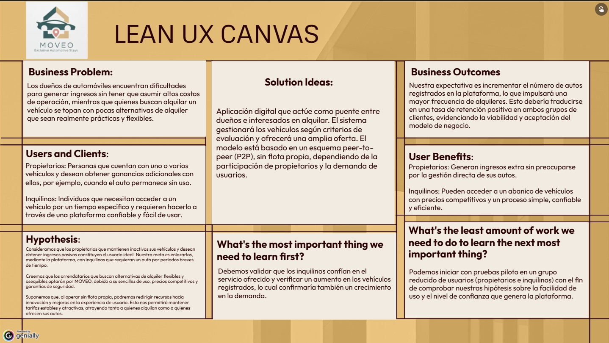

# MOVEO-Report

<strong>Universidad Peruana de Ciencias Aplicadas</strong>

</img>

**Universidad Peruana de Ciencias Aplicadas**

**Carrera:** Ingeniería de Software

**Periodo:** 202610

**Curso:** Aplicaciones para Dispositivos Móviles

**Sección:** 3687

**Profesor:** Quevedo Velasco, David Gerardo

**Informe del Trabajo final**

**Startup:** MOVEO

**Producto:** WheelsPe

| Alumnos |  |
| :---: | :---: |
| **Código** | **Apellidos y Nombres** |
| u202312031 | Arrieta Quispe, Alison Jimena |
| u20211g491 | Encalada Salazar, Alexis |
| u202318049 | Goñe Araccata, Esther Abigail |
| u202321941 | Salazar Caballero, Alvaro Fabrizzio |
| u202317362 | Santiago Peña, Andreow Jomark |

**Abril, 2026**

# **Registro de Versiones del Informe**

| Versión | Fecha | Autor(es) | Descripción de modificación |
| :---- | :---- | :---- | :---- |
| 1.0 (AV1) | 09/04/2026 | Arrieta Quispe, Alison Jimena Encalada Salazar, Alexis Goñe Araccata, Esther Abigail Salazar Caballero, Alvaro Fabrizzio Santiago Peña, Andreow Jomark | Capítulo I: Introducción 1.1 Startup Profile (Descripción de la Startup y perfiles del equipo) 1.2 Solution Profile (Antecedentes y problemática) 1.2.2.1 Lean UX Problem Statements (Definición de los problemas a resolver) 1.2.2.2 Lean UX Assumptions (Identificación de suposiciones) 1.2.2.3 Lean UX Hypothesis Statements (Formulación de hipótesis) 1.3 Segmentos objetivo (Definición del público meta) |
| 1.1 (AV1) | 13/04/2026 | Arrieta Quispe, Alison Jimena Encalada Salazar, Alexis Goñe Araccata, Esther Abigail Salazar Caballero, Alvaro Fabrizzio Santiago Peña, Andreow Jomark | Capítulo I: Introducción y Capítulo II: Requirements Development 1.2.2.4 Lean UX Canvas (Creación del lienzo de Lean UX) 2.1.1 Análisis competitivo (Investigación de competidores) 2.1.2 Estrategias y tácticas frente a competidores (Definición de estrategias competitivas) 2.2.1.Diseño de entrevistas (Creación de guiones de entrevistas) |
| 1.2 (AV1) | 17/04/2026 | Arrieta Quispe, Alison Jimena Encalada Salazar, Alexis Goñe Araccata, Esther Abigail Salazar Caballero, Alvaro Fabrizzio Santiago Peña, Andreow Jomark |  |
| 1.3 (AV1) | 18/04/2026 | Arrieta Quispe, Alison Jimena Encalada Salazar, Alexis Goñe Araccata, Esther Abigail Salazar Caballero, Alvaro Fabrizzio Santiago Peña, Andreow Jomark |  |
| 1.4 (AV1) | 22/04/2026 | Arrieta Quispe, Alison Jimena Encalada Salazar, Alexis Goñe Araccata, Esther Abigail Salazar Caballero, Alvaro Fabrizzio Santiago Peña, Andreow Jomark |  |
| 1.5 (AV1) | 23/04/2026 | Arrieta Quispe, Alison Jimena Encalada Salazar, Alexis Goñe Araccata, Esther Abigail Salazar Caballero, Alvaro Fabrizzio Santiago Peña, Andreow Jomark |  |

# Project Report Collaboration Insights 

Repositorio donde se encuentra el **Project Report**: [https://github.com/App-Moviles-MOVEO/MOVEO-Report](https://github.com/App-Moviles-MOVEO/MOVEO-Report)

FOTO

Utilizamos Google Docs como herramienta colaborativa para redactar el informe y luego trasladamos la información al archivo README.md de nuestro repositorio.

# Contenido
[Student Outcome](#student-outcome)

[Objetivos Smart](#objetivos-smart)

[Capítulo I: Introducción](#capítulo-i-introducción)

[1.1 Startup Profile](#11-startup-profile)

[1.1.1 Descripción de la Startup](#111-descripción-de-la-startup)

[1.1.2 Perfiles de integrantes del equipo](#112-perfiles-de-integrantes-del-equipo)

[1.2 Solution Profile](#12-solution-profile)

[1.2.1 Antecedentes y Problemática](#121-antecedentes-y-problemática)

[1.2.2 Lean UX Process](#122-lean-ux-process)

[1.2.3 Lean UX Problem Statement](#1221-lean-ux-problem-statement)

[1.2.4 Lean UX Assumptions](#1222-lean-ux-assumptions)

[1.2.5 Lean UX Hypothesis Statements](#1223-lean-ux-hypothesis-statements)

[1.2.6 Lean UX Canvas](#1224-lean-ux-canvas)

[1.3 Segmentos objetivo](#segmentos-objetivo)

[Capítulo II: Requirements Elicitation & Analysis](#capítulo-ii-requirements-elicitation--analysis)

[2.1 Competidores](#21-competidores)

[2.1.1 Análisis competitivo](#211-análisis-competitivo)

[2.1.2 Estrategias y tácticas frente a competidores](#212-estrategias-y-tácticas-frente-a-competidores)

[2.2 Entrevistas](#22-entrevistas)

[2.2.1 Diseño de entrevista](#221-diseño-de-entrevista)

[2.2.2 Registro de entrevistas](#222-registro-de-entrevistas)

[2.2.3 Análisis de Entrevistas](#223-análisis-de-entrevistas)

[2.3 Needfinding](#23-needfinding)

[2.3.1 User Persona](#231-user-persona)

[2.3.2 User Task Matrix](#232-user-task-matrix)

[2.3.3 User Journey Mapping](#233-user-journey-mapping)

[2.3.4 Empathy Mapping](#234-empathy-mapping)

[2.3.5 As-is Scenario Mapping](#235-as-is-scenario-mapping)

[2.4 Ubiquitous Language](#24-ubiquitous-language)

[Capítulo III: Requirements Specification](#capítulo-iii-requirements-specification)

[3.1 To-Be Scenario Mapping](#31-to-be-scenario-mapping)

[3.2 User Stories](#32-user-stories)

[3.3 Impact Mapping](#33-impact-mapping)

[3.4 Product Backlog](#34-product-backlog) 

[Capítulo IV: Solutions Software Design](#capítulo-iv-solutions-software-design)

[4.1 Strategic-Level Domain Driven Design](#41-strategic-level-domain-driven-design)

[4.1.1 EventStorming](#411-eventstorming) 

[4.1.1.1 Candidate Context Discovery](#4111-candidate-context-discovery)

[4.1.1.2 Domain Message Flows Modeling](#4112-domain-message-flows-modeling)

[4.1.1.3 Bounded Contexts Canvases](#4113-bounded-contexts-canvases)

[4.1.2. Context Mapping](#412-context-mapping)

[4.1.3 Software Architecture](#413-software-architecture)

[4.1.3.1 Software Architecture Context Level Diagrams](#4131-software-architecture-context-level-diagrams)

[4.1.3.2 Software Architecture Container Level Diagrams](#4132-software-architecture-container-level-diagrams)

[4.1.3.3 Software Architecture Deployment Diagrams](#4133-software-architecture-deployment-diagrams)

[4.1.2 Context Mapping](#412-context-mapping)

[4.1.3 Software Architecture](#413-software-architecture)

[4.1.3.1 Software Architecture Context Level Diagrams](#4131-software-architecture-context-level-diagrams)

[4.1.3.2 Software Architecture Container Level Diagrams](#4132-software-architecture-container-level-diagrams)

[4.1.3.3 Software Architecture Deployment Diagrams](#4133-software-architecture-deployment-diagrams)

[4.2 Tactical-Level Domain Driven Design](#42-tactical-level-domain-driven-design)

[4.2.1 Bounded Contexts: <Bounded Context Name>](#421-bounded-contexts-bounded-context-name)

[4.2.1.1 Domain Layer](#4211-domain-layer)

[4.2.1.2 Interface Layer](#4212-interface-layer)

[4.2.1.3 Application Layer](#4213-application-layer)

[4.2.1.4 Infrastructure Layer](#4214-infrastructure-layer)

[4.2.1.5 Bounded Context Software Architecture Component Level Diagrams](#4215-bounded-context-software-architecture-component-level-diagrams)

[4.2.1.6 Bounded Context Software Architecture Code Level Diagrams](#4216-bounded-context-software-architecture-code-level-diagrams)

[4.2.1.7 Bounded Context Domain Layer Class Diagrams](#4217-bounded-context-domain-layer-class-diagrams)

[4.2.1.8 Bounded Context Database Design Diagram](#4218-bounded-context-database-design-diagram)

[conclusiones y Recomendaciones](#conclusiones-y-recomendaciones)

[Conclusiones](#conclusiones)

[Bibliografía](#bibliografía)

[Anexos](#anexos)

# Student Outcome

El curso aporta al cumplimiento del criterio ABET: **ABET – EAC \- Student Outcome 7:** **Aprendizaje Continuo y Autónomo**

**Criterio:** *La capacidad de adquirir y aplicar nuevos conocimientos según sea necesario, utilizando estrategias de aprendizaje apropiadas.*

En el cuadro siguiente se detallan las actividades llevadas a cabo y las conclusiones formuladas por el equipo, las cuales sirven como evidencia del logro alcanzado en el ABET – EAC \- Student Outcome.

| Criterio específico | Acciones realizadas | Conclusiones |  |
| ----- | ----- | ----- | ----- |
| Actualiza conceptos y conocimientos necesarios para su desarrollo profesional y en especial para su proyecto en soluciones de software. | **Arrieta Quispe, Alison Jimena** *AV1* Investigó y aplicó conceptos de Domain-Driven Design para desarrollar el Domain Message Flows Modeling, Bounded Context Canvases y el Bounded Context Billing, profundizando en el modelado de flujos entre contextos y reglas de negocio financieras.  **Encalada Salazar, Alexis** *AV1* Estudió los fundamentos teóricos de DDD para construir el Ubiquitous Language, el Event Storming y el Context Mapping, aplicando patrones de diseño estratégico en el Bounded Context Rental.  **Goñe Araccata, Esther Abigail** *AV1* Investigó y aplicó metodologías Lean UX y Event Storming para desarrollar el Startup Profile, Solution Profile, el análisis de entrevistas y el Bounded Context Operations, integrando técnicas de investigación cualitativa con la exploración del dominio.  **Salazar Caballero, Alvaro Fabrizzio** *AV1* Investigó patrones de arquitectura de software y gestión de identidad para desarrollar la Software Architecture y el Bounded Context Iam, adquiriendo conocimientos sobre seguridad y verificación de usuarios en plataformas digitales.  **Santiago Peña, Andreow Jomark** *AV1* Aplicó técnicas de Needfinding e investigación con usuarios para desarrollar el análisis de entrevistas y el Bounded Context Carpooling, conectando los hallazgos de campo con el modelado del dominio de movilidad compartida. | **AV1:** Durante la elaboración del primer avance, el equipo identificó y adquirió de forma autónoma los conocimientos necesarios para cada área del proyecto, desde metodologías de discovery hasta diseño estratégico con DDD, demostrando capacidad para actualizar su formación según las exigencias reales del desarrollo. |  |
| Reconoce la necesidad del aprendizaje permanente para el desempeño profesional y el desarrollo de proyectos en soluciones de software. | **Arrieta Quispe, Alison Jimena** *AV1* Al modelar los flujos entre contextos y el contexto Billing, reconoció que el diseño estratégico de software exige formación continua más allá de los contenidos del curso, profundizando en reglas de negocio sobre comisiones y reembolsos.  **Encalada Salazar, Alexis** *AV1* Al construir el Ubiquitous Language a partir del Event Storming, reconoce que la calidad del diseño depende del entendimiento profundo del dominio y no solo del conocimiento técnico.  **Goñe Araccata, Esther Abigail** *AV1* Al liderar las entrevistas y el Big Picture Event Storming, reconoció que la investigación con usuarios y la facilitación colaborativa son competencias profesionales que requieren desarrollo continuo, complementando su formación técnica.  **Salazar Caballero, Alvaro Fabrizzio** *AV1* Al diseñar la arquitectura y el contexto Iam, reconoció que la seguridad y la gestión de identidad son áreas en constante evolución, investigando estándares que van más allá del contenido impartido en el curso.  **Santiago Peña, Andreow Jomark** *AV1* Al desarrollar el Needfinding y el contexto Carpooling, reconoció que el aprendizaje profesional integra tanto la investigación con usuarios como el modelado técnico, ampliando su visión del rol del ingeniero de software. | **AV1:** Durante esta primera etapa del proyecto, el equipo demostró consciencia sobre la necesidad del aprendizaje permanente al enfrentar responsabilidades que requerían conocimientos fuera del contenido directo del curso, respondiendo de forma proactiva mediante investigación autónoma y aplicación práctica en cada entregable. |  |

# Capítulo I: Introducción
# 1.1. Startup Profile
### 1.1.1. Descripción de la Startup

Nuestro proyecto consiste en un servicio digital diseñado para conectar a personas que poseen un vehículo con quienes necesitan uno por un tiempo determinado. A diferencia de una compañía de alquiler tradicional, nuestra propuesta no requiere contar con un parque automotor propio, lo que reduce significativamente los costos iniciales. En lugar de ello, los autos registrados por los mismos usuarios son los que conforman la oferta disponible en la plataforma, generando así una red colaborativa similar a una flota virtual.
El modelo se centra en la intermediación: los dueños obtienen ingresos únicamente cuando su vehículo es efectivamente arrendado, mientras que los arrendatarios acceden a precios más accesibles que en el mercado convencional. De esta manera, se construye un sistema rentable, flexible y equitativo para ambas partes.

Misión: Ofrecer una solución moderna y segura que simplifique el acceso a un vehículo de alquiler, generando confianza y beneficios tanto para el propietario como para el arrendatario. Buscamos que nuestra plataforma sea percibida como una alternativa práctica, clara y orientada a las necesidades reales de los usuarios.

Visión: Aspiramos a consolidarnos como la plataforma más reconocida en el Perú para la renta de automóviles entre particulares. Queremos ser identificados por la innovación de nuestro modelo, la seguridad de nuestras operaciones y la facilidad de uso del sistema. Nuestra meta es que, al pensar en alquiler de autos sin trámites complicados, las personas recurran primero a nosotros.

### 1.1.2. Perfiles de integrantes del equipo
| Integrantes                                                                                                            | Descripción                                                                                                                                                                                                                                                                                                                               | Conocimientos                                                                                                                                                                                                                                                                          |
|:-----------------------------------------------------------------------------------------------------------------------|:------------------------------------------------------------------------------------------------------------------------------------------------------------------------------------------------------------------------------------------------------------------------------------------------------------------------------------------|:---------------------------------------------------------------------------------------------------------------------------------------------------------------------------------------------------------------------------------------------------------------------------------------|
|   Alison Jimena Arrieta Quispe u202317362         | Soy estudiante de la carrera de Ingeniería de Software en la Universidad Peruana de Ciencias Aplicadas (UPC). Mi principal meta es especializarme en la creación de agentes inteligentes y soluciones basadas en Inteligencia Artificial, con enfoque en aprendizaje automático, procesamiento del lenguaje natural y sistemas autónomos. | Tengo experiencia en múltiples lenguajes de programación como Python, C#, Java, JavaScript y SQL, y estoy familiarizado con frameworks como Vue.js, ASP.NET Core y TensorFlow/Keras. Me apasiona aprender tecnologías emergentes y aplicarlas en proyectos reales que generen impacto. |
|   Alexis Encalada Salazar u20211g491                         | Soy estudiante de la carrera de Ingeniería de Software en la Universidad Peruana de Ciencias Aplicadas (UPC). Mi principal meta es especializarme en la creación de agentes inteligentes y soluciones basadas en Inteligencia Artificial, con enfoque en aprendizaje automático, procesamiento del lenguaje natural y sistemas autónomos. | Tengo experiencia en múltiples lenguajes de programación como Python, C#, Java, JavaScript y SQL, y estoy familiarizado con frameworks como Vue.js, ASP.NET Core y TensorFlow/Keras. Me apasiona aprender tecnologías emergentes y aplicarlas en proyectos reales que generen impacto. |
|   Esther Abigail Goñe Araccata u202318049         | Soy estudiante de la carrera de Ingeniería de Software en la Universidad Peruana de Ciencias Aplicadas (UPC). Mi principal meta es especializarme en la creación de agentes inteligentes y soluciones basadas en Inteligencia Artificial, con enfoque en aprendizaje automático, procesamiento del lenguaje natural y sistemas autónomos. | Tengo experiencia en múltiples lenguajes de programación como Python, C#, Java, JavaScript y SQL, y estoy familiarizado con frameworks como Vue.js, ASP.NET Core y TensorFlow/Keras. Me apasiona aprender tecnologías emergentes y aplicarlas en proyectos reales que generen impacto. |
|   Alvaro Fabrizzio Salazar Caballero  u2023211941 | Soy estudiante de la carrera de Ingeniería de Software en la Universidad Peruana de Ciencias Aplicadas (UPC). Mi principal meta es especializarme en la creación de agentes inteligentes y soluciones basadas en Inteligencia Artificial, con enfoque en aprendizaje automático, procesamiento del lenguaje natural y sistemas autónomos. | Tengo experiencia en múltiples lenguajes de programación como Python, C#, Java, JavaScript y SQL, y estoy familiarizado con frameworks como Vue.js, ASP.NET Core y TensorFlow/Keras. Me apasiona aprender tecnologías emergentes y aplicarlas en proyectos reales que generen impacto. |
|   Andreow Jomark Santiago Peña u202317362                   | Soy estudiante de la carrera de Ingeniería de Software en la Universidad Peruana de Ciencias Aplicadas (UPC). Mi principal meta es especializarme en la creación de agentes inteligentes y soluciones basadas en Inteligencia Artificial, con enfoque en aprendizaje automático, procesamiento del lenguaje natural y sistemas autónomos. | Tengo experiencia en múltiples lenguajes de programación como Python, C#, Java, JavaScript y SQL, y estoy familiarizado con frameworks como Vue.js, ASP.NET Core y TensorFlow/Keras. Me apasiona aprender tecnologías emergentes y aplicarlas en proyectos reales que generen impacto. |

# 1.2. Solution Profile

## 1.2.1. Antecedentes y Problemática
Para explicar los fundamentos de nuestra startup utilizaremos una adaptación de la técnica de análisis 5W + 2H, que permite organizar la información respondiendo a las preguntas clave de cualquier iniciativa.

**Antecedentes**

- En los últimos años la necesidad de soluciones de movilidad temporal ha crecido considerablemente, especialmente en zonas urbanas donde adquirir un vehículo propio no siempre es viable. Ante ello surge la oportunidad de una plataforma digital que facilite el contacto directo entre propietarios de automóviles y personas interesadas en alquilarlos, optimizando el proceso a través de un aplicativo accesible.

**Problemática**

- La ausencia de servicios que ofrezcan un alquiler directo entre dueños y arrendatarios dificulta satisfacer la demanda de transporte temporal. Esto genera dos consecuencias principales: los usuarios que requieren un vehículo de manera inmediata encuentran limitaciones, y los propietarios pierden la posibilidad de generar ingresos adicionales con sus autos.

Aplicación del método 5W + 2H

**¿Qué?**

El proyecto busca responder a la falta de un sistema eficiente que conecte a quienes desean rentabilizar sus vehículos con quienes necesitan arrendarlos. La iniciativa está directamente relacionada con dos tipos de clientes: propietarios con autos disponibles y arrendatarios que requieren alternativas accesibles y confiables.

**¿Cuándo?**

La problemática se presenta en el momento en que un propietario desea alquilar su vehículo, pero no cuenta con un canal formal ni seguro para hacerlo. A su vez, los arrendatarios se ven afectados cuando requieren un vehículo por un tiempo limitado —sea por un viaje, una urgencia o una necesidad puntual— y no encuentran opciones adecuadas.
El uso de la plataforma se da justamente en esos escenarios: el dueño publica su vehículo y el arrendatario selecciona la opción que mejor se adapta a su situación.

**¿Dónde?**

El servicio puede utilizarse en cualquier lugar con acceso a internet, ya sea desde casa, el trabajo o en desplazamiento.
La propuesta está dirigida principalmente a contextos urbanos donde la demanda de movilidad es más alta y, paradójicamente, la oferta de plataformas colaborativas de alquiler es todavía reducida.

**¿Quiénes?**

Participan dos grupos principales: los propietarios que desean ofrecer su auto en alquiler y los arrendatarios que buscan una solución práctica sin trámites extensos.
El problema afecta sobre todo a los dueños que no logran monetizar sus vehículos y a las personas que necesitan movilidad temporal pero no encuentran opciones seguras y confiables.
En consecuencia, el público objetivo que hará uso del servicio corresponde a ambos segmentos, integrados en una misma plataforma.

**¿Por qué?**

La raíz del problema se encuentra en la falta de un canal especializado y confiable que asegure la interacción entre dueños y arrendatarios. Esta ausencia limita la rentabilidad de los primeros y restringe la variedad de opciones para los segundos.

**¿Cómo?**

El servicio se utiliza cuando los dueños desean generar ingresos con su vehículo o cuando un arrendatario necesita resolver rápidamente una necesidad de transporte.
Los usuarios llegan a la plataforma a través de campañas digitales, publicidad segmentada en redes sociales y recomendaciones de otros clientes.
En general, el detonante es la búsqueda de una alternativa segura, flexible y accesible frente a los servicios tradicionales de alquiler.

**¿Cuánto cuesta?**

Para los propietarios no existen costos de inscripción ni inversión inicial; únicamente se descuenta una comisión en caso de concretarse el alquiler.
Los arrendatarios, en cambio, acceden a tarifas variables y flexibles, con opciones que resultan más económicas en comparación con las agencias de renta tradicionales.

## 1.2.2. Lean UX Process

### 1.2.2.1. Lean UX Problem Statement

MOVEO tiene como objetivo ofrecer un servicio de alquiler de vehículos accesible, flexible y rentable, conectando de manera segura y eficiente a propietarios y arrendatarios a través de una plataforma digital. Sin embargo, el mercado actual se caracteriza por la falta de innovación, modelos de negocio rígidos, altos costos para los usuarios y una fuerte dependencia de flotas propias, lo que limita la escalabilidad y reduce la diversidad de la oferta. Ante esta situación, se plantea la necesidad de mejorar el modelo de servicio mediante un sistema más adaptable e inclusivo, que permita ampliar la participación de propietarios particulares y optimizar la experiencia de alquiler sin requerir una inversión directa en vehículos.

Consideramos que habremos alcanzado un avance significativo cuando logremos que el número de propietarios inscritos crezca de forma constante y que la oferta de vehículos disponibles se adapte a la demanda real del mercado.

### 1.2.2.2. Lean UX Assumptions

**Segmento de Usuarios:**

**¿Quién es el usuario?**

Nuestros principales usuarios son dos: los dueños de vehículos que desean generar ingresos pasivos sin tener que involucrarse en la gestión diaria de sus autos, y las personas que buscan alternativas de alquiler de vehiculos seguras, cómodas y accesibles.

**¿Dónde se integra el servicio en su vida?**

Para los propietarios, el servicio se convierte en un medio para obtener ingresos extra sin esfuerzo operativo. Para los inquilinos, representa la posibilidad de acceder a un vehículo en el momento en que lo necesitan, sin asumir compromisos de propiedad ni altos costos.

**¿Cuándo y cómo se utiliza el servicio?**

Los dueños lo usan al registrar su vehículo y seguir sus ganancias, mientras que los inquilinos lo emplean cuando requieren transporte para viajes, mudanzas, diligencias o necesidades puntuales de movilidad.

**¿Qué problemas enfrenta el servicio?**

El mayor reto es garantizar la seguridad y confianza de los propietarios respecto al uso de sus vehículos, al mismo tiempo que se asegura que los inquilinos disfruten de una experiencia rápida, sencilla y sin complicaciones.

**Resultados de Negocio (Business Outcomes):**

- Anticipamos que los propietarios valorarán una plataforma que les permita alquilar sin preocuparse de la gestión operativa.
- Creemos que los arrendatarios encontrarán en nuestro servicio una alternativa más económica y variada que las opciones tradicionales.
- Reconocemos que existen competidores en el sector, pero nuestro modelo —sin flota propia— nos permitirá mantener precios atractivos y una mejor experiencia de usuario.
- Sabemos que para mantener la confianza, debemos reforzar la calidad del servicio con pruebas constantes, mejoras continuas y canales abiertos de comunicación con nuestros clientes.

### 1.2.2.3. Lean UX Hypothesis Statements

1. Consideramos que los propietarios interesados en generar ingresos pasivos, sin realizar grandes inversiones ni dedicar demasiado tiempo a la gestión, verán en MOVEO una alternativa confiable para monetizar sus vehículos. Consideraremos que hemos alcanzado el éxito cuando estos propietarios incrementen el uso de la plataforma y obtengan ingresos recurrentes mediante el alquiler de sus autos, evidenciando confianza y satisfacción en el servicio.

2. Creemos que los arrendatarios que buscan opciones de alquiler más flexibles, asequibles y seguras optarán por MOVEO gracias a su facilidad de uso, precios competitivos y garantías de protección. Consideraremos que hemos alcanzado el éxito cuando la frecuencia de alquiler y la tasa de retención de usuarios aumenten, junto con una mejora perceptible en los niveles de satisfacción reportados.

3. Suponemos que al implementar un modelo operativo sin una flota propia de vehículos, podremos destinar mayores recursos a la innovación tecnológica y a la optimización de la experiencia de usuario. Consideraremos que hemos alcanzado el éxito cuando los indicadores de eficiencia operativa y de experiencia del cliente reflejen una reducción de costos, estabilidad en las tarifas y un incremento sostenido en el número de transacciones exitosas.

### 1.2.2.4. Lean UX Canvas.
En el apartado de Lean UX Canvas se desarrolló una estructuración completa y académica de las principales hipótesis estratégicas que sustentan la propuesta de valor y la arquitectura de la plataforma Moveo

Cada hipótesis fue traducida en un Lean UX Canvas formal, siguiendo un enfoque científico-experimental que articula: el problema de negocio detectado (Business Problem ), las soluciones propuestas a nivel funcional y técnico (Solutions ), los resultados esperados a nivel organizacional (Business Outcomes ), la caracterización de los usuarios objetivos (Users ), los beneficios esperados para estos usuarios (User Outcomes & Benefits ), la formulación de hipótesis de aprendizaje (Hypotheses ), y el diseño de experimentos estratégicos para validar o refutar dichas hipótesis (What's the most important thing we need to learn first? y What's the least amount of work we need to do to learn the next most important thing? ).

Este trabajo metodológico permitió no solo establecer un marco claro de experimentación y validación temprana de las decisiones de diseño y tecnología, sino también alinear todos los esfuerzos de desarrollo a métricas de éxito específicas y medibles. Así, el apartado de Lean UX Canvas representa una pieza fundamental dentro del enfoque de construcción iterativa, ágil y centrada en el usuario de Moveo, asegurando que cada funcionalidad propuesta responde a necesidades reales, riesgos priorizados y oportunidades de negocio tangibles.

# 1.3. Segmentos objetivos 
**Segmento 1: Proveedores de vehículos**

Datos demográficos:
- Género: hombres y mujeres.
- Rango etario: de 18 a 70 años.
- Condición socioeconómica: sectores A, B y C (clase media o clase alta).

Datos geográficos:
- Nacionalidad: peruana.
- Área de residencia: zonas urbanas.
- Ubicación principal: Lima Metropolitana.

Datos psicográficos:
- Individuos (naturales o jurídicos) que poseen un vehículo que permanece sin uso la mayor parte del tiempo.
- Personas interesadas en generar ingresos adicionales a través de un recurso que ya poseen, sin necesidad de destinar grandes cantidades de tiempo a la gestión.
- Propietarios que aún no cuentan con un mecanismo práctico, seguro y rápido para ofrecer sus autos en alquiler.

**Segmento 2: Clientes**

Datos demográficos:
- Género: tanto masculino como femenino.
- Edad: entre 18 y 50 años.
- Nivel socioeconómico: clases A, B y C (clase media, media alta y alta).

Datos geográficos:
- Nacionalidad: peruana.
- Lugar de residencia: zonas urbanas.
- Departamento: Lima Metropolitana.

Datos psicográficos:
- Personas que pasan una cantidad considerable de horas en transporte público o en el tráfico y buscan alternativas más cómodas y flexibles.
- Usuarios que no cuentan con los recursos para adquirir un auto propio (nuevo o de segunda mano), pero que requieren movilidad en situaciones específicas.
- Personas que necesitan disponer de un vehículo particular por un período corto, ya sea para actividades puntuales, compromisos laborales o viajes.

# Capítulo II: Requirements Development and Software Solution Design
## 2.1. Competidores 

Previo al desarrollo de la aplicación, hicimos una búsqueda de las opciones que ya existen en el mercado, para ver que es lo que ofrecen y como podemos diferenciarnos de ellos.
- **Peru Rent A Car:**
  Esta plataforma se especializa en el alquiler de coches en Perú. Ofrece una amplia gama de vehículos y opciones de alquiler, así como información sobre destinos turísticos en Perú.
  La plataforma también permite a los usuarios comparar precios y reservar coches en línea.
  

 
  

- **Kayak:**
  Kayak es una de las plataformas de búsqueda de viajes más grandes del mundo. Permite a los usuarios buscar y comparar precios de vuelos, hoteles y alquiler de coches en una sola plataforma.
  Kayak también ofrece herramientas para planificar viajes, como alertas de precios y recomendaciones personalizadas.
  

  

- **Budget Car Rental Peru:**
  A diferencia de Peru Rent A Car, Budget Car Rental es una empresa internacional que ofrece servicios de alquiler de coches en Perú.
  La plataforma permite a los usuarios buscar y comparar precios de coches de alquiler en diferentes ubicaciones y reservar en línea. Budget Car Rental también ofrece opciones de alquiler a largo plazo y programas de fidelización.
  

  

### 2.1.1. Análisis competitivo.

En esta sección tiene como objetivo que su startup conozca mejor a sus competidores, en contraste con la idea inicial que pudiera tener sobre ellos. Se debe desarrollar el siguiente Landscape:  
**Se realiza un mapeo estratégico comparativo entre nuestra propuesta (Moveo) y los principales actores del mercado, evaluando su perfil, marketing, producto y análisis SWOT, con el fin de identificar brechas de mercado, fortalezas propias y oportunidades de posicionamiento diferenciado.**

**¿Por qué llevar a cabo este análisis?**  
*Objetivo: Comprender a fondo el posicionamiento de nuestra startup frente a competidores clave en el mercado de alquiler de autos en Perú, identificando sus fortalezas, debilidades y estrategias, para definir con precisión nuestra ventaja competitiva y oportunidades de diferenciación.*

<table border="1" style="text-align: center;">
	<tbody>
		<tr><td colspan="6">Análisis de competidores</td></tr>
		<tr><td colspan="2"></td><td>Moveo</td><td>Kayak</td><td>Peru Rent A Car</td><td>Budget Car Rental Peru</td></tr>
		<tr><td rowspan="2">Perfil</td><td>Resumen</td>
			<td>Una aplicación que busca ofrecer una plataforma rápida y ágil para el alquiler de autos, con un fuerte enfoque en la seguridad de ambas partes.</td>
			<td>Kayak es una plataforma líder de búsqueda tanto de vuelos, como cuartos de hotel, alquiler de vehículos, etc.</td>
			<td>Esta plataforma web presenta parte de un catálogo establecido de vehículos para alquilar, con una atención mediante WhatsApp y dirigido solo a clientes.</td>
			<td>Plataforma de similar funcionamiento que Rent A Car Peru, orientado a clientes con un énfasis en cuidar el presupuesto de los mismos.</td></tr>
		<tr><td>Ventaja competitiva</td>
			<td>Ofrecer una plataforma tanto para dueños de vehículos como a clientes interesados en alquilar.</td>
			<td>Es la aplicación líder en la búsqueda de servicios por su variedad y robusta plataforma web.</td>
			<td>Líder local del servicio de alquiler de autos, con una amplia flota y rápida atención al usuario</td>
			<td>Ofrece una alternativa de alquiler económica velando por el bolsillo de sus clientes. </td></tr>
		<tr><td rowspan="2">Perfil de Marketing</td><td>Mercado objetivo</td>
			<td>Jóvenes y adultos desde los 20 a los 50 años.</td>
			<td>Turistas o viajeros que necesiten cualquier tipo de servicio de comodidad.</td>
			<td>Adultos peruanos que busquen alquilar un vehiculo.</td>
			<td>Adultos peruanos que busquen alquilar un vehiculo económico.</td></tr>
		<tr><td>Estrategias de marketing</td>
			<td>Marketing digital en redes sociales y colaboraciones con influencers.</td>
			<td>Alianza con Google Ads, tanto en Youtube como Chrome.</td>
			<td>Patrocinio mediante búsquedas de Chrome.</td>
			<td>Patrocinio mediante búsquedas de Chrome.</td></tr>
		<tr><td rowspan="3">Perfil de Producto</td>
			<td>Productos y Servicios</td>
			<td>Aplicación destinada a la oferta de vehículos en alquiler, como la demanda de los mismos.</td>
			<td>Aplicación móvil y web que cuenta con una enorme variedad de servicios esenciales para viajeros y turistas</td>
			<td>Aplicación web rápida e intuitiva que permite consultar parte del catálogo de vehículos disponibles para alquiler.</td>
			<td>Aplicación web ágil y amigable que permite consultar una limitada oferta de vehículos económicos en alquiler</td></tr>
		<tr><td>Precios y Costos</td>
			<td>Costos por publicación de vehículos mediante una suscripción.</td>
			<td>Modelo gratuito, con cobro de comisión a las empresas referidas.</td>
			<td>Ingreso directo mediante el alquiler.</td>
			<td>Ingreso directo mediante el alquiler.</td></tr>
		<tr><td>Canales de distribución</td>
			<td>Disponible en línea a través de la aplicación web.</td>
			<td>Descargable en Google Play y App Store y la plataforma web.</td>
			<td>Disponible en línea a través de la aplicación web.</td>
			<td>Disponible en línea a través de la aplicación web.</td></tr>
		<tr><td rowspan="4">Análisis SWOT</td><td>Fortalezas</td><td><ul>
                    <li>Orientado a jóvenes y adultos peruanos</li><li>Facilidades para alquilar, como ofrecer alquiler</li><li>Énfasis en la seguridad y garantía</li></ul></td>
			<td><ul>
                    <li>Gran cantidad de usuarios</li><li>Referente del sector</li><li>Plataformas ágiles e intuitivas</li></ul></td>
			<td><ul><li>Plataforma local</li><li>Excelente atención al cliente</li></ul></td>
			<td><ul><li>Plataforma web amigable</li><li>Todo el catálogo está disponible para cualquier usuario</li></ul></td></tr>
		<tr><td>Debilidades</td>
            <td><ul><li>Nuevo competidor</li><li>Sector con competidores fuertes ya establecidos</li></ul></td>
			<td><ul><li>Pobre atención al cliente</li></ul></td>
			<td><ul><li>Solo se puede consultar parte del catálogo de vehículos</li></ul></td>
			<td><ul><li>Opta por un nicho muy concreto</li><li>No cuenta con tanta relevancia como su competencia</li></ul></td></tr>
		<tr><td>Oportunidades</td>
            <td><ul><li>Sin competidores a nivel nacional</li><li>Ofrece servicio para ambas partes involucradas en el alquiler</li></ul></td>
			<td><ul><li>Fuerte presencia internacional</li><li>Referente del sector</li></ul></td>
			<td><ul><li>Flota amplia y en crecimiento</li><li>Atención personalizada</li></ul></td>
			<td><ul><li>Excelente interfaz</li></ul></td></tr>
		<tr><td>Amenazas</td>
            <td><ul><li>Competencia ya establecida</li><li>Sector muy competitivo</li></ul></td>
			<td><ul><li>Oferta demasiado ámplia</li><li>Sin control de calidad</li></ul></td>
			<td><ul><li>Oferta fija y poco variada</li><li>Sin opciones para dueños interesados en alquilar</li></ul></td>
<td><ul><li>Se ve opacado por la competencia</li><li>Oferta aún más limitada que la competencia</li></ul></td>
</tr></tbody></table>

### 2.1.2. Estrategias y tácticas frente a competidores. 
Moveo se diferenciará mediante un enfoque local y seguro, integrando tanto a dueños de vehículos como a arrendatarios.
Para contrarrestar la falta de reconocimiento como nuevo competidor, se aplicarán tácticas de marketing digital y alianzas con influencers, generando confianza y visibilidad rápida.
Aprovechando la ausencia de un líder nacional en movilidad tipo Airbnb, la estrategia será posicionarse como la primera opción peruana especializada en alquiler de autos.
Frente a amenazas de grandes plataformas, Moveo enfocará sus esfuerzos en segmentos desatendidos y en brindar soporte inmediato y flexibilidad en precios, destacando su cercanía y adaptabilidad frente a la oferta internacional y tradicional.

## 2.2. Entrevistas

En esta sección se presenta la investigación cualitativa realizada mediante entrevistas profundas a representantes de nuestros dos segmentos objetivo: **propietarios de vehículos** (Segmento 1) e **inquilinos o usuarios que desean alquilar autos** (Segmento 2). El objetivo es comprender sus necesidades reales, frustraciones, hábitos de consumo y expectativas frente a una plataforma de alquiler de autos, validando así los supuestos del modelo de negocio y ajustando la propuesta de valor de Moveo a lo que el mercado realmente demanda.

### 2.2.1. Diseño de entrevista 
Esta sección incluye preguntas demográficas, conductuales y psicográficas dirigidas a cada segmento, con el fin de construir arquetipos (personas) basados en evidencia real. Se aplican buenas prácticas de diseño de entrevistas: preguntas abiertas, no sugestivas, orden lógico (de lo general a lo específico) y enfoque en comportamientos reales, no hipotéticos.

Antes de realizar las entrevistas profundas, se aplicó un formulario digital (Google Forms) a todos los participantes con el objetivo de recolectar información demográfica y conductual básica. Esto permitió segmentar adecuadamente a los entrevistados, personalizar el enfoque de cada entrevista según su perfil, y optimizar el tiempo durante las sesiones cualitativas.

Formulario segmento Proveedores de Vehiculos: https://forms.gle/uyVSkqSiuiKx1nb69

Formulario segmento Inquilinos: https://forms.gle/kz3BdxPoZHKNgqUg9
#### **Segmento 1: Proveedores de Vehiculos** 

**Demográficas (para arquetipo):**
- ¿Cuál es tu nombre completo?
- ¿Qué edad tienes?
- ¿En qué distrito resides?
- ¿Cuál es tu género?
- ¿Cuál es tu estado civil?
- ¿Vives solo, con pareja, con hijos u otros familiares?
- ¿A qué te dedicas (trabajo, estudios, negocio propio)?

**Psicográficas y comportamentales (para arquetipo):**
- ¿Cómo describirías tu personalidad cuando se trata de prestar algo valioso (precavido, confiado, flexible, exigente)?
- ¿Qué marcas de autos confías más para alquilar? ¿Por qué?
- ¿Qué influencers, blogs, canales o redes sociales te influyen a la hora de tomar decisiones sobre tu auto o negocios?
- ¿Qué dispositivos usas con más frecuencia (celular, laptop, tablet)? ¿Qué apps o navegadores prefieres?
- ¿Por qué canales digitales sueles informarte o resolver dudas (WhatsApp, Instagram, Facebook, Google, foros)?

> *Nota: Estas preguntas fueron incluidas en el formulario inicial para identificar patrones de comportamiento digital y afinidades, lo que permitió guiar mejor las entrevistas profundas y construir arquetipos más precisos.*

**Necesidades y comportamiento (preguntas principales):**
- ¿Qué tipo de unidades sueles alquilar (auto, SUV, camioneta, moto, otro)?
- ¿Cuál es el tiempo mínimo y máximo que normalmente estás dispuesto a prestar tu vehículo?
- ¿Qué requisitos solicitas a una persona antes de entregarle tu vehículo?
- ¿Dónde publicas actualmente tus vehículos para alquilarlos (apps, redes sociales, conocidos)?
- ¿Cómo gestionas el control de tus autos disponibles y en uso (anotaciones, Excel, aplicación, otro)?
- ¿Qué tan confiable consideras que son las plataformas actuales para validar a los clientes?
- ¿Qué tan útil sería para ti ver comentarios de otros dueños sobre un cliente antes de alquilar?
- ¿Te interesaría contar con un panel digital donde registres todos tus autos y su estado?
- ¿Qué tan importante consideras poder calificar a los clientes después de cada alquiler?
- ¿Has tenido malas experiencias alquilando tu auto? Cuéntame qué pasó y qué aprendiste.

---
#### **Segmento 2: Clientes**

**Demográficas (para arquetipo):**
- ¿Cuál es tu nombre completo?
- ¿Qué edad tienes?
- ¿En qué distrito vives?
- ¿Cuál es tu género?
- ¿Cuál es tu estado civil?
- ¿Vives solo, con pareja, con hijos u otros familiares?
- ¿Cuál es tu ocupación principal?

**Psicográficas y comportamentales (para arquetipo):**
- ¿Cómo describirías tu estilo al tomar decisiones de consumo (espontáneo, investigador, influenciable, ahorrativo)?
- ¿Qué marcas de autos o servicios de alquiler prefieres o evitas? ¿Por qué?
- ¿Qué personas, influencers o medios digitales te ayudan a decidir antes de alquilar un auto?
- ¿Qué dispositivos usas con más frecuencia (celular, laptop, tablet)? ¿Qué apps o navegadores prefieres?
- ¿Por qué canales digitales sueles buscar soluciones o servicios (WhatsApp, Instagram, Google Maps, TikTok, foros)?

> *Nota: La información recolectada en el formulario permitió identificar segmentos de comportamiento digital y afinidades de marca, facilitando la construcción de arquetipos realistas y la personalización de las preguntas durante la entrevista.*

**Necesidades y comportamiento (preguntas principales):**
- ¿Qué documentos te han solicitado en tus experiencias previas al alquilar un auto?
- ¿Qué tipo de vehículo prefieres alquilar según tu necesidad (trabajo, viaje, ocasión especial)?
- ¿Qué requisitos o condiciones suelen ponerte antes de alquilar (edad mínima, tarjeta de crédito, otros)?
- ¿Qué factores te desaniman al momento de querer alquilar un auto (precio, desconfianza, restricciones, otro)?
- ¿Dónde sueles buscar opciones de autos en alquiler (apps, redes, páginas web, conocidos)?
- ¿Qué tan confías en que las aplicaciones muestran información real de los dueños y autos?
- ¿Qué tan valioso sería para ti revisar reseñas de otros usuarios sobre el dueño antes de alquilar?
- ¿Te resultaría útil poder reservar un vehículo con anticipación directamente desde la app?
- ¿Qué tan importante es para ti dejar una opinión sobre tu experiencia con el dueño o el vehículo?
- ¿Cuál ha sido tu peor experiencia alquilando un auto? ¿Qué cambiarías para evitarlo?

### 2.2.2. Registro de entrevistas

### 2.2.3. Análisis de Entrevistas 

## 2.3. Needfinding

### 2.3.1. User Persona

### 2.3.2. User Task Matrix

### 2.3.3. User Journey Mapping

### 2.3.4. Empathy Mapping 

### 2.3.5. Big Picture EventStorming

### 2.3.6. Ubiquitous Language

Arrendador:	Usuario que publica su vehículo para alquiler.

Arrendatario:	Usuario que alquila un vehículo disponible en la app.

Vehículo:	Entidad principal registrada por un arrendador.

Reserva:	Proceso mediante el cual un arrendatario aparta un vehículo en una fecha.

Publicación:	Objeto que contiene los datos visibles de un vehículo (precio, fotos, reglas).

Reseña:	Valoración escrita o numérica sobre el arrendador o vehículo.

Framework:	Conjunto de herramientas y librerías que usamos para construir la aplicación .

Entidad:	Objeto del dominio que tiene identidad propia .

Repositorio: Componente de software que gestiona la persistencia de
## 2.4. Requirements Specification

### 2.4.1. User Stories

### 2.4.2. Impact Mapping

### 2.4.3. Product Backlog

## 2.5. Strategic-Level Domain Driven Design

En esta sección se introduce el proceso de Domain-Driven Desing a nivel estratégico para MOVEO. Nuestro enfoque nos permitió conceptualizar el sistema a partir de la lógica de nuetro negocio, con el proposito de modelar una arquitectura de microservicios coherentes. Para conseguir eso identificamos subconjuntos del sistema con límites naturales y claros, conocidos como los Bounded Contexts. Las herramientas utilizadas para este propósito son el EventStorming, que nos ayudó a visualizar el flujo de eventos del negocio, y el Bounded Context Canvas, la cual nos ayuda a definir formalmente cada contexto y sus relaciones, garantizando así una base sólida para el desarrollo de nuestro proyecto.

### 2.5.1 EventStorming

Event Storming es una técnica que consiste en la realización de un taller facilitado en el que los miembros del equipo identifican eventos claves del negocio y los requisitos para el bien funcionamiento de la plataforma, a lo largo de diferentes pasos que deber ser realizados colaborativamente.

Esta herramiente nos permitió elaborar una arquitectura de aplicación más robusta, estructurada y alineada con el enfoque de Domain-Driven Desing, además de visualizar posibles flujos de los usuarios y estructuras de código a utilizar. En nuestro negocio por temas de visualización y facilidad al momento de diseñar los diagramas hemos utilizado la plataforma de Miro para realizar el Event Storming.

#### 2.5.1.1. Candidate Context Discovery
#### 2.5.1.2. Domain Message Flows Modeling
#### 2.5.1.3. Bounded Contexts Canvases

### 2.5.2. Context Mapping

### 2.5.3. Software Architecture

#### 2.5.3.1. Software Architecture Context Level Diagrams
#### 2.5.3.2. Software Architecture Container Level Diagrams
#### 2.5.3.3. Software Architecture Deployment Diagrams

## 2.6. Tactical-Level Domain Driven Design

### 2.6.x. Bounded Contexts: <Bounded Context Name>

#### 2.6.1.1 Domain Layer
#### 2.6.1.2 Interface Layer
#### 2.6.1.3 Application Layer
#### 2.6.1.4 Infrastructure Layer
#### 2.6.1.5 Bounded Context Software Architecture Component Level Diagrams
#### 2.6.1.6 Bounded Context Software Architecture Code Level Diagrams
#### 2.6.1.7 Bounded Context Domain Layer Class Diagrams
#### 2.6.1.8 Bounded Context Database Design Diagram

## Conclusiones y Recomendaciones

### Conclusiones

### Bibliografía

### Anexos

